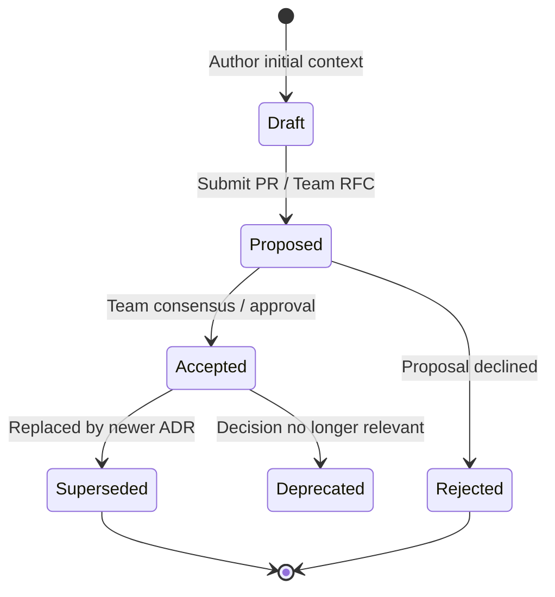

# ADR Lifecycle & Structural Standards

Standard Operating Procedure for the lifecycle states, file organization, and immutability invariants of Architecture Decision Records (ADRs).

---

## 1. ADR Lifecycle State Machine

An ADR captures an architectural decision at a specific point in time. It moves through distinct states:



### State Definitions
- **Draft**: Work in progress; problem and candidate options being gathered.
- **Proposed**: Shared with the team for review and RFC discussion.
- **Accepted**: Decision agreed upon and binding for the codebase.
- **Rejected**: Proposal evaluated and deliberately not chosen (retained as permanent record of why not).
- **Deprecated**: Context changed such that the decision is no longer applicable.
- **Superseded**: Replaced by a subsequent decision (must link to `Superseded by ADR-XXXX`).

---

## 2. The Immutability Invariant

> [!IMPORTANT]
> **ADRs are historical records, not living mutable specifications.**
> Once an ADR is marked **Accepted**, its text MUST NOT be modified to reflect new decisions.

When architectural requirements change or a technology is replaced:
1. Author a **new ADR** documenting the new context, forces, and decision.
2. In the new ADR, set `Supersedes: ADR-0012`.
3. In the old ADR, update only the metadata line to `Status: Superseded by ADR-0024` with a markdown link to the new record.

---

## 3. Directory Layout and File Naming

ADRs reside under version control in a dedicated documentation directory:

```
docs/adr/
├── 0001-record-architecture-decisions.md
├── 0002-use-postgresql-for-event-store.md
├── 0003-adopt-graphql-for-client-api.md
└── 0004-supersede-graphql-with-rest.md
```

### Naming Conventions
- Sequential 4-digit zero-padded prefix: `0001-`, `0002-`, `0003-`.
- Kebab-case descriptive slug describing the decision (not the problem): `0002-use-postgresql-for-event-store.md`.
- Never reuse or reorder existing numbers.
