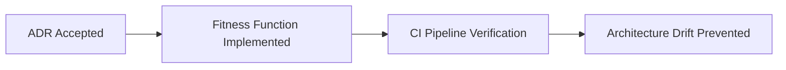

# Consequences & Architectural Compliance

Methodology for mapping consequences across positive, negative, and neutral impacts, and implementing automated compliance verification.

---

## 1. Consequence Mapping

Architectural choices ripple across systems. Group consequences into three distinct buckets:

### Positive Consequences
- Capabilities unlocked or accelerated.
- Reductions in operational friction, latency, or compute spend.
- Improvements in developer velocity and decoupling.

### Negative Consequences (Trade-offs & Tech Debt)
- New operational dependencies (e.g. requires managing an additional cluster).
- Increased cognitive load or specialized skill requirements.
- Migration debt created for existing legacy components.
- Potential vendor lock-in risks.

### Neutral / Lateral Consequences
- Team restructuring or changes in code organization conventions.
- Changes in build pipelines or CI test duration.
- Deprecation of older APIs or configurations.

---

## 2. Architectural Fitness Functions & Compliance

An ADR is only valuable if the architecture actually complies with it over time. Where possible, attach **Architectural Fitness Functions** (automated tests):

### Examples of Automated Fitness Functions
1. **Layer Dependency Enforcement**:
   - Tool: `eslint-plugin-boundaries`, `deptrac`, or `ArchUnit`.
   - Rule: Prevent Presentation Controllers from directly importing DB Models or Repositories.
2. **Package / Module Boundaries**:
   - Enforce that newly introduced libraries cannot be imported outside designated wrapper packages.
3. **Performance Budget Checks**:
   - Automated Lighthouse or bundle-size CI checks ensuring client bundle remains under 250KB.
4. **Linting and AST Rules**:
   - Static analysis rules forbidding deprecated functions or patterns superseded by this ADR.

---

## 3. Review Triggers & Deprecation Cadence

Specify clear conditions under which this decision should be re-evaluated:
- Scale thresholds (e.g., "Re-evaluate if active users exceed 1M or write volume exceeds 5,000 RPS").
- Temporal bounds (e.g., "Review in 12 months after evaluating operational maintenance cost").
- Upstream ecosystem shifts (e.g., "Review when native runtime support for feature X becomes GA").
