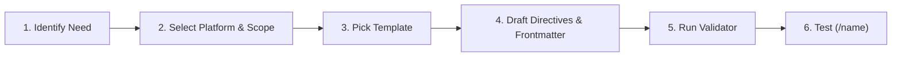

# Authoring Commands & Workflows

Commands and workflows are user- or agent-invocable prompt artifacts (`/name`) that provide **explicit, directive instructions on what actions an AI agent must take**.

- **Command**: A parameterized, single-turn instruction template (`/name [args]`).
- **Workflow**: A multi-step structured procedure (sequential checkpoints or scripted subagent fan-outs).

---

## 1. Choosing the Artifact

| Need | Right Artifact | Skill to Consult |
|---|---|---|
| Reusable prompt directive with parameters | **Command** | `ai-authoring-commands` (this skill) |
| Multi-step procedure with checkpoints or JS orchestration | **Workflow** | `ai-authoring-commands` (this skill) |
| Prompt bodies, personas, orchestration patterns & Mermaid.js | **Prompt Pattern** | `ai-authoring-prompts` |
| Knowledge/runbook loaded dynamically on demand | **Skill** | `ai-authoring-skills` |
| Persistent background context (always-on or path-scoped) | **Rule** | `ai-authoring-rules` |
| Delegated execution in isolated context & permissions | **Subagent** | `ai-authoring-agents` |
| Deterministic lifecycle gate, command blocker, or auto-formatter | **Hook** | `ai-authoring-hooks` |

---

## 2. Platform Discovery & Location Matrix

Write against the target platform directory; subfolders automatically namespace commands where supported.

| Platform | Workspace / Project Scope | Personal / Global Scope | Invocation |
|---|---|---|---|
| **Claude Code** | `<root>/.claude/commands/<name>.md`<br>`<root>/.claude/workflows/<name>.js` | `~/.claude/commands/<name>.md`<br>`~/.claude/workflows/<name>.js` | `/<name>`<br>`/workflows` |
| **Google Antigravity** | `<root>/.agents/workflows/<name>.md`<br>`<root>/.agents/commands/<name>.md` | `~/.gemini/antigravity/global_workflows/<name>.md`<br>`~/.gemini/config/workflows/<name>.md` | `/<name>` |
| **OpenCode** | `<root>/.opencode/commands/<name>.md`<br>`opencode.json` (`command` map) | `~/.config/opencode/commands/<name>.md` | `/<name>` |
| **VS Code / Copilot** | `<root>/.github/prompts/<name>.prompt.md`<br>`<root>/.vscode/prompts/<name>.prompt.md` | `~/.config/Code/User/prompts/<name>.prompt.md` | `/<name>` |
| **Cursor** | `<root>/.cursor/commands/<name>.md`<br>`plugin.json` (`commands` path) | `~/.cursor/commands/<name>.md` | `/<name>` |
| **OpenAI Codex** | `<root>/.codex/prompts/<name>.md` | `~/.codex/prompts/<name>.md` | `/<name>` |
| **Nous Hermes** | `skills/<name>/SKILL.md` | `~/.hermes/skills/<name>/SKILL.md` | `/<skill-name>` |
| **Gemini CLI** | `<root>/.gemini/commands/<name>.toml` | `~/.gemini/commands/<name>.toml` | `/<name>` |

---

## 3. Frontmatter Configuration Superset

Every platform reads YAML frontmatter between `---` fences. Build from this superset schema:

```yaml
---
description: string                 # Single-line summary shown in command autocomplete picker
argument-hint: string               # Autocomplete usage hint (e.g. "[pr-number] [--strict]")
allowed-tools: string[]             # Whitelist of allowed tool names
model: string                       # Model override (e.g. sonnet, gpt-4o, gemini-3.5-pro)
subtask: boolean                    # Isolate execution in a child subagent thread
agent: string                       # Target agent profile for command execution
---
```

### Platform-Specific Frontmatter References

Consult the dedicated platform reference before authoring platform-specific features:

| Platform | Reference File | Key Platform Capabilities |
|---|---|---|
| **Google Antigravity** | `references/platforms/antigravity.md` | `capabilities.allowed_tools`, `allowed_bash_commands`, `max_turns`, 12k char cap |
| **Claude Code** | `references/platforms/claude-code.md` | `context: fork`, `effort`, `disable-model-invocation`, scripted JS `agent()` / `pipeline()` |
| **VS Code / Copilot** | `references/platforms/copilot-vscode.md` | `${input:var:placeholder}`, `${selection}`, `${file}`, `handoffs: []` |
| **OpenCode** | `references/platforms/opencode.md` | `agent:`, `subtask: true`, greedy positional parameters, `opencode.json` |
| **Cursor** | `references/platforms/cursor.md` | `user-invocable: false`, `@Codebase`, `@Git`, `@Terminal`, plugin variables `${VAR}` |
| **OpenAI Codex** | `references/platforms/codex.md` | `$ARGUMENTS`, `$UPPERCASE_NAME`, `allowed-tools` |
| **Nous Hermes** | `references/platforms/hermes.md` | `metadata.hermes.blueprint` (`schedule`, `deliver`), slot-filling, `${HERMES_SKILL_DIR}` |
| **Gemini CLI** | `references/platforms/gemini-cli.md` | TOML format (`description`, `prompt`), `{{args}}` |

Up-to-date sources:
- [Google Antigravity Workflows](https://antigravity.google/docs/ide/workflows/#workflows)
- [Claude Code Workflows](https://code.claude.com/docs/en/workflows) & [Commands](https://code.claude.com/docs/en/commands)
- [VS Code / Copilot Prompt Files](https://code.visualstudio.com/docs/agent-customization/prompt-files)
- [OpenCode Commands](https://opencode.ai/docs/commands/)
- [Cursor Plugin Component Discovery](https://cursor.com/docs/reference/plugins#cursor-plugin-component-discovery)
- [OpenAI Codex & ChatGPT Skills / Prompts](https://learn.chatgpt.com/docs/build-skills)
- [Nous Hermes Agent Skills & Blueprints](https://hermes-agent.nousresearch.com/docs/developer-guide/creating-skills)
- [Gemini CLI](https://antigravity.google/docs/cli)

---

## 4. Parameter & Context Interpolation Standard

### Parameter Placeholders

- **Full Arguments String (`$ARGUMENTS` or `{{args}}`)**: Injects all arguments passed after the command name.
- **Positional Arguments (`$1`, `$2`, ..., `$n`)**: Whitespace-delimited arguments by index.
  - *OpenCode Rule*: The highest-numbered positional placeholder greedily consumes its position and all subsequent arguments.
  - Default fallbacks: Use `${1:-default_value}` where supported.
- **Interactive Inputs (`${input:variableName:placeholder}`)**: On VS Code / Copilot, triggers an input box if missing.

### Dynamic Context Injection

- **Pre-Execution Shell Injections (`` !`command` `` or `!<cmd>`)**:
  - Runs a shell command locally *before* prompt rendering; embeds `stdout` directly into prompt context.
  - **Rule**: Shell commands MUST be strictly read-only inspection commands (e.g. `` !`git diff --staged` ``, `` !`npm test` ``).
- **File Inclusions (`@path` / `@file`)**:
  - Automatically reads and embeds target file or directory tree contents into prompt context.

---

## 5. Command Prompt Body & Cognitive Architecture

The markdown body following the frontmatter defines the command or workflow instructions executed by the agent.

> **Note**: For composing prompt bodies, directive phrasing, approval checkpoints, negative constraints, and output contracts, load and apply `ai-authoring-prompts`.

When authoring command bodies, apply the cognitive patterns from `ai-authoring-prompts`:

1. **Directive Phrasing & RFC 2119 Directives**: Use direct, imperative commands (`Run`, `Verify`, `Refactor`) and explicit `MUST` / `MUST NOT` constraints rather than conversational hedges (`modern-prompt-principles.md`).
2. **Sequential Topologies & Phase Gates**: Multi-step workflows should follow the Sequential Pipeline topology and SOP Task Runner archetype from `ai-authoring-prompts` with explicit `- [ ]` checklists and phase transition criteria.
3. **Human Approval Gates (`[P3.2]`)**: Insert explicit stopping checkpoints before destructive actions (file overwrites, git pushes, migrations):
   ```markdown
   ## ⚠️ CHECKPOINT: User Approval Gate
   - **STOP & PROMPT**: Present plan and request explicit user confirmation before executing changes.
   ```
4. **Negative Constraints (`[P3.1]`)**: Pre-empt common shortcut rationalizations (e.g. *"Do NOT perform unrequested refactorings outside of `$1`"*).
5. **Structured Output Contracts (`[P5.1]`–`[P5.4]`)**: Define machine-verifiable return formats (markdown tables, diff blocks, or checklist logs).

---

## 6. Starter Templates

Select the closest template from `templates/` when authoring a new command or workflow:

| Pattern | Template Path | Best For |
|---|---|---|
| **Review Checklist** | `templates/review-checklist.md` | Rigorous git/PR review with diff injection & severity report |
| **Parameterized Directive** | `templates/parameterized-directive.md` | Multi-argument scaffolding, refactoring, or code generation |
| **Isolated Subtask** | `templates/isolated-subtask.md` | Deep audits and research running in a child subagent context |
| **Sequential Workflow** | `templates/sequential-workflow.md` | Multi-phase procedures with human approval checkpoints |
| **Scripted Workflow** | `templates/scripted-workflow.js` | Claude Code JavaScript workflows with subagent fan-out & schemas |


---

## 7. Authoring Workflow



1. **Identify Need**: Confirm the task is an actionable directive (command) or multi-step procedure (workflow), rather than a skill or rule.
2. **Select Target Platform & Scope**: Determine workspace (`.agents/workflows/`, `.claude/commands/`, `.github/prompts/`, `.opencode/commands/`) vs user scope.
3. **Pick Starter Template**: Copy the closest template from `templates/`.
4. **Draft Directives & Frontmatter**:
   - Write a concise `description` and descriptive `argument-hint`.
   - Embed dynamic context (`` !`git diff` ``, `@file`).
   - Define ordered steps with `- [ ]` checkboxes and explicit verification gates.
5. **Validate**:
   - Verify frontmatter syntax.
   - Run the skill validator: `python3 dot_agents/skills/ai-authoring-skills/scripts/validate.py dot_agents/skills/ai-authoring-commands`.
6. **Test Invocation**: Run `/<name>` in the target environment and verify parameter substitution and prompt execution.

---

## 8. Validation Checklist

- [ ] File location and extension match target platform discovery paths.
- [ ] Frontmatter YAML parses cleanly and includes `description` and `argument-hint`.
- [ ] All parameter placeholders (`$ARGUMENTS`, `$1..$n`, `${input:...}`) match expected user inputs.
- [ ] Pre-execution shell commands (`` !`cmd` ``) are read-only and safe.
- [ ] Destructive actions contain explicit user approval gates.
- [ ] Output format is clearly defined with markdown headers, tables, or checklists.
