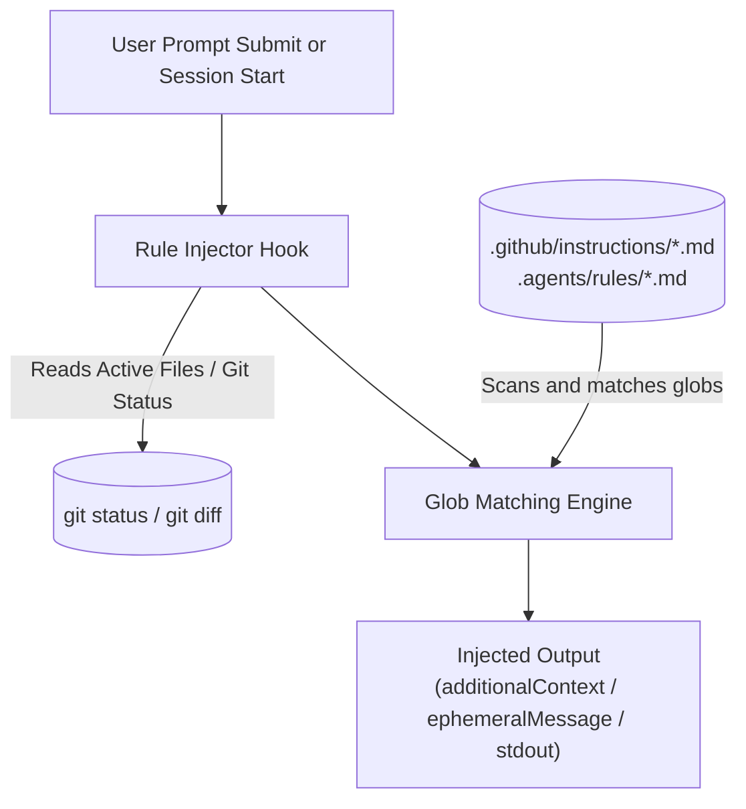
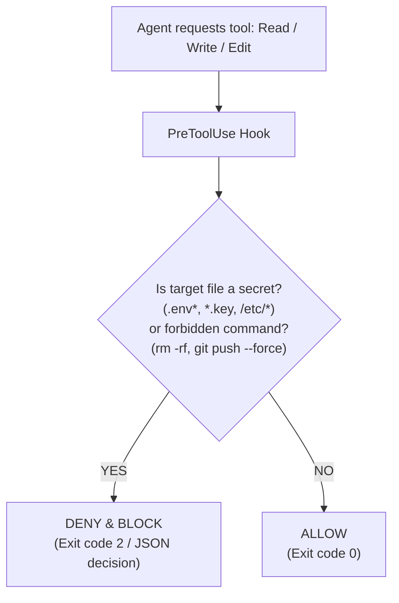

# Simulating Dynamic & Path-Scoped Rules with Hooks

## The Challenge

Different AI agent platforms have varying levels of native support for **Rules**:

| Platform | Native Path-Scoped Rules? | Native Always-On Rules? | Dynamic Triggers? |
|---|---|---|---|
| **GitHub Copilot / VS Code** | Yes (`.github/instructions/*.instructions.md` with `applyTo:`) | Yes (`copilot-instructions.md`, `AGENTS.md`) | Path-based |
| **Cursor** | Yes (`.cursor/rules/*.mdc` with `globs:`) | Yes (`alwaysApply: true`) | Path & Model Decision |
| **Google Antigravity** | Yes (`.agents/rules/*.md` with Glob) | Yes (Always On) | Path & Model Decision |
| **Claude Code** | Yes (`.claude/rules/*.md` with `paths:`) | Yes (`CLAUDE.md`) | Path-based |
| **OpenCode** | Partial (static `instructions:` array in `opencode.json`) | Yes (`AGENTS.md`) | No dynamic runtime path scoping |
| **ChatGPT / Codex** | No native glob scoping | Yes (`AGENTS.md`, `AGENTS.override.md`) | No dynamic path scoping |
| **Hermes Agent** | No native glob scoping | Yes (`AGENTS.md`) | No dynamic path scoping |

When using platforms like Codex, OpenCode, or Hermes, projects often need:
1. Rules that only apply when specific files (e.g. `*.ts`, `src/database/**`) are touched.
2. Hard boundaries that cannot be bypassed by model hallucinations.
3. Turn-specific reminders based on recent git changes.

**Lifecycle hooks provide the universal mechanism to simulate and enforce rules across all platforms.**

---

## Pattern 1: Soft Context Injection (Dynamic Rule Matching)

This pattern dynamically evaluates rule globs at prompt or turn initialization and injects matching rule markdown directly into the model's context window.



### Implementation Recipe (Cross-Platform Bash Script)

Place this script at `scripts/rule-injector.sh`:

```bash
#!/usr/bin/env bash
set -euo pipefail

# Find files modified, staged, or untracked in current git worktree
CHANGED_FILES=$(git status --porcelain 2>/dev/null | awk '{print $2}' || true)

# If no changes yet, check recently modified files
if [ -z "$CHANGED_FILES" ]; then
  CHANGED_FILES=$(git log -n 1 --name-only --pretty=format: 2>/dev/null || true)
fi

INJECTED_RULES=""

# Scan rule directories (Copilot instructions or Antigravity rules)
RULE_DIRS=(".github/instructions" ".agents/rules" ".claude/rules")

for DIR in "${RULE_DIRS[@]}"; do
  [ -d "$DIR" ] || continue
  for RULE_FILE in "$DIR"/*.{md,instructions.md,mdc}; do
    [ -f "$RULE_FILE" ] || continue

    # Extract applyTo / globs / paths from YAML frontmatter
    GLOBS=$(awk '/^---$/{c++;next} c==1{if($1 ~ /^(applyTo|globs|paths):/) {sub(/^[^:]*:[[:space:]]*/, ""); print}}' "$RULE_FILE" | tr -d '"' | tr ',' ' ')

    if [ -n "$GLOBS" ]; then
      MATCHED=0
      for GLOB in $GLOBS; do
        for FILE in $CHANGED_FILES; do
          # shellcheck disable=SC2053
          if [[ "$FILE" == $GLOB ]]; then
            MATCHED=1
            break 2
          fi
        done
      done
      if [ "$MATCHED" -eq 1 ]; then
        CONTENT=$(awk '/^---$/{c++;next} c>=2' "$RULE_FILE")
        INJECTED_RULES="${INJECTED_RULES}\n\n[RULE: $(basename "$RULE_FILE")]\n${CONTENT}"
      fi
    fi
  done
done

# Output formatted JSON for the platform
if [ -n "$INJECTED_RULES" ]; then
  # Format for Claude Code / VS Code additionalContext
  jq -n --arg ctx "$INJECTED_RULES" '{
    hookSpecificOutput: {
      additionalContext: ("Active Path Rules:\n" + $ctx)
    }
  }'
else
  echo '{}'
fi
```

### Wiring by Platform

- **Claude Code**: Attach to `UserPromptSubmit` in `.claude/settings.json`.
- **VS Code / Copilot**: Attach to `SessionStart` in `.github/hooks/rules.json`.
- **Google Antigravity**: Attach to `PreInvocation` in `.agents/hooks.json` (outputting `injectSteps: [{ "ephemeralMessage": ... }]`).
- **Codex**: Attach to `UserPromptSubmit` in `.codex/hooks.json`.

---

## Pattern 2: Hard Deterministic Guardrails (Tool Interception)

Prompt rules can fail if the model overlooks instructions. A `PreToolUse` or `tool.execute.before` hook guarantees hard deterministic enforcement.

### Example: Protecting Secrets & Sensitive Files



### Implementation in OpenCode (`.opencode/plugins/security-guard.ts`)

```typescript
import { type Plugin } from "@opencode-ai/plugin"

export const SecurityGuardPlugin: Plugin = async () => {
  const PROTECTED_PATTERNS = [/\.env/, /\.pem$/, /id_rsa/, /credentials\.json/]

  return {
    "tool.execute.before": async (input, output) => {
      // 1. Guard file reads and writes
      const targetPath = output.args.filePath || output.args.path || ""
      if (PROTECTED_PATTERNS.some((pattern) => pattern.test(targetPath))) {
        throw new Error(`SECURITY POLICY VIOLATION: Access to protected path '${targetPath}' is denied.`)
      }

      // 2. Guard destructive shell execution
      if (input.tool === "bash" || input.tool === "execute_command") {
        const cmd = output.args.command || ""
        if (/rm\s+-rf\s+[/~]/i.test(cmd) || /git\s+push\s+.*--force/i.test(cmd)) {
          throw new Error(`CRITICAL GUARD: Destructive shell command '${cmd}' was blocked.`)
        }
      }
    }
  }
}
```

### Implementation in Claude / VS Code (`.github/hooks/security.json`)

```json
{
  "hooks": {
    "PreToolUse": [
      {
        "matcher": "Bash|Edit|Write|runTerminalCommand",
        "hooks": [
          {
            "type": "command",
            "command": "./scripts/guard-tool-use.sh",
            "timeout": 5
          }
        ]
      }
    ]
  }
}
```

---

## Summary of Rule Simulation Strategies

| Strategy | When to Choose | Recommended Hook Event | Failure Mode |
|---|---|---|---|
| **Soft Rule Simulation** | Informational guidelines, code style, conventions | `UserPromptSubmit`, `SessionStart`, `PreInvocation` | Non-blocking (model sees rule in context) |
| **Hard Guardrail Simulation** | Security policies, forbidden files, branch protection | `PreToolUse`, `tool.execute.before`, `pre_tool_call` | Hard blocking (tool fails immediately with error) |
| **Verification Gate** | Enforcing test passing before completion | `Stop`, `session.idle` | Re-enters agent loop until verified |
