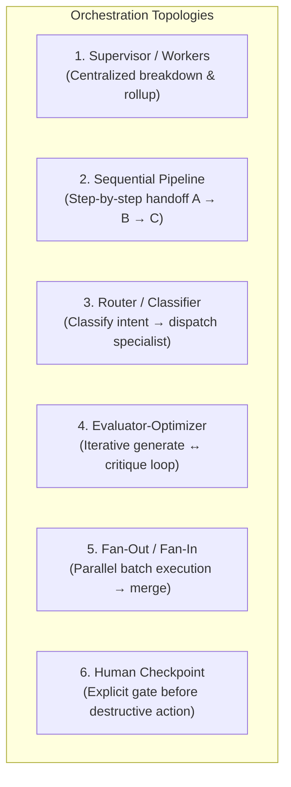
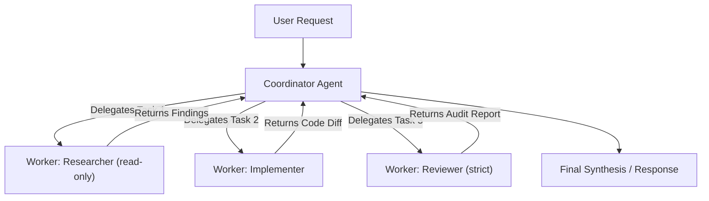
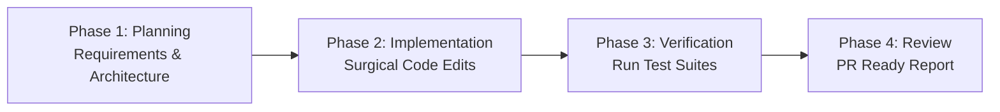
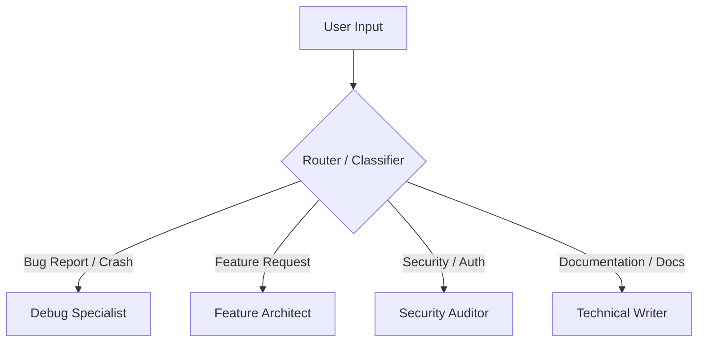
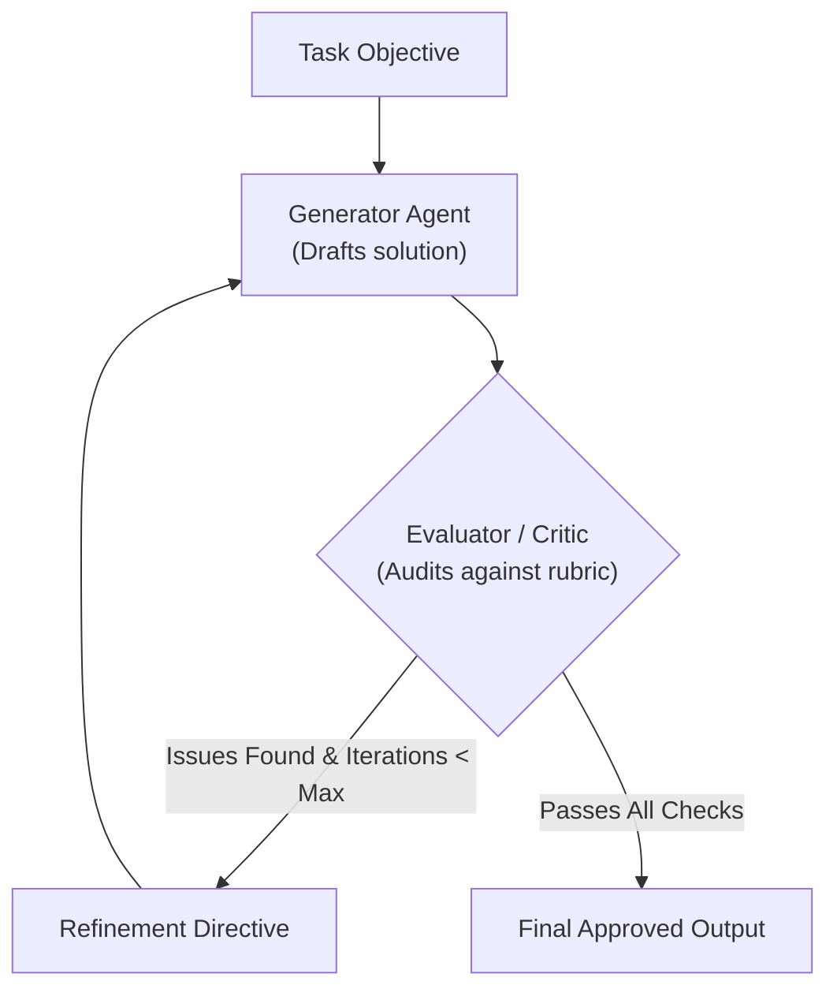
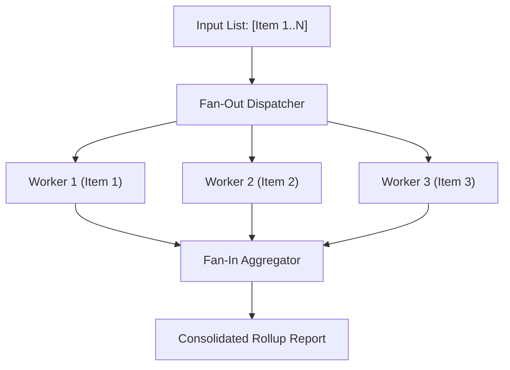
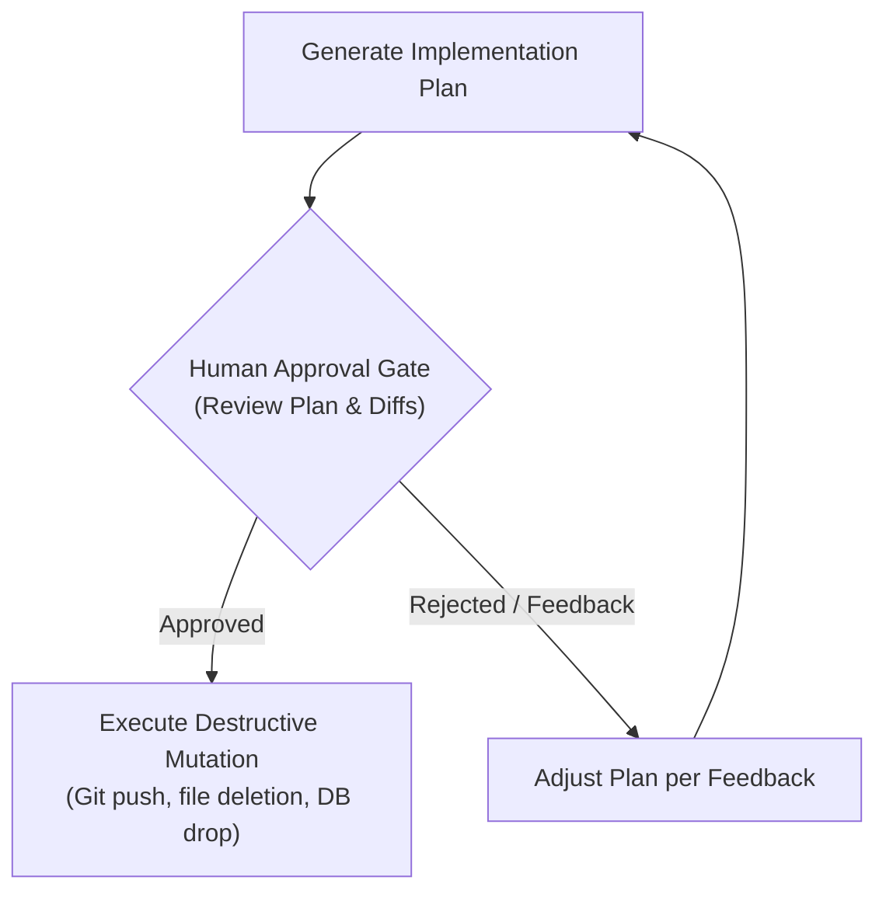

# Orchestration Topologies & Multi-Agent Coordination

Architectural patterns for orchestrating single-agent, multi-agent, and human-in-the-loop workflows across AI artifacts.

---

## 1. Topologies Overview

---

## 2. Detailed Topology Patterns

### Pattern 1: Supervisor / Coordinator-Workers

A central coordinator decomposes a complex goal into discrete tasks, delegates them to specialized workers (subagents or tool calls), and synthesizes the outputs into a coherent final result.

- **Best For**: End-to-end features, full-stack migrations, complex refactors.
- **Key Directive**: The coordinator maintains high-level state and never performs high-noise exploration itself. Workers return structured summaries.
- **Context Isolation Rule**: Each worker prompt MUST be context-complete (file paths, constraints, expected output format) because subagents do not inherit coordinator chat history.

---

### Pattern 2: Sequential Pipeline

Linear multi-stage process where the output of phase $N$ becomes the input context for phase $N+1$.

- **Best For**: Strict CI/CD lifecycles, release workflows, ticket resolution pipelines.
- **Key Directive**: Define clear exit gates between each phase. A phase MUST NOT start until the previous phase passes verification.

---

### Pattern 3: Router / Intent Classifier

A lightweight classification step inspects the input query and routes it to the optimal specialized persona or skill.

- **Best For**: Triage agents, customer support bots, multi-domain developer CLIs.
- **Key Directive**: Keep the classifier prompt zero-shot and lightweight. Return a typed category identifier.

---

### Pattern 4: Evaluator-Optimizer (Critic-Refiner)

An iterative loop where a Generator produces candidate content, an Evaluator critiques it against strict rubrics, and the Generator refines it until quality thresholds are satisfied.

- **Best For**: High-stakes code generation, security audits, technical document authoring.
- **Key Directive**: Cap iterations (e.g. max 2–3 loops) to prevent infinite refinement cycles.

---

### Pattern 5: Fan-Out / Fan-In (Parallel Map-Reduce)

Concurrently dispatching identical or partitioned tasks across multiple isolated workers, followed by an aggregation step.

- **Best For**: Linting across 50 repositories, surveying large directories, benchmark evaluation suites.
- **Key Directive**: Workers must output token-efficient structured JSON or markdown rows so the aggregator can easily reduce the dataset.

---

### Pattern 6: Human-in-the-Loop Checkpoint Gate

A guardrail pattern that pauses execution before destructive, state-mutating, or high-risk operations to request explicit human approval.

- **Best For**: Database migrations, live deployments, git rebase/push operations, deleting files.
- **Key Directive**: Clearly state: `**STOP & PROMPT**: Present plan and request explicit user confirmation before proceeding.`
