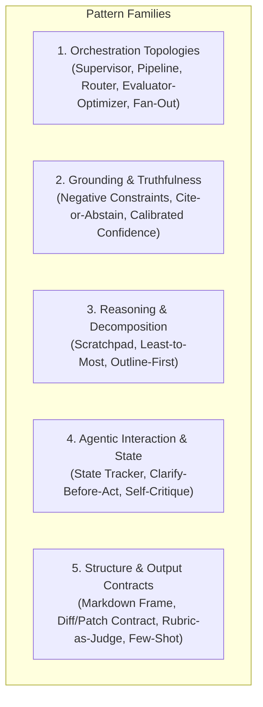
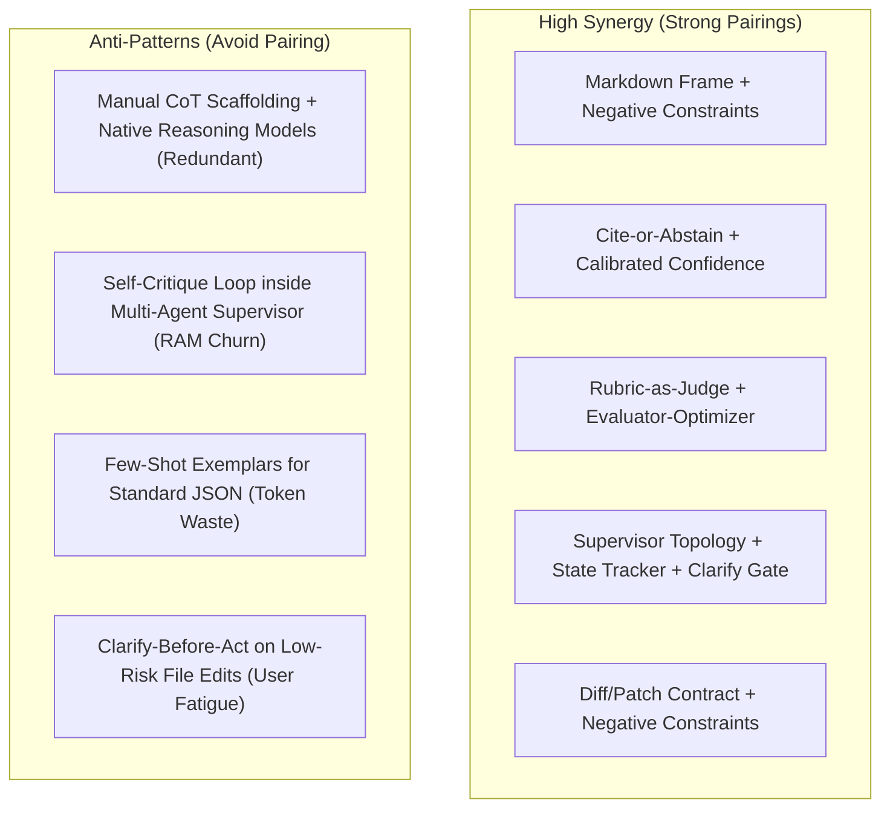
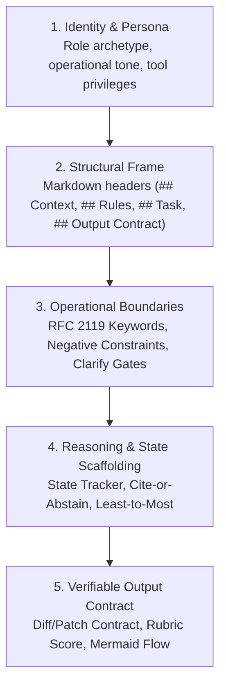
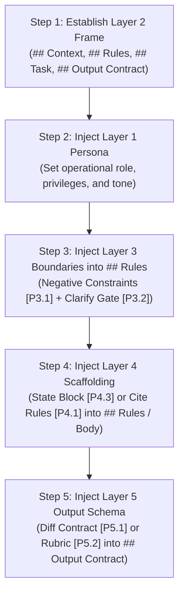
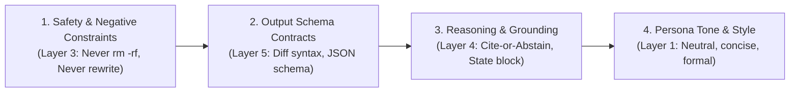

# Master Pattern Catalog, Decision Matrices & Composition Rules

Comprehensive catalog of prompt patterns, decision matrices, compatibility graphs, slot-filling assembly mechanics, and conflict resolution rules for authoring robust AI artifacts.

---

## 1. Master Decision Matrix (Selection by Symptom)

| Operational Need / Observed Symptom | Primary Pattern | Companion Pattern | Target Template / Library Card |
|---|---|---|---|
| **Surgical code generation or refactoring** | Diff/Patch Contract | Structured Markdown Frame, Negative Constraints | `templates/archetype-surgical-implementer.md` |
| **Strict security, PR, or fact audit** | Cite-or-Abstain | Calibrated Confidence, Rubric-as-Judge | `templates/archetype-fact-based-auditor.md` |
| **Multi-agent decomposition & rollup** | Supervisor Topology | State Tracker, Clarify-Before-Act | `templates/archetype-autonomous-supervisor.md` |
| **Deterministic ordered runbook / procedure** | SOP Checklist | Least-to-Most, Negative Constraints | `templates/archetype-sop-task-runner.md` |
| **Ambiguous or underspecified user request** | Clarify-Before-Act | Calibrated Confidence, State Tracker | `templates/pattern-library.md` (`[P3.2]`) |
| **Single-turn quality boost without subagents** | Self-Critique-Refine | Rubric-as-Judge | `templates/pattern-library.md` (`[P4.6]`) |
| **Multi-turn state loss or context compaction** | State Tracker | Plan-and-Execute, Clarify-Before-Act | `templates/pattern-library.md` (`[P4.3]`) |
| **Over-confident fabrication or hallucinations** | Calibrated Confidence | Cite-or-Abstain | `templates/pattern-library.md` (`[P4.2]`) |
| **Context-bound Q&A / extraction** | Cite-or-Abstain | Structured Markdown Frame, Calibrated Confidence | `templates/pattern-library.md` (`[P4.1]`) |
| **Model rationalizes shortcuts or scope creep** | Negative Constraints | RFC 2119 Directives | `templates/pattern-library.md` (`[P3.1]`) |
| **Auditable evidence required before verdict** | Structured Scratchpad | Rubric-as-Judge, Cite-or-Abstain | `templates/pattern-library.md` (`[P4.4]`) |
| **Multi-step problem below subagent complexity** | Least-to-Most | Structured Markdown Frame | `templates/pattern-library.md` (`[P4.5]`) |
| **Long-form document / architecture plan** | Outline-First | Plan-and-Execute | `templates/pattern-library.md` (`[P2.2]`) |
| **Untrusted data, prompt injection, mixed inputs** | Structured Markdown Frame | Few-Shot Exemplars | `templates/pattern-library.md` (`[P2.1]`) |
| **Non-standard custom DSL syntax or regex** | Few-Shot Exemplars | Structured Markdown Frame | `templates/pattern-library.md` (`[P5.3]`) |
| **Subjective quality grading or evaluation** | Rubric-as-Judge | Structured Scratchpad | `templates/pattern-library.md` (`[P5.2]`) |
| **Visual architecture, decision trees, lifecycles** | Mermaid.js Standard | Flowchart, Sequence, State Diagram | `@references/visual-diagrams.md` |

---

## 2. Pattern Families & Operational Boundaries

### Family 1: Grounding & Truthfulness
- **Negative Constraints (`[P3.1]`)**: Pre-empt predictable shortcuts and anti-patterns with RFC 2119 keywords before the model rationalizes them.
  - *When to Use*: Every prompt where common LLM failure modes occur (e.g. unrequested refactoring, hallucinating helper functions, deleting comments).
  - *When NOT to Use*: Generic advice ("be careful"). Must specify exact forbidden actions and replacements.
- **Cite-or-Abstain (`[P4.1]`)**: Answer only from supplied context; require verbatim quotes; explicitly abstain on gaps.
  - *When to Use*: Compliance audits, legal/policy reviews, document extraction.
  - *When NOT to Use*: Creative brainstorming or general knowledge Q&A.
- **Calibrated Confidence (`[P4.2]`)**: Require explicit confidence ratings (HIGH / MEDIUM / LOW) and structured assumptions when evidence is incomplete.
  - *When to Use*: Triage reviews, architecture trade-offs, exploratory audits.
  - *When NOT to Use*: Deterministic tasks (e.g. linter or test suite execution).

### Family 2: Reasoning & Decomposition
- **Structured Scratchpad (`[P4.4]`)**: Enforce auditable evidence collection before emitting final verdicts or diffs.
  - *When to Use*: Security audits, PR reviews, scoring models without native thinking.
  - *When NOT to Use*: Models with native reasoning tokens (Claude 3.7 Thinking, o1/o3) on standard coding tasks.
- **Least-to-Most Decomposition (`[P4.5]`)**: Break problems into ordered sub-problems where step $N$ builds on step $N-1$.
  - *When to Use*: Algorithmic refactoring, complex mathematical transforms.
  - *When NOT to Use*: Independent subtasks that can be executed in parallel (use Fan-Out/Fan-In).
- **Outline-First (`[P2.2]`)**: Generate and lock high-level structure before fleshing out content.
  - *When to Use*: Long-form technical documentation, architecture specs (>500 lines).
  - *When NOT to Use*: Short code patches or single-file edits.

### Family 3: Agentic Interaction & State
- **State Tracker (`[P4.3]`)**: Maintain a structured state block (Current Phase, Decisions Made, Next Step) rewritten every turn.
  - *When to Use*: Autonomous executions lasting >3 turns or vulnerable to context compaction.
  - *When NOT to Use*: Single-turn questions or short 1-turn interactions.
- **Clarify-Before-Act (`[P3.2]`)**: Pause and ask bounded clarifying questions when input is ambiguous.
  - *When to Use*: High-risk, irreversible operations where assumptions cause data loss.
  - *When NOT to Use*: Low-cost, reversible edits (state assumption and proceed).
- **Self-Critique-Refine (`[P4.6]`)**: Single-turn generator-critic pass before emitting output.
  - *When to Use*: Single-response environments where no second agent can be spawned.
  - *When NOT to Use*: Multi-agent setups with dedicated reviewer subagents; multiple loops in one turn.

### Family 4: Structure & Output Contracts
- **Structured Markdown Frame (`[P2.1]`)**: Use clear Markdown headers (`## Context`, `## Rules`, `## Task`, `## Output Contract`) to separate instructions from data.
  - *When to Use*: All prompt bodies to organize requirements, context, and expected schemas.
  - *When NOT to Use*: Monolithic unstructured blobs of prose.
- **Diff/Patch Contract (`[P5.1]`)**: Require machine-applicable unified diffs or replacement chunks.
  - *When to Use*: Code generation, refactoring, and automated patch agents.
  - *When NOT to Use*: Pure advisory reviews or documentation analysis.
- **Few-Shot Exemplars (`[P5.3]`)**: Provide 1–2 canonical input/output examples.
  - *When to Use*: Non-standard DSLs, fragile regex, custom AST formats.
  - *When NOT to Use*: Standard JSON/Markdown formats (schema constraints are token-cheaper).
- **Rubric-as-Judge (`[P5.2]`)**: Anchor evaluations to explicit 1–5 or Pass/Fail criteria with concrete evidence requirements.
  - *When to Use*: Code review bots, test quality audits, automated grading.
  - *When NOT to Use*: Binary deterministic checks handled by linters.

---

## 3. Pattern Compatibility & Conflict Graph

---

## 4. Full-Stack Pattern Composition Architecture

In production AI systems, a robust prompt is assembled by layering patterns into a cohesive cognitive hierarchy:

### Canonical Starter Archetypes
1. **The Surgical Implementer**: Layer 1 (`[P1.1]`) + Layer 2 (`[P2.1]`) + Layer 3 (`[P3.1]`) + Layer 5 (`[P5.1]`) &rarr; `templates/archetype-surgical-implementer.md`
2. **The Fact-Based Auditor**: Layer 1 (`[P1.2]`) + Layer 2 (`[P2.1]`) + Layer 3 (`[P3.3]`) + Layer 4 (`[P4.1]`, `[P4.2]`) + Layer 5 (`[P5.2]`) &rarr; `templates/archetype-fact-based-auditor.md`
3. **The Autonomous Supervisor**: Layer 1 (`[P1.3]`) + Layer 2 (`[P2.1]`) + Layer 3 (`[P3.2]`) + Layer 4 (`[P4.3]`) + Layer 5 (`[P5.4]`) &rarr; `templates/archetype-autonomous-supervisor.md`
4. **The Strict SOP Task Runner**: Layer 1 (`[P1.4]`) + Layer 2 (`[P2.1]`) + Layer 3 (`[P3.3]`) + Layer 4 (`[P4.5]`) + Layer 5 (`[P5.4]`) &rarr; `templates/archetype-sop-task-runner.md`

---

## 5. Slot-Filling Dynamic Assembly Algorithm

When composing custom prompts outside the 4 canonical archetypes, use this deterministic 5-step assembly algorithm to populate the Layer 2 Structural Frame (`[P2.1]`):

### Insertion Slot Map

| Target Slot in Layer 2 Frame | Injected Patterns | Purpose |
|---|---|---|
| **`# {{ROLE_HEADER}}`** | Layer 1 (`[P1.1]`–`[P1.4]`) | Declares identity, domain scope, and operational bounds |
| **`## Context`** | Runtime Data / Workspace Info | Supplies static facts, tech stack, and file paths |
| **`## Rules`** | Layer 3 (`[P3.1]`–`[P3.3]`) + Layer 4 (`[P4.1]`–`[P4.3]`) | Houses MUST/MUST NOT directives, citation rules, and ambiguity gates |
| **`## Task`** | Objective Description | Declares the specific runtime goal or user request |
| **`## Output Contract`** | Layer 5 (`[P5.1]`–`[P5.4]`) | Defines strict return schemas, diffs, tables, or exit verifications |

---

## 6. Precedence & Conflict Resolution Rules

When multiple pattern clauses are fused into a single prompt body, resolve directive conflicts in this strict order:

1. **Safety & Negative Constraints (Layer 3) supersede all other instructions**: An output format request or persona suggestion never authorizes violating a negative constraint.
2. **Output Schema Contracts (Layer 5) supersede freeform explanations**: When an output contract is specified, the agent MUST emit strictly the structured payload without conversational preamble.
3. **Grounding & Citation Directives (Layer 4) supersede speculative completions**: If evidence is missing, the agent MUST trigger the escape hatch or abstain rather than completing the schema with fabricated data.
4. **Persona Tone (Layer 1) provides baseline posture**: Governs phrasing and conciseness, but yields to specific task directives.
