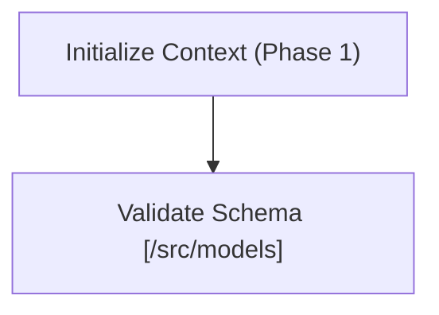
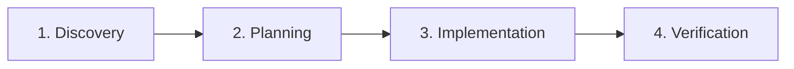
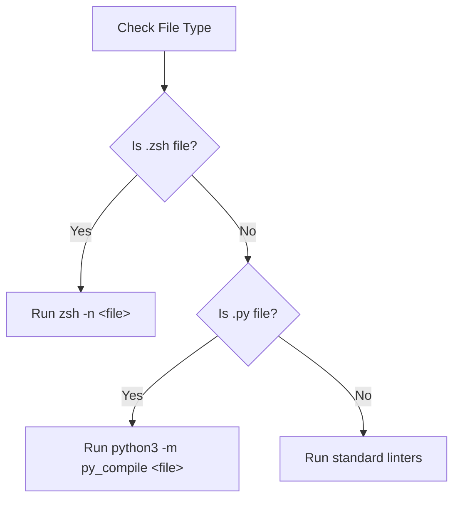
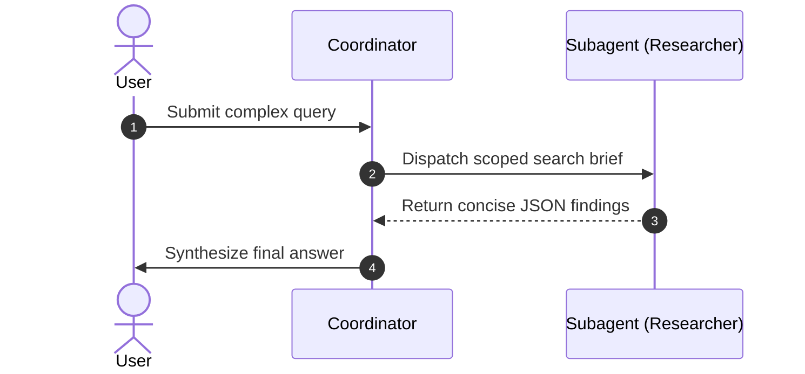
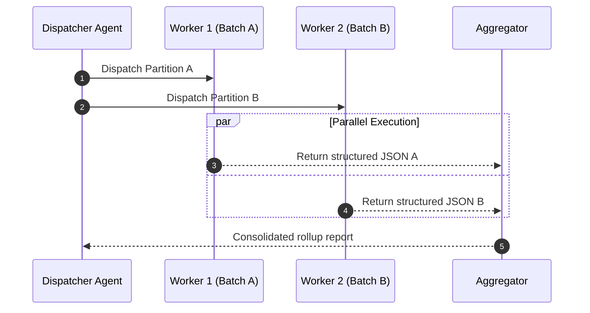
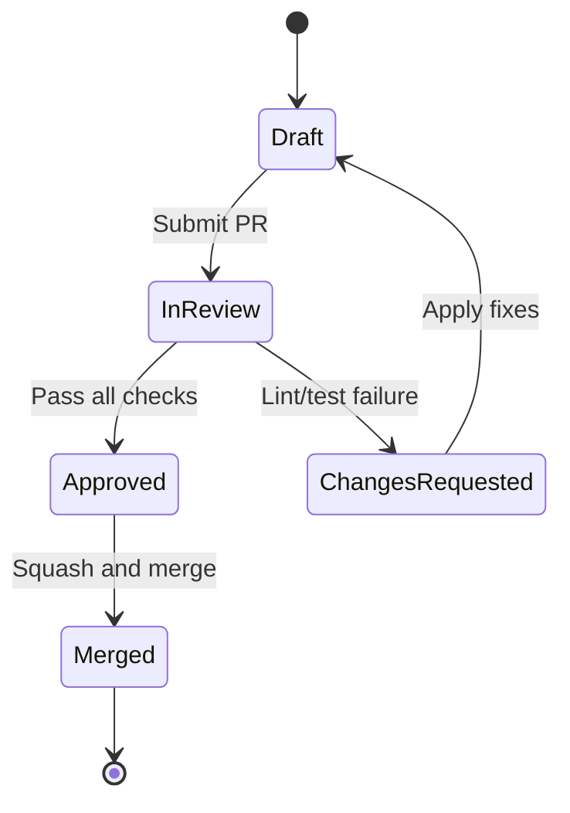
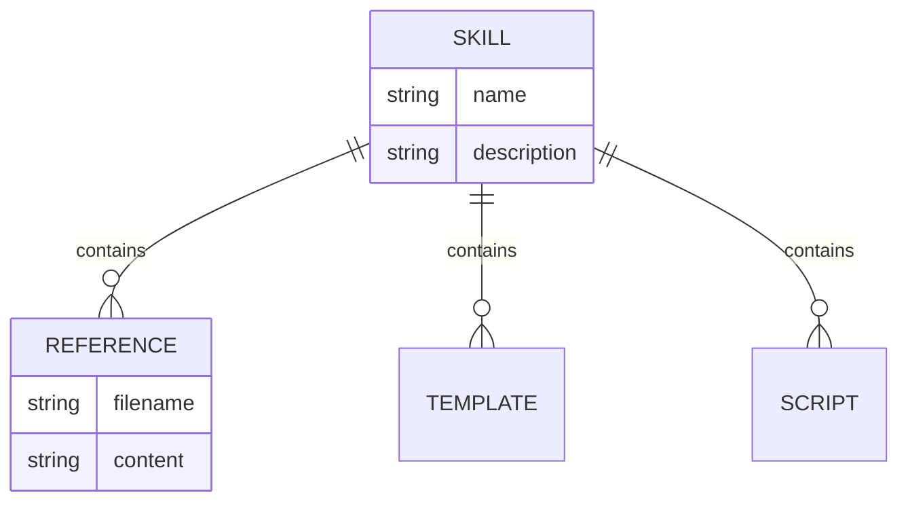

# Visual Diagrams & Mermaid.js Standard

Rules, standards, and copy-paste templates for representing architectures, workflows, state progressions, and decision logic using Mermaid.js.

---

## 1. The Mandatory Mermaid.js Rule

> [!IMPORTANT]
> **NEVER use ASCII art, box-drawing characters (`┌─┐`, `│ │`), or text arrows (`──►`, `-->`) in prompts or documentation.**
> **ALWAYS use native Mermaid.js code blocks (`mermaid`) for visual representations.**

### Why Mermaid.js Beats ASCII Art
1. **Visual Rendering**: Renders natively into rich interactive diagrams in modern markdown viewers (GitHub, IDEs, Claude, Cursor, Antigravity).
2. **Deterministic Syntax**: Eliminates misalignment caused by variable-width fonts or markdown auto-formatting.
3. **Token Efficiency**: Clean declarative syntax uses fewer tokens than sprawling ASCII boxes with space padding.
4. **Maintainability**: Modifying a step in Mermaid takes one line edit; adjusting ASCII art requires redrawing entire box matrices.

---

## 2. Standard Diagram Types & Use Cases

| Diagram Type | Keyword | Best Used For |
|---|---|---|
| **Flowchart (LR)** | `flowchart LR` | Sequential pipelines, multi-phase execution lifecycles |
| **Flowchart (TD)** | `flowchart TD` | Hierarchical systems, decision trees, supervisor-worker topologies |
| **Sequence Diagram** | `sequenceDiagram` | Multi-agent communications, API request/response flows, tool lifecycles |
| **State Diagram** | `stateDiagram-v2` | Phase progressions, approval gates, task lifecycle state transitions |
| **Entity Relationship** | `erDiagram` | Schema definitions, configuration hierarchies, data models |

---

## 3. Syntax Rules & Best Practices

### Rule A: Always Quote Node Labels with Special Characters
Node labels containing parentheses `()`, brackets `[]`, braces `{}`, quotes, or slashes MUST be wrapped in double quotes:



### Rule B: Clean Flow Direction
- Use `flowchart TD` (Top-Down) for hierarchical systems and branching decision trees.
- Use `flowchart LR` (Left-to-Right) for sequential pipelines and lifecycle stages.

### Rule C: When NOT to Use Diagrams
Do NOT add a Mermaid diagram for:
- Simple linear sequences of 2–3 trivial steps (use a numbered list instead).
- Simple key-value mappings or 2-column lookups (use a Markdown table instead).
- Trivial code one-liners (use a fenced code block).

---

## 4. Copy-Paste Starter Templates

### Sequential Pipeline (Flowchart LR)


### Decision Tree with Conditional Branches (Flowchart TD)


### Multi-Agent Coordinator Handoff (Sequence Diagram)


### Evaluator-Optimizer Critique Loop (Sequence Diagram)
```mermaid
sequenceDiagram
    autonumber
    participant Coord as Coordinator
    participant Gen as Generator
    participant Critic as Evaluator / Critic
    
    Coord->>Gen: Task requirements &amp; context
    loop Critique &amp; Refine (Max 2–3 loops)
        Gen->>Critic: Candidate draft / code patch
        Critic-->>Gen: Audit findings &amp; rubric score (Fail)
    end
    Gen->>Critic: Final refined draft
    Critic-->>Coord: Verified approved output (Pass)
```

### Fan-Out / Fan-In Parallel Map-Reduce (Sequence Diagram)


### Task Lifecycle (State Diagram)


### Configuration / Entity Schema (Entity Relationship Diagram)

