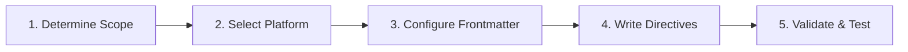

# Authoring Rules & Instructions

Create, configure, transpile, and maintain persistent AI rules and instructions across GitHub Copilot/VS Code, Cursor, Google Antigravity, Claude Code, ChatGPT/OpenAI Codex, OpenCode, and Hermes Agent.

Rules are persistent context injected into prompts — always-on, path-scoped, or model-decided. They shape agent behavior and enforce project-specific coding standards.

---

## When to Use

- The user says "create a rule", "add a rule for X", "make Cursor/Copilot/Claude always follow Y", or "update project instructions".
- Configuring frontmatter keys: `applyTo`, `globs`, `paths`, `alwaysApply`, `trigger: model_decision`, or `excludeAgent`.
- Converting or transpiling rules between platform formats (e.g. Cursor `.mdc` to Copilot `.instructions.md` or Antigravity `.agents/rules/`).
- Setting up **hook-based rule simulation** on platforms that lack native frontmatter glob engines (OpenAI Codex, OpenCode).
- Debugging why an instruction file is not being discovered or applied.
- Choosing whether a requirement belongs in a **rule**, **skill**, **command**, **subagent**, or **hook**.

---

## Decision Matrix: Choosing the Right Artifact

| Need | Artifact | Platform Mechanism | Skill to Load |
|---|---|---|---|
| Project-wide coding conventions & bootstrap commands | **Root Memory** | `AGENTS.md`, `CLAUDE.md`, `GEMINI.md` | `ai-authoring-rules` |
| Guidelines active only when editing matching files | **Path-Scoped Rule** | `applyTo:`, `globs:`, `paths:` | `ai-authoring-rules` |
| Infrequently needed domain guidance | **Model-Decision Rule** | `trigger: model_decision`, Cursor Intelligent | `ai-authoring-rules` |
| Prompt bodies, personas, orchestration patterns & Mermaid.js | **Prompt Pattern** | Universal prompt design & decision matrices | `ai-authoring-prompts` |
| Multi-step procedure or reusable tool integration | **Skill** | `SKILL.md` (Agentskills.io standard) | `ai-authoring-skills` |
| Interactive user shortcut with parameters | **Command** | Slash command (`/name`, `.prompt.md`) | `ai-authoring-commands` |
| Isolated, high-noise exploration or audited execution | **Subagent** | `<name>.agent.md` / `<name>.md` | `ai-authoring-agents` |
| Deterministic binary pass/fail guardrail or hook simulation | **Lifecycle Hook** | `hooks.json`, TypeScript plugins | `ai-authoring-hooks` |

---

## Platform Matrix

| Platform | Workspace Path | User / Global Path | File Extension | Frontmatter Dialect |
|---|---|---|---|---|
| **GitHub Copilot / VS Code** | `.github/instructions/`<br>`.github/copilot-instructions.md` | VS Code User Settings / `~/.copilot/` | `.instructions.md` | `applyTo:`, `description:`, `excludeAgent:` |
| **Cursor** | `.cursor/rules/`<br>`.cursorrules` (legacy root) | Settings > User Rules | `.mdc` *(mandatory)* | `globs:`, `description:`, `alwaysApply:` |
| **Google Antigravity** | `.agents/rules/`<br>`GEMINI.md` / `AGENTS.md` | `~/.gemini/GEMINI.md`<br>`~/.gemini/config/rules/` | `.md` | `trigger:` / `activation:`, `globs:`, `description:` |
| **Claude Code** | `.claude/rules/`<br>`CLAUDE.md` (hierarchical) | `~/.claude/CLAUDE.md`<br>`~/.claude/rules/` | `.md` | `paths:` (omitted = always on) |
| **ChatGPT / Codex** | `.codex/rules/*.rules`<br>`AGENTS.md` (repo root) | `~/.codex/rules/`<br>`~/.codex/config.toml` | `.rules`, `.md` | Policy DSL; simulated via `hooks.json` |
| **OpenCode** | `AGENTS.md` (root/dir)<br>`opencode.json` | `~/.config/opencode/AGENTS.md` | `.md`, `.json` | Multi-file `instructions: []`; plugin hooks |
| **Hermes Agent** | `AGENTS.md`, `.hermes.md`<br>`AGENTS.override.md` | `SOUL.md` (personality)<br>`~/.hermes/` | `.md` | Layered prompt hierarchy |

---

## Universal Superset Schema & Transpilation

When authoring cross-platform rules, define the rule concept using the universal schema and transpile to the target platform dialect:

```yaml
---
# Universal Conceptual Schema
name: api-error-handling
description: "RFC 7807 error formatting and status code standards for backend APIs"
scope:
  mode: glob                     # always_on | glob | model_decision | manual
  patterns:
    - "src/api/**/*.ts"
    - "src/controllers/**/*.ts"
  exclude_agents:
    - "cloud-agent"
---
```

### Dialect Mapping Table

| Universal Field | Copilot / VS Code | Cursor (`.mdc`) | Antigravity (`.md`) | Claude Code (`.md`) |
|---|---|---|---|---|
| **Globs / Patterns** | `applyTo: "src/api/**/*.ts"` | `globs: "src/api/**/*.ts"` | `globs: ["src/api/**/*.ts"]` | `paths: ["src/api/**/*.ts"]` |
| **Always Active** | `applyTo: "**"` (or root file) | `alwaysApply: true` | `trigger: always_on` | *(omit `paths` key)* |
| **Model / Intelligent** | `description: "..."` | `description: "..."` + `alwaysApply: false` | `trigger: model_decision` + `description: "..."` | *(use skill or root CLAUDE.md)* |
| **Manual / @mention** | In UI attach menu | `@rule-name` in chat | `trigger: manual` | *(reference file path)* |
| **Agent Exclusions** | `excludeAgent: "cloud-agent"` | — | — | — |

---

## Platform Reference Guides

For exhaustive syntax, configuration options, and runtime execution rules:

- [Google Antigravity Reference](@references/platforms/antigravity.md) — Documentation: <https://antigravity.google/docs/rules-workflows/#workspace-rules>
- [Cursor Reference](@references/platforms/cursor.md) — Documentation: <https://cursor.com/docs/rules>
- [GitHub Copilot & VS Code Reference](@references/platforms/copilot-vscode.md) — Documentation: <https://code.visualstudio.com/docs/agent-customization/custom-instructions>
- [Claude Code Reference](@references/platforms/claude-code.md) — Documentation: <https://docs.anthropic.com/en/docs/claude-code>
- [ChatGPT & Codex Reference](@references/platforms/codex.md) — Documentation: <https://learn.chatgpt.com/docs/agent-configuration/rules>
- [OpenCode Reference](@references/platforms/opencode.md) — Documentation: <https://opencode.ai/docs/configuration>
- [Hermes Agent Reference](@references/platforms/hermes.md) — Documentation: <https://hermes-agent.nousresearch.com/docs/>
- [Hooks & Rule Simulation Guide](@references/hooks-and-simulation.md): In-depth guide and code recipes for simulating path-scoped rules on platforms lacking native frontmatter glob engines.
- [Rule Authoring Best Practices](@references/best-practices.md): Token budgeting, negative constraints, verifiable directives, and conflict hierarchy.

---

## Rule Authoring Workflow

Follow this 5-step process when creating or updating rules:



### Step 1: Determine Scope & Mode
- Is the rule universal? -> **Always-On** / Root memory file.
- Does it apply only to specific file extensions or directories? -> **Path-Scoped** (`applyTo:` / `globs:` / `paths:`).
- Is it a specialized domain task referenced only occasionally? -> **Model Decision** / Skill.

### Step 2: Select Platform & Target Directory
- Identify the target platform(s) and resolve destination paths (`.github/instructions/`, `.cursor/rules/`, `.agents/rules/`, `.claude/rules/`).

### Step 3: Configure Frontmatter
- Apply the appropriate YAML frontmatter keys matching the target platform dialect.

### Step 4: Write Directives (Quality Standards)
- **Verifiable & Actionable**: State concrete actions ("Run `npm run lint` before committing").
- **Negative Constraints**: Clearly specify forbidden patterns ("Do NOT use `any`", "NEVER run `rm -rf` on symlinks").
- **The Pointer Pattern**: Reference canonical files (`file:///path/to/example.ts`) instead of copying massive code snippets.

### Step 5: Validate & Test
Run the rule validation script relative to this skill's root directory (`<skill-dir>/scripts/...` e.g. `.github/skills/ai-authoring-rules/scripts/...`) to verify YAML syntax, glob patterns, file extensions, and token budgets:

```bash
python3 <skill-dir>/scripts/validate.py <path-to-rule-or-dir>
```

---

## Standard Rule Templates

Ready-to-use templates (adapted from industry best practices and [awesome-copilot](https://github.com/github/awesome-copilot/tree/main/instructions)) are provided in `templates/`:

- [`agent-safety-governance.instructions.md`](templates/agent-safety-governance.instructions.md) — Source: <https://github.com/github/awesome-copilot/blob/main/instructions/agent-safety.instructions.md>
- [`ai-prompt-engineering-best-practices.instructions.md`](templates/ai-prompt-engineering-best-practices.instructions.md) — Source: <https://github.com/github/awesome-copilot/blob/main/instructions/ai-prompt-engineering-safety-best-practices.instructions.md>
- [`api-mcp-development.instructions.md`](templates/api-mcp-development.instructions.md) — Source: <https://github.com/github/awesome-copilot/blob/main/instructions/php-mcp-server.instructions.md>
- [`language-framework-conventions.instructions.md`](templates/language-framework-conventions.instructions.md): Path-scoped language standards (TypeScript, Python, PHP, Go).
- [`path-scoped-testing.instructions.md`](templates/path-scoped-testing.instructions.md): Unit/integration testing, mocking boundaries, and assertion rules.

---

## Validation Checklist

Before finalizing any rule file, ensure:

- [ ] **Location & Extension**: File placed in correct platform directory with required extension (`.instructions.md`, `.mdc`, `.md`, `.rules`).
- [ ] **Frontmatter Validity**: `---` delimiters present and valid YAML syntax.
- [ ] **Dialect Conformity**: Keys match the platform (`applyTo` vs `globs` vs `paths` vs `trigger` — never mixed).
- [ ] **Globs Tested**: Glob patterns match intended file paths and do not over-match unrelated files.
- [ ] **Token Budget**: Character/line budget respected (< 12,000 chars for Antigravity, < 200 lines for Claude, < 500 lines for Cursor).
- [ ] **Automated Validation**: `python3 <skill-dir>/scripts/validate.py <file>` outputs `PASS`.
