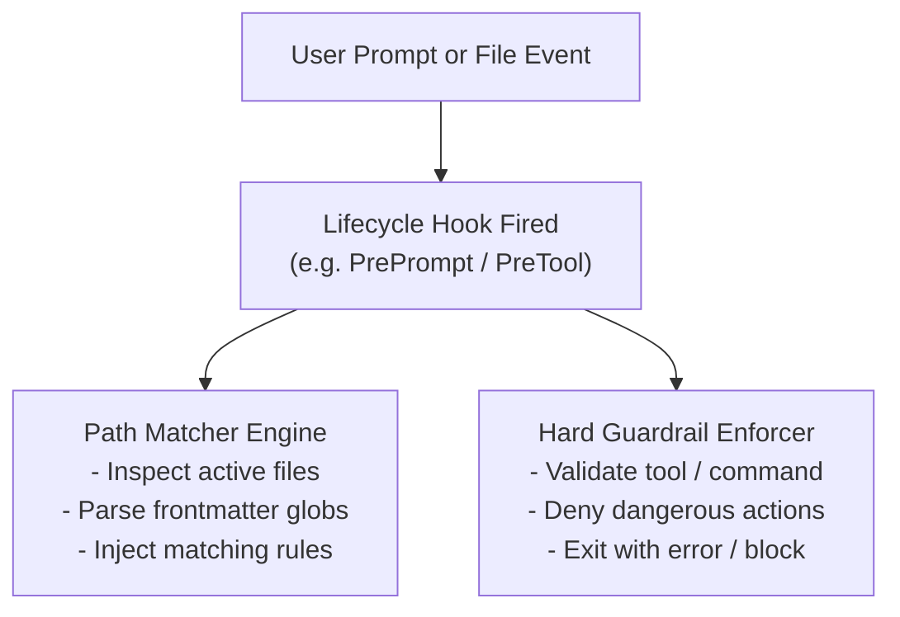

# Simulating Path-Scoped Rules & Guardrails via Hooks

Some AI agent platforms (e.g. OpenAI Codex, OpenCode, or custom CLI runners) do not natively evaluate YAML frontmatter glob patterns (like `applyTo:` or `globs:`) on markdown rule files. 

However, these platforms provide **lifecycle hooks and plugin architectures** that allow developers to simulate path-scoped rule injection and enforce hard behavioral guardrails.

---

## 1. Architecture Overview



---

## 2. OpenAI Codex Hook Simulation

Codex supports lifecycle hooks configured in `.codex/hooks.json` or `~/.codex/config.toml`.

### Hook Configuration (`.codex/hooks.json`)

```json
{
  "hooks": {
    "UserPromptSubmit": [
      {
        "command": "python3 scripts/codex_rule_injector.py --prompt \"$PROMPT\""
      }
    ],
    "PreToolUse": [
      {
        "matcher": "writeFile|editFile|bash",
        "command": "python3 scripts/codex_guardrail_checker.py --tool \"$TOOL_NAME\" --args \"$TOOL_ARGS\""
      }
    ]
  }
}
```

### Python Helper: Rule Injector Script (`scripts/codex_rule_injector.py`)

This script parses all `.instructions.md` or `.agents/rules/*.md` files in the repository, evaluates their `applyTo:` / `globs:` against mentioned files, and outputs matching rules to stdout for Codex to include in the context:

```python
#!/usr/bin/env python3
import fnmatch
import os
import re
import sys
from pathlib import Path

def parse_frontmatter_globs(file_path):
    text = file_path.read_text(encoding="utf-8")
    if not text.startswith("---"):
        return [], text
    parts = text.split("---", 2)
    if len(parts) < 3:
        return [], text
    frontmatter = parts[1]
    body = parts[2]
    
    globs = []
    for line in frontmatter.splitlines():
        line = line.strip()
        m = re.match(r"^(applyTo|globs|paths):\s*(.*)$", line)
        if m:
            val = m.group(2).strip(" \"'[]")
            globs.extend([g.strip(" \"'") for g in val.split(",") if g.strip()])
    return globs, body

def main():
    prompt = sys.argv[2] if len(sys.argv) > 2 else ""
    repo_root = Path.cwd()
    rules_dir = repo_root / ".agents" / "rules"
    instructions_dir = repo_root / ".github" / "instructions"

    rule_files = list(rules_dir.glob("*.md")) + list(instructions_dir.glob("*.instructions.md"))
    injected_rules = []

    for rule_file in rule_files:
        globs, body = parse_frontmatter_globs(rule_file)
        if not globs:
            continue
        
        # Check if any glob matches files mentioned in prompt or recently touched
        for pattern in globs:
            # Simple check if glob pattern matches keywords in user prompt
            pattern_stem = pattern.replace("**/*", "").replace("*", "").strip("/")
            if pattern_stem and pattern_stem in prompt:
                injected_rules.append(f"### Rule: {rule_file.name}\n{body.strip()}")
                break

    if injected_rules:
        print("\n\n---\n[System Injected Path Rules]\n" + "\n\n".join(injected_rules))

if __name__ == "__main__":
    main()
```

---

## 3. OpenCode Plugin Simulation

OpenCode supports TypeScript plugins in `.opencode/plugins/`.

### TypeScript Plugin (`.opencode/plugins/scoped-rules.ts`)

```typescript
import { Plugin, PluginContext } from '@opencode/plugin-api';
import * as fs from 'fs';
import * as path from 'path';

export default class ScopedRulesPlugin implements Plugin {
  name = 'scoped-rules-plugin';

  async onPrePrompt(context: PluginContext) {
    const activeFile = context.session.activeFile;
    if (!activeFile) return;

    const rulesDir = path.join(context.workspaceRoot, '.github/instructions');
    if (!fs.existsSync(rulesDir)) return;

    const files = fs.readdirSync(rulesDir);
    for (const file of files) {
      if (!file.endsWith('.instructions.md')) continue;
      const content = fs.readFileSync(path.join(rulesDir, file), 'utf-8');
      
      // Check applyTo frontmatter
      const match = content.match(/applyTo:\s*["']?([^"'\n]+)["']?/);
      if (match) {
        const pattern = match[1];
        if (activeFile.includes(pattern.replace(/\*/g, ''))) {
          context.injectContextSnippet({
            title: `Rule: ${file}`,
            content: content
          });
        }
      }
    }
  }
}
```

---

## 4. Hard Guardrails via Pre-Tool Execution Hooks

While rules provide soft guidelines to LLMs, **security-critical constraints** (e.g., blocking `rm -rf`, preventing hardcoded secret commits, restricting production DB access) should be enforced with `PreToolUse` hooks that terminate with a non-zero exit code:

```python
#!/usr/bin/env python3
# scripts/codex_guardrail_checker.py
import sys
import json

FORBIDDEN_COMMANDS = ["rm -rf", "DROP TABLE", "chmod 777", "git push --force"]

def main():
    tool_args = sys.argv[4] if len(sys.argv) > 4 else ""
    for cmd in FORBIDDEN_COMMANDS:
        if cmd in tool_args:
            sys.stderr.write(f"[GUARDRAIL VIOLATION]: Blocked dangerous execution pattern: '{cmd}'\n")
            sys.exit(1) # Denies execution
    sys.exit(0)

if __name__ == "__main__":
    main()
```
