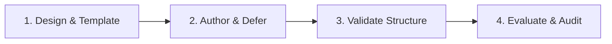

# Agent Skills Authoring Skill

Standard Operating Procedure for creating, auditing, refactoring, and validating agent skill packages conforming to the agentskills.io open standard.

---

## When to use

- User asks to "create a skill", "make a skill for X", "skill-ify this", or "turn this into a skill".
- Modifying, renaming, breaking down, merging, or optimizing existing agent skills.
- Auditing skills for undertriggering, context bloat, or broken resource references.
- Packaging CLI tools or scripts into structured skill interfaces.
- Running empirical evaluations, pass-rate benchmarks, or trigger tests.

---

## Skill Lifecycle Workflows

---

### 1. Skill Design & Package Layout
1. **Determine Scope & Name**: Select a standard name `<prefix>-<domain>-<task>` (e.g., `ai-authoring-skills`, `git-expert`, `code-tdd`).
2. **Draft Pushy Description**: Keep under 1024 characters; explicitly state WHAT the skill does and literal user trigger phrases to prevent undertriggering.
3. **Progressive Disclosure**: Keep `SKILL.md` body concise (<500 lines target). Offload deep domain docs into `@references/`, reusable output schemas into `templates/`, and executable tools into `scripts/`.
4. Read `@references/skill-structure.md` and `@references/platforms/antigravity.md`.

---

### 2. CLI Tool Integration & Scripts
1. **Black-Box Scripts**: Bundle standalone helpers in `scripts/` using Python (standard library or `uvx`). Agents must rely on `--help` and avoid reading script source code.
2. **CRUD Prefix Convention**: Use standard prefixes (`get-`, `list-`, `search-`, `create-`, `update-`, `delete-`).
3. Read `@references/script-standards.md` and `@references/cli-integration/cli-to-skill.md`.

---

### 3. Validation & Quality Gate
1. **Automated Validation**: Run the validator before committing any skill edits:
   `python3 <skill-dir>/scripts/validate.py <skill-directory>`
2. **Compilation**: Confirm all bundled scripts compile (`python3 -m py_compile`, `bash -n`, `zsh -n`).
3. **Reference Integrity**: Ensure every referenced path (`@references/...`, `templates/...`, `scripts/...`) exists on disk.
4. Read `@references/audit-workflow.md`.

---

### 4. Testing & Empirical Evaluations
1. For quantitative verification, execute parallel subagent eval runs (with-skill vs. baseline) to benchmark trigger rates and instruction fidelity.
2. Read `@references/evals.md`.

---

## Category Templates

| Category | Typical Use Case | Template Reference |
|---|---|---|
| **Workflow / SOP** | Multi-stage procedural tasks requiring completion verification | `templates/workflow-sop.md` |
| **Guidelines** | Code style, security policies, architecture constraints | `templates/guidelines.md` |
| **Tool Integration** | CLI wrappers, MCP adapters, and API interfaces | `templates/integration-tool.md` |
| **Orchestrator** | Subagent task decomposition and synthesis | `templates/orchestrator.md` |
| **Meta** | Self-improving tools, skill auditing, authoring | `templates/meta.md` |

---

## Script Helpers & Execution

Run helper scripts relative to this skill's root directory (`<skill-dir>/scripts/...`):

| Utility | Location | Invocation Syntax | Purpose |
|---|---|---|---|
| `validate.py` | `@scripts/validate.py` | `python3 <skill-dir>/scripts/validate.py <path>` | Validates frontmatter, description cap, body length, paths, and script syntax |
| `validate.py (self-test)` | `@scripts/validate.py` | `python3 <skill-dir>/scripts/validate.py --self-test` | Runs internal test suite of the validation engine |

---

## Output Contract & Verification

Every created or edited skill package must satisfy:
1. `python3 <skill-dir>/scripts/validate.py <skill-path>` passes all checks with zero errors.
2. `SKILL.md` body remains strictly under 500 lines (optimally <80 lines).
3. Frontmatter `description` is under 1024 characters with explicit trigger phrases.