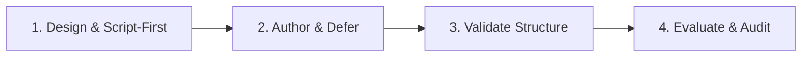

# Agent Skills Authoring Skill

Standard Operating Procedure for creating, auditing, refactoring, and validating agent skill packages conforming to the agentskills.io open standard.

---

## Core Invariant: Gather First, Then Script the Workflow

**Understand the task before acting on it — and script the understanding.**

Two rules, in order. The second depends on the first.

### 1. Gather before you act

Every workflow starts by establishing what is actually true: which resource,
which state, which fields, which version. An agent that acts before it has
gathered is guessing, and guesses about a remote system cost more than guesses
about local files — a wrong ID posts a comment on the wrong issue, a stale
snapshot approves a broken build, a misread field ships a broken release.

**Gathering is not the interesting part of the task, so it gets scripted
hardest.** It is also the most expensive part when done badly: it is where the
hundreds of tool calls accumulate.

So the rule is not "gather first, then decide." It is:

> **Design the gathering step as a script, and run it before any judgement,
> mutation, or recommendation.**

### 2. The script is the unit of work

A skill that describes a procedure as a numbered list of individual tool calls
makes the agent execute it one call at a time — hundreds of round-trips, each
one burning context on arguments, boilerplate, and partial output the agent
must reassemble by hand. This is the single most common and most expensive
defect in a skill package.

**Before writing any workflow skill, write the script. Then write the SKILL.md
that routes to it.**

| Anti-pattern | Correct |
|---|---|
| "1. Run `gh pr view`. 2. Run `gh pr checks`. 3. Run `gh pr diff`. 4. Compare them." | `bash <skill-dir>/scripts/pr_audit_bundle.sh --repo <o/r> --pr <n>` |
| SKILL.md contains a hand-rolled `for` loop over `git` | That loop lives in `scripts/`, takes arguments, emits JSON |
| Six `list-*.sh` scripts the agent must chain | One `*-bundle.sh` that gathers all six in a single invocation |
| "Look up the issue, then check whether the fix landed, then review" | One gather script that returns all three, from one consistent snapshot |
| Agent acts on the first thing it reads | Gather script runs first; every judgement is made against its full output |

### The gather-then-act shape

A well-scripted workflow has this shape, and the gather step is deliberately the
biggest single call:

```
1. GATHER  →  one bundle script → one consistent, dense JSON document
2. REASON  →  agent judgement over the full document (the only non-mechanical part)
3. ACT     →  one mutating call, report-only until the user approves
```

Two properties make this worth enforcing:

- **One consistent snapshot.** A gather script reads state once. A chain of
  calls can read `PR state` at T1 and `CI status` at T3 and correlate them as if
  simultaneous. Only the bundle makes that impossible.
- **Full context before judgement.** The agent sees the whole picture before it
  decides anything, so "the branch name looked odd" and "CI was green at the
  time" cannot silently substitute for what the system actually says.

Rules that follow from this:

0. **Gather first, then act.** Design the workflow so the state-gathering step is
   a single script that runs before any judgement or mutation. Never let the
   agent begin acting on a partially-gathered picture.
1. **Bundle by default.** If a task needs ≥2 sequential tool invocations to
   answer one question, it belongs in one script. See `@references/cli-integration/script-patterns.md`.
2. **The script's output IS the context budget.** Emit dense JSON, not prose
   logs, formatted tables, or ANSI. Filter server-side / script-side before
   output, not in the agent's head afterwards. Prefer scripts that write large
   payloads to `--out <dir>` and print a summary — long stdout gets truncated,
   and a truncated read yields confident, wrong conclusions.
3. **Loops never live in SKILL.md.** Any shell loop, `jq` chain, or inline
   `python3 -c` in a skill body is a script that hasn't been written yet.
4. **Report-only by default.** Scripts must be safe to run blind. Mutations
   require an explicit flag; never make the default invocation destructive.
5. **Verify the script works before documenting it.** A documented script that
   errors is worse than the loop it replaced.

5. **Verify the script works before documenting it.** A documented script that
   errors is worse than the loop it replaced.

### When gathering genuinely cannot be scripted

Some facts need a judgement call or a tool with no batch mode. That is the
exception, and it must be explicit:

- **Say what is gathered and what is not.** `bundle.sh` returns everything
  mechanical; the agent then makes exactly one targeted call for the remainder,
  named in the skill.
- **Do not accumulate.** Two ad-hoc calls is acceptable; a sixth means the
  bundle is incomplete — extend it.
- **Never act on the un-gathered part.** If a fact could not be retrieved, the
  agent reports the gap rather than inferring the value. A missing check is not
  a passing check.

---

## When to use

- User asks to "create a skill", "make a skill for X", "skill-ify this", or "turn this into a skill".
- Modifying, renaming, breaking down, merging, or optimizing existing agent skills.
- Auditing skills for undertriggering, context bloat, or broken resource references.
- **Auditing a skill whose workflow forces the agent into hundreds of tool calls
  when one script would do** — the most common high-cost defect.
- Packaging CLI tools or scripts into structured skill interfaces.
- Running empirical evaluations, pass-rate benchmarks, or trigger tests.

---

## Skill Lifecycle Workflows


```mermaid
flowchart LR
    A["1. Design & Script-First"] --> B["2. Author & Defer"]
    B --> C["3. Validate Structure"]
    C --> D["4. Evaluate & Audit"]
```

---

### 1. Skill Design & Package Layout
1. **Determine Scope & Name**: Select a standard name `<prefix>-<domain>-<task>` (e.g., `ai-authoring-skills`, `git-expert`, `code-tdd`).
2. **Draft Pushy Description**: Keep under 1024 characters; explicitly state WHAT the skill does and literal user trigger phrases to prevent undertriggering.
3. **Design the Gather Step First**: Before drafting prose, list every fact the
   workflow must establish before anyone can act. That list *is* the gather
   script's contract — write it, and make it one invocation returning all of it
   from a single consistent snapshot.
4. **Design the Rest of the Scripts**: Group the remaining tool invocations by
   the single question they answer. Each group of ≥2 becomes one bundled script.
4. **Progressive Disclosure**: Keep `SKILL.md` body concise (<500 lines target). Offload deep domain docs into `@references/`, reusable output schemas into `templates/`, and executable tools into `scripts/`.
5. Read `@references/skill-structure.md` and `@references/platforms/antigravity.md`.

---

### 2. Script Authoring & Standards
1. **Script the Workflow**: Bundle ≥2 sequential tool calls into a single invocation. Prefer one composite script over N atomic ones. See the Composite Workflow pattern in `@references/cli-integration/script-patterns.md`.
2. **Black-Box Scripts**: Bundle standalone helpers in `scripts/` using Python (standard library or `uvx`). Agents must rely on `--help` and avoid reading script source code.
3. **CRUD Prefix Convention**: Use standard prefixes (`get-`, `list-`, `search-`, `create-`, `update-`, `delete-`), plus `-bundle` / `-rollup` suffixes for composite scripts.
4. Read `@references/script-standards.md` and `@references/cli-integration/cli-to-skill.md`.

---

### 3. Validation & Quality Gate
1. **Automated Validation**: Run the validator before committing any skill edits:
   `python3 <skill-dir>/scripts/validate.py <skill-directory>`
   To audit empirical script usage across recent sessions (default 200 sessions):
   `python3 <skill-dir>/scripts/validate.py --audit-script-usage [--sessions 200] <skill-directory>`
2. **Compilation**: Confirm all bundled scripts compile (`python3 -m py_compile`, `bash -n`, `zsh -n`).
3. **Reference Integrity**: Ensure every referenced path (`@references/...`, `templates/...`, `scripts/...`) exists on disk.
4. **Scriptability Check**: Confirm the validator reports no `workflow-scriptability` WARN.
5. **Empirical Script Usage**: Audit bundled script executions across conversation history (`audit_bundled_scripts.py --sessions 200`) to raise obsolete scripts for removal or consolidation.
6. Read `@references/audit-workflow.md`.

---

### 4. Testing & Empirical Evaluations
1. For quantitative verification, execute parallel subagent eval runs (with-skill vs. baseline) to benchmark trigger rates and instruction fidelity.
2. **Measure tool-call count**, not just pass rate. A skill that passes its eval while making 200 tool calls has failed the efficiency objective. The script is the unit of work.
3. Read `@references/evals.md`.

---

## Category Templates

| Category | Typical Use Case | Template Reference |
|---|---|---|
| **Workflow / SOP** | Multi-stage procedural tasks requiring completion verification | `templates/workflow-sop.md` |
| **Guidelines** | Code style, security policies, architecture constraints | `templates/guidelines.md` |
| **Tool Integration** | CLI wrappers, MCP adapters, and API interfaces | `templates/integration-tool.md` |
| **Orchestrator** | Subagent task decomposition and synthesis | `templates/orchestrator.md` |
| **Meta** | Self-improving tools, skill auditing, authoring | `templates/meta.md` |

---

## Script Helpers & Execution

Run helper scripts relative to this skill's root directory (`<skill-dir>/scripts/...`):

| Utility | Location | Invocation Syntax | Purpose |
|---|---|---|---|
| `validate.py` | `@scripts/validate.py` | `python3 <skill-dir>/scripts/validate.py <path>` | Validates frontmatter, description cap, body length, paths, script syntax, and workflow scriptability |
| `validate.py (self-test)` | `@scripts/validate.py` | `python3 <skill-dir>/scripts/validate.py --self-test` | Runs internal test suite of the validation engine |
| `audit_bundled_scripts.py` | `@scripts/audit_bundled_scripts.py` | `python3 <skill-dir>/scripts/audit_bundled_scripts.py <path> [--sessions 200]` | Audits empirical script usage in conversation history via search_tools.py |

---

## Output Contract & Verification

Every created or edited skill package must satisfy:
1. `python3 <skill-dir>/scripts/validate.py <skill-path>` passes all checks with zero errors.
2. `SKILL.md` body remains strictly under 500 lines (optimally <80 lines).
3. Frontmatter `description` is under 1024 characters with explicit trigger phrases.
4. **Every documented workflow step is either a single script invocation or
   genuinely irreducible.** A step an agent must perform by making 2+ separate
   tool calls is an unfinished script.
5. **The workflow gathers before it acts.** The state-gathering step is a single
   script that returns everything the judgement needs, from one consistent
   snapshot. Any fact the workflow cannot establish is reported as a gap, never
   inferred — and no mutation is documented before the gather step.
6. **No shell loops, `jq` chains, or inline `python3 -c` in any `SKILL.md` body.**
   Those belong in `scripts/`, behind `--help`.
7. **At least one bundled script exists for any tool-backed workflow skill**, and
   its invocation is documented in a routing table with a "run when" condition.
8. Scripts are report-only by default; mutations require an explicit flag.
9. Each new script compiles (`py_compile` / `bash -n`) and its documented
   invocation has been executed successfully at least once.
10. Bundled scripts are audited for empirical usage (`--audit-script-usage`);
    obsolete or dead scripts are flagged for removal or consolidation.