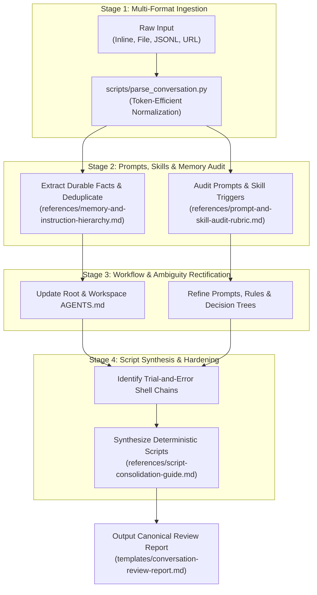
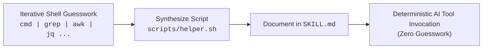

# AI Conversation Review

Comprehensive system for auditing human-AI conversations, extracting durable memory, optimizing prompt and skill architectures, rectifying ambiguity or inaccurate context, and synthesizing fragile terminal command trial-and-error into deterministic, reusable scripts.

---

## When to Use

- The user says "review this conversation", "audit our session", "analyze chat history", or "run conversation review".
- You need to extract durable learnings, decisions, or user corrections into `~/.agents/AGENTS.md`.
- You want to identify gaps in workspace instructions (`AGENTS.md`, `.github/copilot-instructions.md`, `CLAUDE.md`, `GEMINI.md`).
- An agent struggled with tool execution, suffered from ambiguous instructions, or made repetitive mistakes that require prompt or skill refinement.
- You need to consolidate trial-and-error terminal command sequences into small, reusable, deterministic scripts so future LLM turns no longer guess.
- Auditing skill lifecycle (deciding whether to merge fragmented skills, break up bloated skills, or refine trigger descriptions).

---

## 4-Stage Review Pipeline



---

## Stage 1: Multi-Format Ingestion & Normalization

The review system accepts conversation transcripts from any AI platform:
- **Antigravity / Gemini CLI**: `transcript.jsonl` or `transcript_full.jsonl`
- **Claude Code**: JSON/JSONL session logs (`~/.claude/projects/...`)
- **OpenCode**: Session JSON history
- **OpenAI / ChatGPT**: JSON conversation exports
- **Plain Markdown / Text**: Exported chat text (`User:` / `Assistant:`)

### Ingestion Helper
To extract turns and tool invocations without consuming excessive tokens:

```bash
# Ingest from a log file
python3 scripts/parse_conversation.py /path/to/transcript.jsonl

# Ingest only errors and tool calls
python3 scripts/parse_conversation.py /path/to/transcript.jsonl --errors-only
```

---

## Stage 2: Prompts, Skills & Memory Audit

### 1. Durable Memory & Instructions
Extract durable facts following the Single Source of Truth Hierarchy:
- **Global Memory (`~/.agents/AGENTS.md`)**: Authoritative source for technical context, architectural decisions, and user corrections.
- **Workspace Memory (`AGENTS.md`)**: Repo-specific build recipes, conventions, and test commands.
- **Instruction Diffs**: Check `.github/copilot-instructions.md`, `CLAUDE.md`, and `GEMINI.md` for outdated guidance or missing edge cases.

See [references/memory-and-instruction-hierarchy.md](references/memory-and-instruction-hierarchy.md) for qualification criteria and deduplication logic.

### 2. Prompt & Skill Sharpness
Audit all prompts and skills used during the conversation:
- **Goal Scoping vs Micromanagement**: Strip manual "think step by step" scaffolding on reasoning models; declare clear output schemas and verifiable success criteria.
- **Negative Constraints**: Pre-empt observed agent failure modes with strict RFC 2119 negative constraints.
- **Skill Lifecycle**: Evaluate whether to **Merge** fragmented skills, **Break Up** multi-purpose bloated skills, or **Refine Triggers** in `SKILL.md` frontmatter descriptions.

See [references/prompt-and-skill-audit-rubric.md](references/prompt-and-skill-audit-rubric.md) for the evaluation rubric and symptom matrix.

---

## Stage 3: Workflow Rectification & Ambiguity Elimination

Identify where communication or instructions broke down:
1. **Correct Inaccurate Context**: Rectify hallucinated flags, wrong paths, or deprecated APIs discovered during tool runs.
2. **Eliminate Ambiguity**: Convert vague guidance ("handle edge cases") into concrete decision matrices or tables.
3. **Streamline Multi-Step Workflows**: Introduce phase gates and clear handoff contracts between coordinator and subagents.

---

## Stage 4: Terminal Command Consolidation & Script Synthesis

When an agent iterates through trial-and-error shell commands (e.g. fiddling with `awk`, `grep`, or nested API loops), consolidate the sequence into a deterministic script.



### Script Synthesis Directives
1. **Self-Documenting `--help`**: Scripts MUST provide clear `--help` so agents discover usage without reading source files.
2. **Token-Efficient Markdown Output**: Scripts MUST format output as clean Markdown summaries to stdout by default.
3. **Strict Error Handling**: Use `set -euo pipefail` in Bash/Zsh or structured exception handling in Python.
4. **Placement**: Place workflow-specific scripts in `dot_agents/skills/<skill-name>/scripts/` or general utilities in `dot_local/bin/df.<name>`.

See [references/script-consolidation-guide.md](references/script-consolidation-guide.md) and [templates/script-wrapper-blueprint.sh](templates/script-wrapper-blueprint.sh).

---

## Cognitive Boundaries Matrix

Route improvements to the appropriate artifact type:

| Need | Artifact | Target Location | Skill Reference |
|---|---|---|---|
| Persistent user facts & decisions | **Global Memory** | `~/.agents/AGENTS.md` | `ai-conversation-review` |
| Workspace build recipes & rules | **Workspace Memory** | `AGENTS.md`, `CLAUDE.md` | `ai-authoring-rules` |
| File/path-scoped coding rules | **Path Rule** | `.github/instructions/*.instructions.md` | `ai-authoring-rules` |
| Multi-step capability or tool script | **Skill** | `dot_agents/skills/<name>/SKILL.md` | `ai-authoring-skills` |
| Isolated context / custom model tier | **Subagent** | `.github/agents/*.agent.md` | `ai-authoring-agents` |
| Slash shortcut or interactive prompt | **Command** | `.github/prompts/*.prompt.md` | `ai-authoring-commands` |
| Deterministic lifecycle check | **Hook** | `hooks.json`, `.github/hooks/` | `ai-authoring-hooks` |

---

## Output Contract & Review Report

All conversation reviews MUST generate a structured Markdown report using [templates/conversation-review-report.md](templates/conversation-review-report.md).

### Report Sections
1. **Durable Memory Updates**: Additions, updates, and stale removals for `~/.agents/AGENTS.md`.
2. **Workspace & Global Instruction Alignment**: Concrete file diffs and new rule blocks.
3. **Skill & Prompt Optimizations**: Actionable refactors, merged skills, or trigger rewrites.
4. **Terminal Command Consolidation & Scripts**: Complete, runnable script source code and invocation docs.
5. **Compliance & Guardrails Audit**: Adherence findings, root cause analysis of deviations, and preventative fixes.
