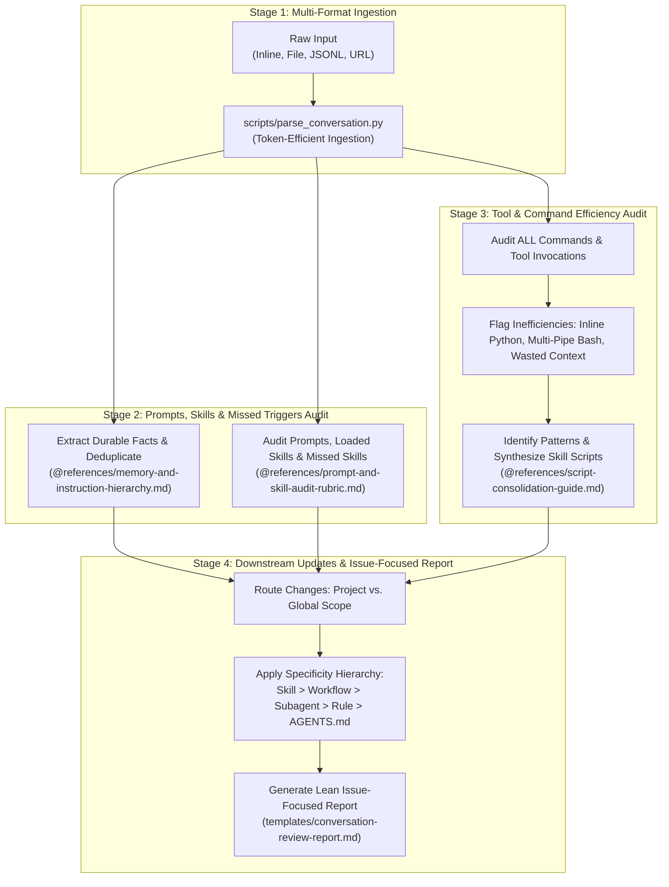

# AI Conversation Review

Comprehensive system for auditing human-AI conversations: reviewing tool and command efficiency, enforcing simpler commands, identifying missed skills, synthesizing command patterns into deterministic reusable skill scripts, and routing downstream improvements through a scope-aware, specificity-first hierarchy.

---

## When to Use

- The user says "review this conversation", "audit our session", "analyze chat history", or "run conversation review".
- You need to audit tool and command usage to eliminate complex inline Python scripts (`python3 -c "..."` / heredocs) or opaque bash pipelines in favor of simpler commands.
- You need to identify command patterns from trial-and-error shell sequences and consolidate them into reusable scripts inside skills.
- You want to discover which skills **should have been loaded but were missed**, diagnosing why the agent failed to trigger them.
- You want to extract durable learnings, decisions, or user corrections into project or global memory.
- You need to identify gaps in workspace instructions (`AGENTS.md`, `.github/copilot-instructions.md`, `CLAUDE.md`, `GEMINI.md`) or update skills/workflows/agents.

---

## 4-Stage Review Pipeline



---

## Stage 1: Multi-Format Ingestion & Normalization

The review system accepts conversation transcripts from any AI platform:
- **Antigravity / Gemini CLI**: `transcript.jsonl` or `transcript_full.jsonl`
- **Claude Code**: JSON/JSONL session logs (`~/.claude/projects/...`)
- **OpenCode**: Session JSON history
- **OpenAI / ChatGPT**: JSON conversation exports
- **Plain Markdown / Text**: Exported chat text (`User:` / `Assistant:`)

### Ingestion Helper
To extract turns and tool invocations without consuming excessive tokens, run the parser relative to this skill's root directory (`<skill-dir>/scripts/...` e.g. `.github/skills/ai-conversation-review/scripts/...`):

```bash
# Ingest from a log file
python3 <skill-dir>/scripts/parse_conversation.py /path/to/transcript.jsonl

# Ingest only errors and tool calls
python3 <skill-dir>/scripts/parse_conversation.py /path/to/transcript.jsonl --errors-only
```

---

## Stage 2: Prompts, Skills & Missed Triggers Audit

### 1. Durable Memory & Instructions
Extract durable facts following the Single Source of Truth Hierarchy and Scope Distinctions:
- **Project Scope**: Repo-specific build recipes, testing flows, and architecture belong in project instructions (`<project>/AGENTS.md`, `.github/instructions/*.instructions.md`).
- **Global Scope**: Universal developer context, user preferences, and cross-repo invariants belong in `~/.agents/AGENTS.md`.

See [@references/memory-and-instruction-hierarchy.md](@references/memory-and-instruction-hierarchy.md) for qualification criteria and deduplication logic.

### 2. Prompt & Skill Sharpness
Audit all prompts and skills relevant to the conversation:
- **Audit Loaded Skills**: Were loaded skills executed efficiently? Did the agent encounter gaps in the skill's instructions or scripts?
- **Audit Missed Skills**: Identify tasks where an existing skill **should have been used but was never loaded**. Diagnose why: was the frontmatter `description` too narrow, missing trigger keywords, or failing to match user phrasing?
- **Goal Scoping vs Micromanagement**: Strip manual "think step by step" scaffolding on reasoning models; declare clear output schemas and verifiable success criteria.
- **Negative Constraints**: Pre-empt observed failure modes with strict RFC 2119 negative constraints.

See [@references/prompt-and-skill-audit-rubric.md](@references/prompt-and-skill-audit-rubric.md) for the evaluation rubric and symptom matrix.

---

## Stage 3: Tool & Command Usage Efficiency Audit

Thoroughly inspect **all** terminal commands and tool invocations executed during the session:

### 1. Efficiency & Simplicity Assessment
- **Was tool and command usage efficient?** Did the agent run exploratory trial-and-error loops, guessing flags or syntax across multiple turns?
- **Can commands be made simpler?** Enforce simpler, readable, declarative commands.
- **Flag Anti-Patterns**:
  - **Inline Python Scripts**: Flag any use of `python3 -c "..."` or heredocs (`python3 << 'EOF'`). These are hard to review in diffs/transcripts, prone to escaping bugs, and waste tokens.
  - **Complex Bash Pipelines**: Flag commands with >2 pipes (`grep | awk | sed | jq`) or fragile regex acrobatics.
  - **Context Window Flooding**: Flag commands that emit large, unformatted stdout dumps into the conversation context.

### 2. Pattern Detection & Skill Script Synthesis
- Identify recurring command patterns across turns or common workflows.
- Consolidate ad-hoc sequences into a deterministic, reusable script located **exclusively within the appropriate skill package** (`<skill-dir>/scripts/`).
- Ensure every synthesized script satisfies:
  1. **Self-Documenting `--help`**: Documents parameters and options so future LLMs do not need to guess or inspect source code.
  2. **Token-Efficient Output**: Emits concise Markdown summaries to stdout by default.
  3. **Strict Error Trapping**: Uses `set -euo pipefail` in shell or structured `try/except` in Python.

See [@references/script-consolidation-guide.md](@references/script-consolidation-guide.md) and [templates/script-wrapper-blueprint.sh](templates/script-wrapper-blueprint.sh).

---

## Stage 4: Downstream Updates & Issue-Focused Reporting

### Two-Dimensional Routing: Scope × Specificity

When addressing issues, route fixes according to Scope (Project vs. Global) and Specificity:

1. **Scope Selection**:
   - **Project-Specific Scope**: Updates apply only to the repository where the task took place (e.g. project-specific skills, repo build instructions, project root `AGENTS.md`).
   - **General Global Scope**: Updates apply universally across all workspaces in the user's dotfiles (e.g. global skills in dotfiles, universal agents, `~/.agents/AGENTS.md`).
2. **Specificity Hierarchy**:
   Always target the most granular artifact first:
   $$\text{Skill} \longrightarrow \text{Workflow} \longrightarrow \text{Subagent} \longrightarrow \text{Path Rule / Instruction} \longrightarrow \text{Root AGENTS.md}$$
   - If a command was ad-hoc: update or create a **Skill script** and document it in `SKILL.md`.
   - If a multi-step sequence was fragile: update the **Workflow** or **Subagent**.
   - If a file pattern had unstated rules: update the **Path Rule** (`.instructions.md`).
   - **Root `AGENTS.md` (Project or Global) MUST ONLY be updated if the change represents a general behavior across that entire scope.**

---

## Output Contract & Review Report

All conversation reviews MUST generate a lean, issue-focused Markdown report using [templates/conversation-review-report.md](templates/conversation-review-report.md).

### Lean Reporting Rules
- **No Congratulatory Bloat**: Do not summarize what worked well or provide congratulatory commentary.
- **Focus on Issues & Solutions**: Strictly report problems discovered, root cause analysis, and concrete fixes/diffs.
- **Mandatory Sections**:
  1. **Skill & Workflow Trigger Issues**: Missed skills that should have loaded, trigger fixes, and skill gaps.
  2. **Tool & Command Usage Inefficiencies**: Flagged complex commands (inline Python, multi-pipe bash), wasted context, and synthesized skill scripts.
  3. **Downstream Updates**: Concrete diffs for project-specific and/or global skills, workflows, subagents, rules, or `AGENTS.md`.
  4. **Compliance & Guardrails Deviations**: Violations or near-misses of safety guardrails and proposed preventative rules.
