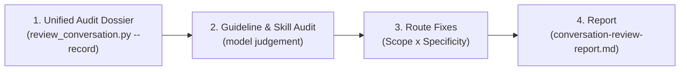

# AI Conversation Review

Turn a finished session into measurable improvements for the skills, agents and instructions that ran in it.

**Core principle:** scripts gather and count; the model only judges. If a review step can be done deterministically, it MUST be done by a script in `<skill-dir>/scripts/`.

`<skill-dir>` = the directory containing this file. Always invoke scripts by that path; never assume the working directory.

---

## Pipeline


```mermaid
flowchart LR
  A["1. Unified Audit Dossier<br/>(review_conversation.py --record)"] --> B["2. Guideline & Skill Audit<br/>(model judgement)"]
  B --> C["3. Route Fixes<br/>(Scope x Specificity)"]
  C --> D["4. Report<br/>(conversation-review-report.md)"]
```

**Data-gathering budget: 3 or fewer tool calls per review.**
Using `review_conversation.py` executes ingest, smells audit, offload analysis, timeline extraction, and history recording in **1 single tool call**, leaving 2 spare calls if targeted inspection of a rule file or git commit is required.

---

## Stage 1: Gather Audit Dossier (Single Command)

Supported platforms (natively resolved without manual exports):
- **VS Code Copilot Chat**: Pass session UUID or transcript path (searches `workspaceStorage`).
- **Google Antigravity / Gemini CLI**: Pass conversation UUID (auto-resolves `~/.gemini/antigravity-cli/brain/<uuid>/.system_generated/logs/transcript.jsonl`).
- **OpenCode**: Pass session ID (`ses_...`) or `--platform opencode --latest` (directly queries `~/.local/share/opencode/opencode.db` in read-only SQLite mode; zero temporary files needed).
- **Claude Code**: Pass UUID or path in `~/.claude/projects/`.
- **Markdown / Plain text**: Pass file path.

### Canonical Single-Step Execution

Run the unified review script with `--record`. It auto-resolves file paths, session UUIDs, or `--latest`, computes all offload metrics, audits command smells, extracts user corrections with verified turn numbers, and updates review history in **one call**:

```bash
# Review by UUID or path across any platform (records baseline automatically):
python3 <skill-dir>/scripts/review_conversation.py <uuid_or_path_or_ses_id> --record

# Auto-resolve the active/most recent transcript across workspaces:
python3 <skill-dir>/scripts/review_conversation.py --latest --record

# Filter --latest by platform if desired:
python3 <skill-dir>/scripts/review_conversation.py --latest --platform [copilot|antigravity|opencode]
```

### Deep Statistics & Diagnostic Modes

When diagnosing huge transcripts, exploring unfamiliar formats, or investigating specific turns, use the built-in deterministic inspection modes instead of writing ad-hoc scratch scripts:

```bash
# 1. Byte size breakdown & top context hogs (largest single events, tool costs):
python3 <skill-dir>/scripts/review_conversation.py <target> --sizes

# 2. Schema introspection, depth <= 3 nested keys, & universal field mapping:
python3 <skill-dir>/scripts/review_conversation.py <target> --schema

# 3. Slice a specific segment, turn, or final turn as a bounded table:
python3 <skill-dir>/scripts/review_conversation.py <target> --segment final
python3 <skill-dir>/scripts/review_conversation.py <target> --segment turn:17
python3 <skill-dir>/scripts/review_conversation.py <target> --segment 2707:2787

# 4. Chronological user prompts timeline with timestamps & correction flags:
python3 <skill-dir>/scripts/review_conversation.py <target> --user-turns
```

### Output of Stage 1 Dossier

The default command emits a token-efficient Markdown dossier (<120 lines, ~1.2k tokens) containing:
1. **Metrics & History Baseline**: tool calls, failed calls, mechanical chains, repeated sequences, retry loops, offloadable share %, and baseline delta comparison against previous runs.
2. **Top Script Candidates**: sequence, occurrences, calls saved, suggested class, recommended script name, and **sample argument context**.
3. **Failed Tool Calls & Smells**: exact event line numbers, tool names, arguments, error details, inline code counts, deep pipelines (>2 pipes), and duplicate reads.
4. **User Turns & Corrections Timeline**: exact User Turn # and Event # for all turns, with user corrections highlighted (`Wait`, `instead`, `please ensure`, etc.).

### Strict Prohibitions
- **NEVER write ad-hoc Python scratch scripts or heredocs** (`python3 -c "..."`, `python3 << 'EOF'`).
- **NEVER chain multi-command pipelines** (`cmd | grep | awk | sed | jq`).
- **NEVER dump raw, unparsed transcripts into context**.
- **NEVER run multiple manual script calls** when `review_conversation.py` collects everything deterministically in 1 call.

---

## Stage 2: Offload Assessment & Script Classification

Every review MUST answer, with numbers: **how much of this session's work could a script have done instead of the model?**

All metrics are taken directly from the Section 1 & 2 outputs of `review_conversation.py`.

| Signal | Meaning | Why it is offloadable |
|---|---|---|
| Mechanical chain | 2+ tool calls with no reasoning between them | The model added nothing between steps |
| Repeated sequence | Same tool order seen 2+ times | It is a procedure; make it one parameterised script |
| Retry loop | Failed call followed by the same tool | The model was guessing syntax |
| Command smells | Pipelines >2 pipes, duplicate file reads, inline scripts | Brittle, token-wasteful trial-and-error |

**Model Judgement:** Review each Script Candidate from the dossier and finalize its classification:

| Class | Rule | Action |
|---|---|---|
| **Script** | Inputs known up front; steps never branch on meaning (e.g. Git workflows, build/test pipelines) | Write the script, document it in the owning skill |
| **Script + flags** | Branches on simple conditions (exists, failed, regex matches) | Script with a flag per branch |
| **Keep in model** | Depends on interpreting content (code semantics, tone, architectural decisions) | Leave in model; script only data gathering in front of it |

You MUST NOT recommend scripting a "Keep in model" step.

### Standards for Every Proposed Script
1. `--help` documents every flag, so agents never read source code to use it.
2. Non-interactive (no prompts, pagers, or TUIs).
3. Concise Markdown to stdout by default; `--json` for machine use.
4. Fails loudly: `set -euo pipefail` (shell) or structured `try/except` (Python).
5. Idempotent; mutating scripts require `--dry-run`.

Start shell helpers from `<skill-dir>/templates/script-wrapper-blueprint.sh`. Detail: `references/script-consolidation-guide.md`.

---

## Stage 3: Guideline & Skill Audit

### 3a. Guideline Compliance
1. Identify the instruction files active in the session (`AGENTS.md`, `.github/copilot-instructions.md`, `CLAUDE.md`, `GEMINI.md`, `*.instructions.md`, loaded `SKILL.md` files).
2. Extract only **checkable** rules (e.g. "use script X", "no inline Python", "provide file paths and line numbers").
3. Mark each rule **Kept / Broken / N/A** using the exact **User Turn # (Event #)** from the timeline as evidence.
4. For each Broken rule, diagnose: rule unclear, rule buried, rule contradicted elsewhere, or tooling made it hard to follow.

### 3b. Skills
- **Loaded skills:** were their scripts used, or did the agent improvise around them? Any gaps in instructions?
- **Missed skills:** a matching skill existed but was never loaded. Diagnose the cause: description too narrow, missing trigger phrases, or overlap with another skill. The fix is usually frontmatter `description`.
- **Granularity:** recommend merging overlapping skills or splitting bloated skills.

Rubric and symptom matrix: `references/prompt-and-skill-audit-rubric.md`.

### 3c. Durable Learnings
Extract only explicit user decisions, corrections and preferences that will recur. Cite the exact User Turn # and quote the user correction. Deduplicate against existing instructions. Detail: `references/memory-and-instruction-hierarchy.md`.

---

## Stage 4: Route Fixes

**Scope first:** project-specific fixes go in the project; universal fixes go in the user's global agent config. Never put project commands in global files, or universal tooling in project files.

**Then the most specific target:**
1. **Skill** (`SKILL.md` or `scripts/`): ad-hoc commands, missing scripts, triggers.
2. **Agent / subagent definition**: fragile multi-step behaviour or delegation.
3. **Path-scoped instruction** (`*.instructions.md`): unstated rules for particular file types.
4. **Root `AGENTS.md`** (project or global): ONLY for behaviour that applies across that entire scope.

Note: `.github/workflows/` holds CI pipelines, not agent workflows. Do not route agent fixes there.

**Precedence when rules conflict:** the more specific file wins for its own scope. Root `AGENTS.md` sets defaults; skills and path rules may narrow them but must not contradict universal safety rules.

---

## Stage 5: Report

Use `templates/conversation-review-report.md`. The report MUST contain, in order:

1. **Metrics**: tool calls, failed calls, offloadable share, projected calls after scripting, review data-gathering calls used, and history baseline comparison.
2. **Script candidates**: sequence replaced, occurrences, calls saved, class, suggested script, target skill.
3. **Guideline violations**: rule, source file, turn/event evidence, diagnosis.
4. **Suggestions / Advice**: one line each, with a priority (High/Medium/Low) and evidence (turn number).
5. **Improvements**: concrete diffs per target file.

No praise, no narrative recap, no findings without evidence.
