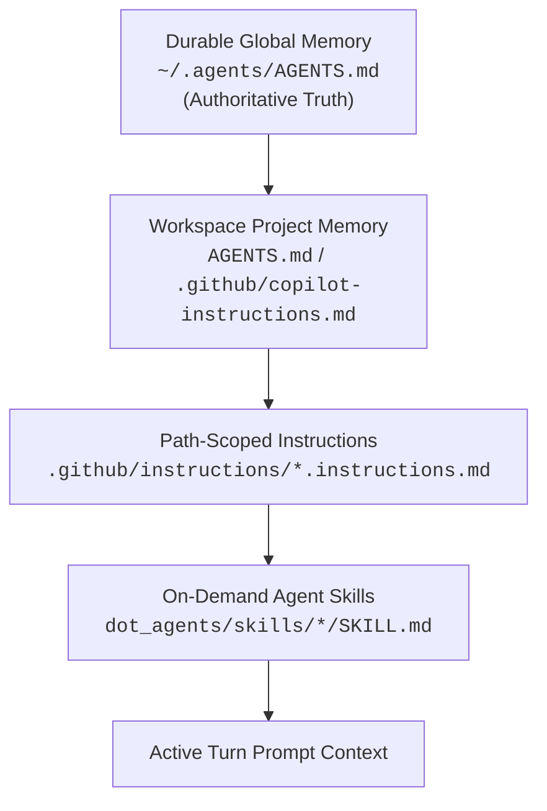
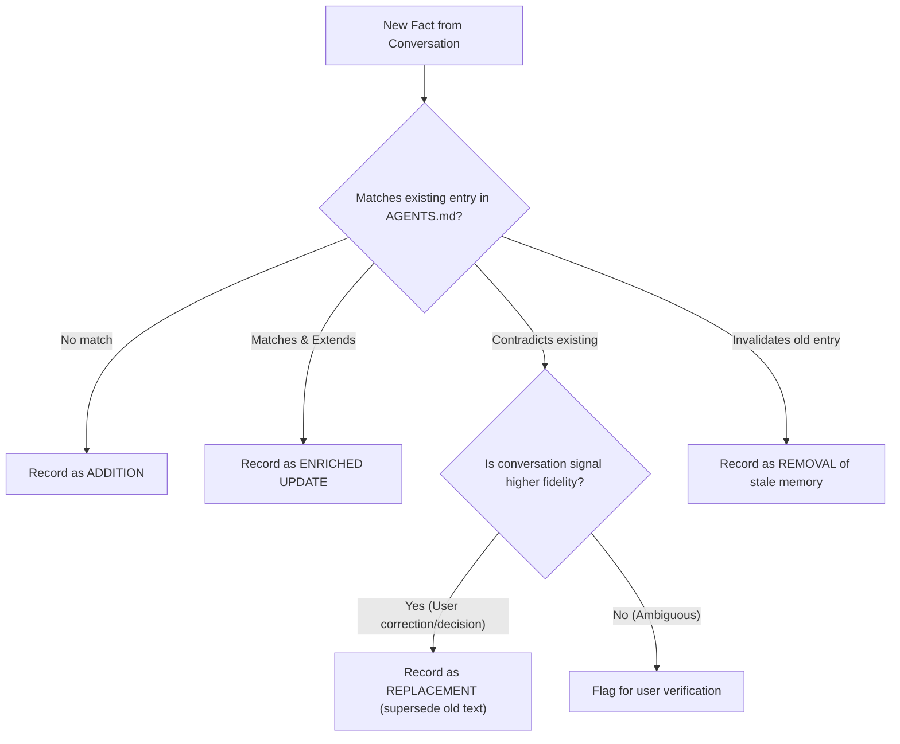

# Memory & Instruction Hierarchy

Guidelines for managing durable memory, resolving contradictions, and maintaining consistency across workspace and global instruction files.

---

## 1. Single Source of Truth Hierarchy

To prevent instruction drift, fragmentation, and conflicting directives across AI surfaces, follow this strict precedence hierarchy:

### Hierarchy Rules
1. **Authoritative Memory**: `~/.agents/AGENTS.md` is the canonical source for durable technical facts, user preferences, and cross-project decisions.
2. **Project Memory**: Workspace-level `AGENTS.md` (and symlinked instruction entry points like `.github/copilot-instructions.md`, `CLAUDE.md`, `GEMINI.md`) contain repo-specific commands, build recipes, and coding guardrails.
3. **No Parallel Memory Databases**: Workspace-only notes MUST remain ephemeral. Do NOT create secondary or divergent persistent memory stores.
4. **Promotion Path**: Patterns that mature across multiple projects or workflows should be graduated from ephemeral session notes into `~/.agents/AGENTS.md` or dedicated skills.

---

## 2. Memory Extraction & Qualification Criteria

When auditing a conversation, extract facts into memory ONLY if they meet strict qualification criteria:

| Category | What to Capture | Qualification Criteria | Example |
|---|---|---|---|
| `technical_context` | Stack, environment, tooling versions, architecture decisions | Verified factual technical property used in workspace | "The `cloakpkg` project uses Go 1.23 on the `main` branch." |
| `decision` | Settled design choice, architectural consensus | Explicit user decision that should not be reopened | "Services on macOS MUST use shell redirection `>` to truncate logs on each run." |
| `correction` | Mistake made by AI and corrected by user | High-confidence correction with clear rationale | "Obsidian slugification in `bin/df.obsidian` must use `${note_title// /-}`." |
| `communication_preference` | User formatting, interaction style, output brevity | Explicitly requested style rule or repeated pattern | "Output Markdown tables by default; avoid conversational filler." |

### What MUST NOT Be Stored in Memory
- One-off transient requests or temporary debugging tasks.
- Speculative inferences without explicit user confirmation.
- Secrets, credentials, tokens, or PII (store tool or alias names only).
- Unstructured chatter or meta-conversation.

---

## 3. Conflict Resolution & Deduplication Logic

When a newly extracted fact interacts with existing memory or instruction entries:

### Directives
- **Exact Replacement**: Always cite the exact prior string being replaced so diffs can be applied cleanly.
- **De-duplication**: If a fact is already covered by a skill or standard instruction, do not duplicate it into memory — reference the skill instead.
- **Pruning**: Actively recommend the removal of stale, deprecated, or superseded memory lines during conversation review.
