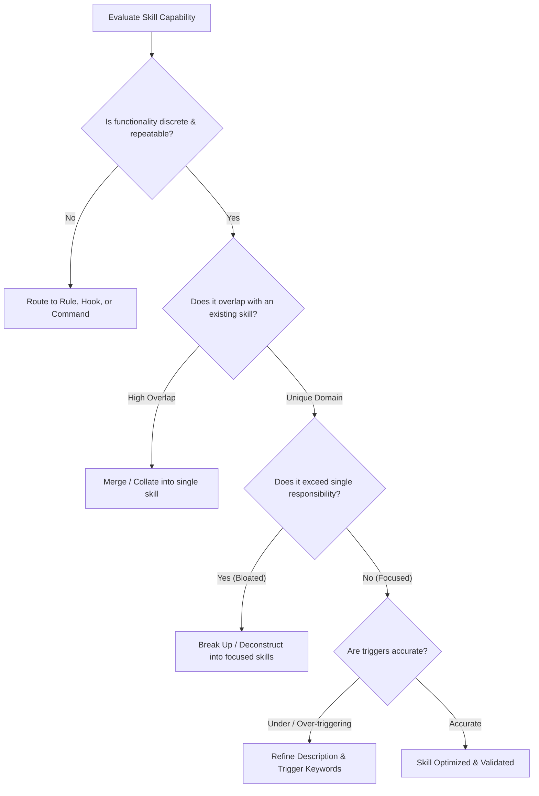

# Prompt & Skill Audit Rubric

Evaluation criteria, symptom-to-solution matrices, and lifecycle standards for reviewing prompts, skills, commands, and subagents extracted from human-AI conversations.

---

## 1. Prompt Sharpness & Goal-Scoping Rubric

Evaluate prompt bodies and system instructions against modern reasoning model principles:

| Dimension | Anti-Pattern (Micromanaged / Fragile) | Target Pattern (Goal-Oriented & Robust) | Remediating Action |
|---|---|---|---|
| **Goal Scoping** | Prescribes rigid step-by-step thinking ("First read X, think about Y, then explain Z") | Defines the explicit goal, operational bounds, and verifiable definition of "Done" | Strip manual thinking scaffolding; declare output schemas and test conditions |
| **Section Hierarchy** | Monolithic text block mixing rules, input data, and instructions | Clear Markdown headers (`## Context`, `## Rules`, `## Task`, `## Output Contract`) | Refactor into structured markdown sections; isolate variables in code fences |
| **Negative Constraints** | Absent or vague ("try to be careful with files") | Explicit RFC 2119 negative constraints ("MUST NOT run `rm -rf` without checking for symlinks") | Add crisp negative constraints targeting observed failure modes |
| **Diagrams & Visuals** | ASCII art boxes (`┌─┐`, `│ │`), text arrows (`──►`), unquoted labels | Native Mermaid.js (`flowchart TD`, `sequenceDiagram`) with quoted labels | Convert all ASCII art to standard Mermaid syntax |
| **Cognitive Scaffolding** | Repetitive boilerplate and artificial chains of thought | Direct, zero-shot imperative instructions with progressive disclosure pointers | Reduce verbosity; point to reference files instead of inlining code |
| **Ambiguity & Vagueness** | "Handle errors nicely", "use appropriate tools" | Explicit fallback behaviors and deterministic error codes | Replace loose prose with concrete rules and exit conditions |

---

## 2. Skill Lifecycle & Granularity Decision Matrix

When reviewing skills used in or suggested by a conversation, determine the appropriate lifecycle action:

### Granularity Actions

1. **Merge / Collate**:
   - *Symptom*: Multiple fragmented skills that share underlying tools, configs, or domain concepts (e.g. separate skills for listing, creating, and deleting the same resource).
   - *Action*: Collate into a unified skill package (`SKILL.md`) with a clear internal routing table.
2. **Break Up / Deconstruct**:
   - *Symptom*: A single skill handling divergent tasks, requiring multiple unrelated tool dependencies, or exceeding cognitive scope.
   - *Action*: Split into separate, single-purpose skills following the `{primary-thing}-{domain-area}` naming standard.
3. **Refine Triggers & Description**:
   - *Symptom*: The agent failed to load the skill when needed (undertriggering) or loaded it unnecessarily (overtriggering).
   - *Action*: Rewrite the frontmatter `description` (under 1024 characters) to explicitly state WHAT it does, WHEN to trigger, and literal trigger phrases users type.

---

## 3. Cognitive Boundaries Matrix

Verify that capabilities and workflows are codified into the correct container artifact:

| Artifact | Cognitive Boundary | Lifecycle Trigger | Target Location |
|---|---|---|---|
| **Root Memory** | Low-to-medium complexity, durable workspace conventions | Ingested every session | `AGENTS.md`, `CLAUDE.md`, `~/.agents/AGENTS.md` |
| **Path-Scoped Rule** | File/extension specific standards | Ingested when touching matching files | `.github/instructions/*.instructions.md`, `.cursor/rules/*.mdc` |
| **Skill** (`SKILL.md`) | Discrete, multi-step procedure or tool integration | On-demand discovery via agent reasoning | `dot_agents/skills/<name>/SKILL.md` |
| **Subagent** | Isolated task requiring separate context window or model tier | Explicit coordinator delegation | `.github/agents/*.agent.md`, `.agents/agents/` |
| **Command** | User-triggered shortcut or interactive template | Slash command in UI (`/command`) | `.github/prompts/*.prompt.md`, `.claude/commands/` |
| **Lifecycle Hook** | Deterministic binary pass/fail check or auto-formatter | Pre/post tool execution event | `hooks.json`, `.github/hooks/`, plugins |

---

## 4. Conversation Symptom Matrix

Map conversation breakdowns to root causes and fixes:

| Observed Symptom | Root Cause | Remediating Change |
|---|---|---|
| Agent guessed tool syntax or failed repeatedly | Lack of documented CLI wrapper or script | Synthesize a consolidated shell/python script with `--help` |
| Agent violated safety guardrail (e.g. deleted symlink) | Missing explicit negative constraint | Add strict RFC 2119 negative constraint to workspace `AGENTS.md` |
| Agent missed domain context known to user | Uncaptured durable memory | Extract durable fact into `~/.agents/AGENTS.md` |
| Agent produced raw JSON instead of interactive UI | Anti-pattern tool sequencing (e.g. `update_topic` + `ask_user`) | Document sequencing rule in root memory and enforce in skill |
| Agent loaded wrong skill or missed relevant skill | Ambiguous or overly narrow skill description | Update `SKILL.md` frontmatter description with explicit phrases |
| Output was excessively verbose or unformatted | Missing structured output contract | Add template with Markdown headers or typed tables |
