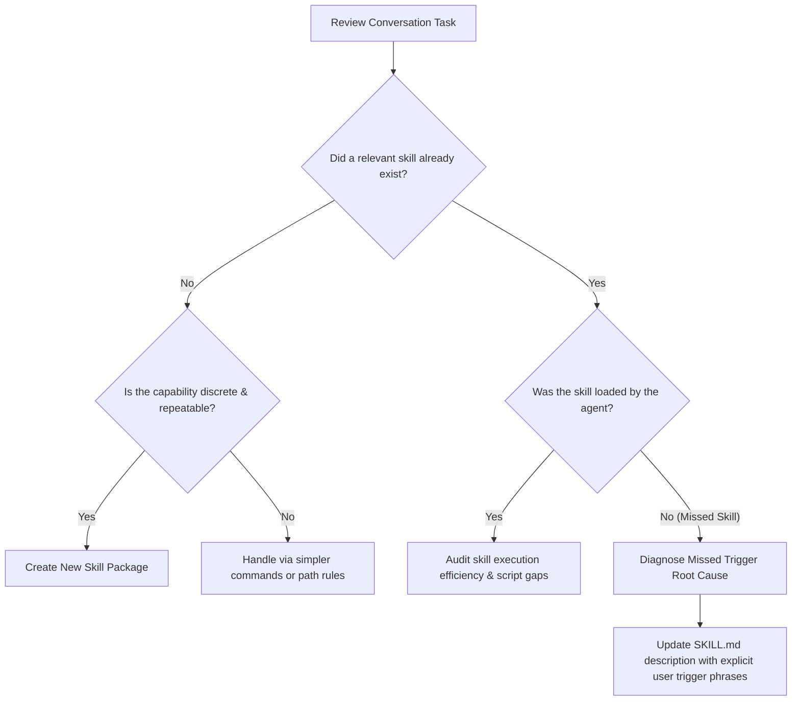
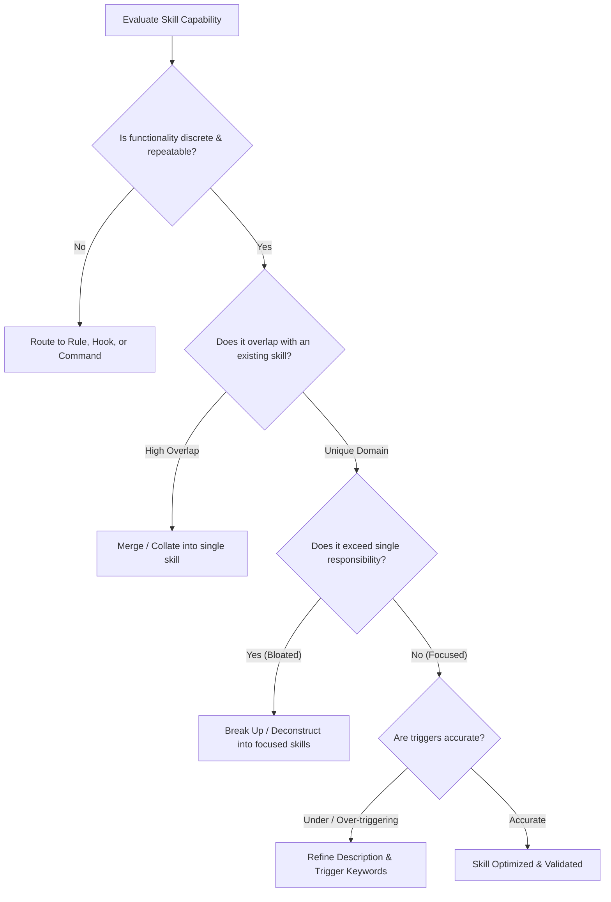
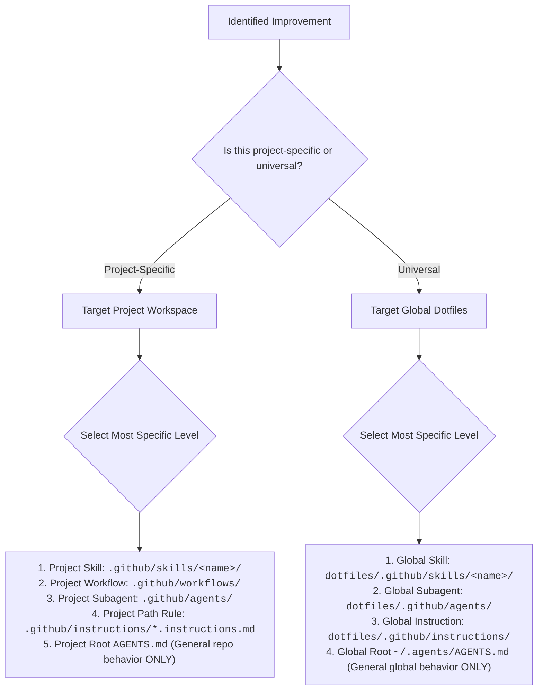

# Prompt & Skill Audit Rubric

Evaluation criteria, symptom-to-solution matrices, and lifecycle standards for reviewing prompts, skills, commands, subagents, and tool/command efficiency extracted from human-AI conversations.

---

## 1. Tool & Command Usage Efficiency Rubric

Evaluate all tool invocations and terminal commands executed during the session against efficiency, simplicity, and reviewability standards:

| Dimension | Anti-Pattern (Inefficient / Complex) | Target Pattern (Efficient & Simple) | Remediating Action |
|---|---|---|---|
| **Command Simplicity** | Inline Python scripts (`python3 -c "..."`, heredocs) or opaque bash pipelines (`cmd \| grep \| awk \| sed \| jq`) | Simple, declarative, single-purpose CLI commands or dedicated skill scripts | Move complex logic into `<skill-dir>/scripts/`; enforce simpler commands in guidelines |
| **Tool Directness** | Multi-turn exploratory guessing with trial-and-error commands | Direct execution of a single parameterized command or dedicated skill script | Synthesize a reusable skill script with `--help` and clear flags |
| **Context Conservation** | Running commands that dump hundreds of lines of unfiltered stdout into context | Filtering, paginating, or emitting clean Markdown summaries from the script | Add token-efficient summary formatting inside the skill script |
| **Reusability & Patterns** | LLM repeatedly synthesizes custom commands for a recurring workflow across turns | LLM invokes an existing, deterministic skill script | Package recurring command patterns into a reusable script in `<skill-dir>/scripts/` |
| **Reviewability** | Dense, multi-line escaped commands in chat logs that humans cannot audit | Clean, legible command invocations with visible, understandable flags | Enforce strict command simplicity; reject inline scripts |

---

## 2. Missed Skill & Trigger Audit Rubric

Auditing conversations MUST inspect both the skills that were executed and **skills that SHOULD have been used but were never loaded**:

### Diagnosing Why a Skill Was Missed
1. **Description Ambiguity**: Frontmatter `description` failed to describe WHAT the skill does in terms matching user intent.
2. **Missing Trigger Keywords**: Common terms, synonyms, or CLI tool names were absent from the description.
3. **Cognitive Overload**: The agent was overwhelmed by bloated workspace context and defaulted to ad-hoc guessing.
4. **Fix Requirement**: Update the target skill's frontmatter `description` with explicit trigger phrases, or add clear routing instructions to the relevant workflow/agent.

---

## 3. Skill Lifecycle & Granularity Decision Matrix

When reviewing skills used in or suggested by a conversation, determine the appropriate lifecycle action:

### Granularity Actions
1. **Merge / Collate**: Collate fragmented skills that share underlying tools or domain concepts into a unified skill package (`SKILL.md`) with an internal routing table.
2. **Break Up / Deconstruct**: Split bloated skills handling divergent tasks into separate single-purpose skills (`{primary-thing}-{domain-area}`).
3. **Refine Triggers & Description**: If a skill was missed or over-triggered, rewrite frontmatter `description` (under 1024 chars) to state WHAT it does, WHEN to trigger, and literal user trigger phrases.

---

## 4. Scope & Specificity Hierarchy

When codifying learnings and fixes from a conversation review, route changes according to **Scope (Project vs. Global)** and **Specificity**:

### Specificity Hierarchy Rules
1. **Specificity First**: Changes should be as specific as possible. Target skills, workflows, and subagents first.
2. **Root `AGENTS.md` Restraint**: `AGENTS.md` (whether project root or global root) should **ONLY** ever be updated if the required change represents a general behavior across that entire scope.
3. **Scope Cleanliness**: Never place project-specific commands, build steps, or domain logic in global files. Never place universal developer tooling inside project-only instructions.

---

## 5. Conversation Symptom Matrix

Map conversation breakdowns to root causes and fixes:

| Observed Symptom | Root Cause | Remediating Change | Target Scope & Level |
|---|---|---|---|
| Agent ran inline Python (`python -c`) or complex bash pipelines | Missing reusable helper script in skill | Synthesize script in `<skill-dir>/scripts/` and document in `SKILL.md` | Skill Script |
| Agent repeatedly executed trial-and-error command loops | Unclear CLI usage or missing wrapper | Consolidate command pattern into a skill script with `--help` | Skill Script |
| Skill existed for the task, but agent never loaded it | Skill description was undertriggering or missing trigger phrases | Add exact user intent and trigger phrases to `SKILL.md` frontmatter | Skill Frontmatter |
| Agent guessed repo build/test steps ad-hoc | Missing project-level instructions | Add recipe to project-level instructions or project root `AGENTS.md` | Project Scope |
| Agent violated universal safety rule (e.g. symlink deletion) | Missing general guardrail | Add strict negative constraint to `~/.agents/AGENTS.md` | Global Root Memory |
| Agent loaded wrong skill or overtriggered | Skill description too broad or overlapping | Narrow frontmatter description and clarify boundaries | Skill Frontmatter |
| Tool output was excessively verbose, exhausting context | Unfiltered command output | Add markdown summary formatting and output limits to skill script | Skill Script |
