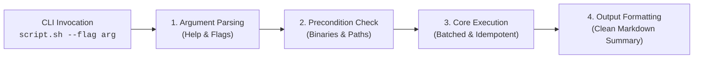
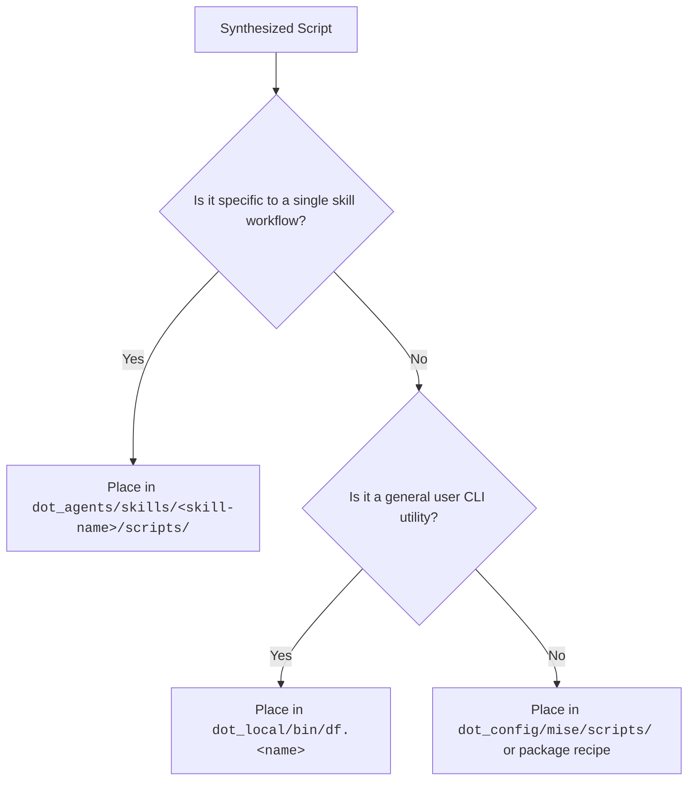

# Terminal Command Consolidation Guide

Principles, heuristics, and architectural standards for turning multi-turn, trial-and-error shell commands into deterministic, reusable scripts so AI agents no longer guess.

---

## 1. Why Consolidate Commands?

When an AI agent interacts with complex tools or multi-step shell pipelines, it often experiences:
1. **Trial-and-Error Iteration**: Invoking commands repeatedly with slight flag modifications when commands fail or output formats differ.
2. **Context Window Exhaustion**: Piping massive unfiltered outputs across multiple turns.
3. **Flaky Orchestration**: Fragile string-splitting, word-splitting, or unhandled exit codes in ad-hoc bash one-liners.

**The Solution**: Encapsulate multi-step logic, pipeline parsing, and edge cases into a single, well-tested script bundled inside a skill or `dot_local/bin/`. The AI agent then invokes the script as a black-box tool.

---

## 2. Detection Heuristics: When to Synthesize a Script

Flag a command sequence for consolidation if it exhibits any of these indicators:

| Indicator | Conversation Evidence | Recommended Action |
|---|---|---|
| **Multi-Turn Trial** | Agent attempted 2+ bash commands to achieve a single outcome (e.g. searching, formatting, querying API) | Synthesize a single script taking target parameters |
| **Complex Piping** | `cmd \| grep \| awk \| sed \| jq` chain longer than 2 pipes | Wrap into an idempotent script with typed parameters |
| **API / Tool Iteration** | Shell loop calling `curl` or `gh` repeatedly for multiple items | Implement batched requests in Python or Zsh |
| **Formatting Fragility** | Complex regex or text truncation logic executed inline in the shell | Standardize output parsing inside a Python/Zsh helper |
| **Interactive Failure** | Tool hung waiting for interactive input or pagers (`PAGER=cat` missing) | Enforce non-interactive flags (`-y`, `--no-pager`, batch mode) |

---

## 3. Architecture of a Consolidated Script

Every consolidated script MUST satisfy these engineering standards:

### Mandatory Standards
1. **Self-Documenting `--help`**: Provide a clear `--help` text documenting options, arguments, and return values so the agent can discover usage without reading source code.
2. **Non-Interactive Execution**: Never prompt for user input or open a TUI. Pass automatic confirmation flags (`-y`, `--non-interactive`) to sub-processes.
3. **Structured & Token-Efficient Output**: Output concise, readable Markdown tables or summaries directly to stdout. Avoid emitting megabytes of raw dump.
4. **Idempotency & Safety**: Safe to run repeatedly without mutating state unexpectedly. Check if files or resources already exist before writing.
5. **Strict Error Trapping**: Use `set -euo pipefail` in Bash/Zsh or structured `try/except` in Python. Return non-zero exit codes on failure with a clear error message to `stderr`.

---

## 4. Script Placement & Routing Rules

Route newly synthesized scripts using this decision tree:

### Documenting in `SKILL.md`
Once a script is placed in a skill's `scripts/` folder:
- Document the command invocation syntax and options in the skill's `SKILL.md`.
- Ensure agents can execute it directly (`scripts/helper.sh --arg value`) without opening or reading the source code first.
