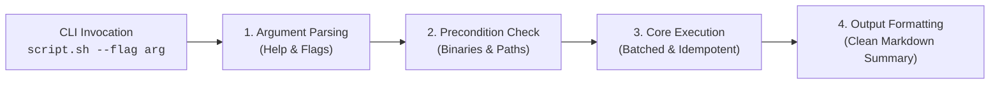
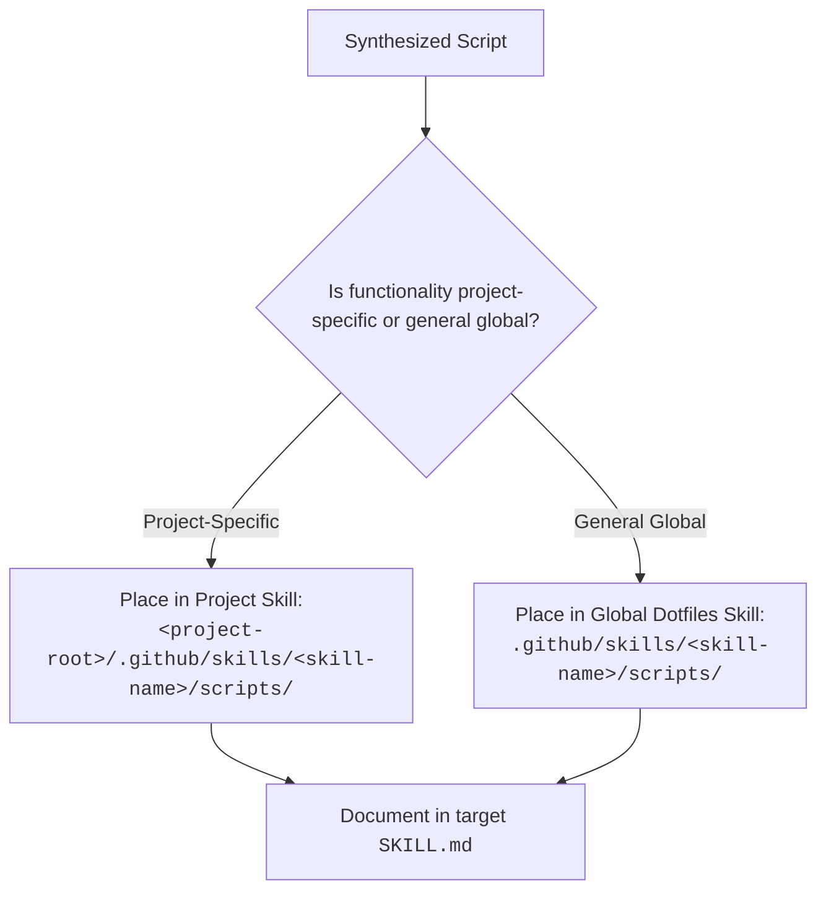

# Terminal Command Consolidation & Simplicity Guide

Principles, heuristics, and architectural standards for turning multi-turn, trial-and-error shell commands into deterministic, reusable scripts, eliminating opaque inline scripts, and enforcing command simplicity so AI agents no longer guess.

---

## 1. Why Consolidate Commands?

When an AI agent interacts with complex tools or multi-step shell pipelines, it often falls into predictable failure modes:
1. **Trial-and-Error Iteration**: Invoking commands repeatedly with slight flag modifications when ad-hoc syntax fails or output formats differ.
2. **Context Window Exhaustion**: Emitting and ingesting massive unfiltered command outputs across multiple conversation turns.
3. **Escalating Command Complexity**: Generating unreadable inline Python scripts (`python3 -c "..."` or heredocs) and deeply nested bash one-liners (`cmd | grep | awk | sed | jq ...`).
4. **Reviewability Breakdown**: Humans cannot easily audit, verify, or review multi-line escaped inline scripts in chat logs and diffs.

**The Solution**: Encapsulate multi-step logic, pipeline parsing, and edge cases into a single, well-tested script bundled inside a skill package (`<skill-dir>/scripts/`). The AI agent then invokes the script via a clean, predictable, single-line CLI command.

---

## 2. The Simpler Commands Mandate

AI agents MUST produce simple, declarative, easily auditable commands.

### Anti-Patterns to Eliminate

| Anti-Pattern | Example Smell | Why It Fails | Mandatory Alternative |
|---|---|---|---|
| **Inline Python Scripts** | `python3 -c "import sys, json; data=json.load(sys.stdin)..."` or `python3 << 'EOF'` | Impossible to review easily in transcripts; fragile quoting/escaping; prone to syntax crashes. | Move logic into a dedicated script in the skill's `scripts/` directory. |
| **Monolithic Bash Pipelines** | `cmd \| grep -v foo \| awk '{print $2}' \| sed 's/x/y/' \| xargs -I{} ...` | Brittle under unexpected delimiters; ignores pipeline error exit codes; hard to debug. | Wrap into a single parameterized skill script with error trapping. |
| **Ad-Hoc JSON Reshaping** | `curl ... \| jq -r '.items[] \| select(...) \| {id, name}'` nested in shell loops | Inefficient multi-turn iterations; leaks API tokens; fails on null fields. | Use a dedicated Python or shell script in the skill that parses and outputs clean Markdown tables. |
| **Unbounded Raw Dumps** | Running log/search commands without limits or filters | Consumes thousands of context tokens with irrelevant data, truncating prompt memory. | Script must emit token-efficient Markdown summaries to stdout by default. |

---

## 3. Detection Heuristics: When to Synthesize a Script

Flag a command sequence for consolidation if it exhibits any of these indicators:

| Indicator | Conversation Evidence | Recommended Action |
|---|---|---|
| **Inline Code Execution** | Agent executed `python3 -c`, `bash -c`, or multi-line heredocs (`<<EOF`) | Extract into a clean, reusable script inside `<skill-dir>/scripts/` |
| **Multi-Turn Guesswork** | Agent attempted 2+ bash commands to achieve a single outcome (e.g. searching, formatting, querying API) | Synthesize a single script taking target parameters |
| **Complex Piping** | `cmd \| grep \| awk \| sed \| jq` chain longer than 2 pipes | Wrap into an idempotent script with typed parameters |
| **API / Tool Iteration** | Shell loop calling `curl` or `gh` repeatedly for multiple items | Implement batched requests in a dedicated skill script |
| **Context Flooding** | Unfiltered stdout produced >100 lines of noise into the conversation | Add filtering, summary flags, or pagination within the skill script |
| **Interactive Failure** | Tool hung waiting for interactive input or pagers (`PAGER=cat` missing) | Enforce non-interactive flags (`-y`, `--no-pager`, batch mode) inside the script |

---

## 4. Architecture of a Consolidated Skill Script

Every consolidated script MUST satisfy these engineering standards:

### Mandatory Standards
1. **Self-Documenting `--help`**: Provide clear `--help` text documenting options, arguments, and return values so the agent can discover usage without reading source code.
2. **Non-Interactive Execution**: Never prompt for user input or open a TUI. Pass automatic confirmation flags (`-y`, `--non-interactive`) to sub-processes.
3. **Structured & Token-Efficient Output**: Output concise, readable Markdown tables or summaries directly to stdout. Avoid emitting raw data dumps.
4. **Idempotency & Safety**: Safe to run repeatedly without mutating state unexpectedly. Check if files or resources already exist before writing.
5. **Strict Error Trapping**: Use `set -euo pipefail` in Bash/Zsh or structured `try/except` in Python. Return non-zero exit codes on failure with a clear error message to `stderr`.

---

## 5. Scope-Aware Script Placement Rules

Consolidated scripts are placed **exclusively inside skill directories** (`<skill-dir>/scripts/`). Never place agent workflow scripts in `dot_local/bin/df.*` or arbitrary workspace roots.

Route newly synthesized scripts using this decision tree:

### Scope Distinctions
- **Project-Specific Scope**: Scripts tailored to a specific repository's proprietary build system, local microservices, database schemas, or repo-level API endpoints belong in that project's `.github/skills/<skill-name>/scripts/`.
- **General Global Scope**: Scripts for universal developer tasks, cross-repo tools (e.g. GitHub PR review helpers, universal conversation parsers, general git workflows) belong in the global dotfiles skill directory (`.github/skills/<skill-name>/scripts/`), available across all workspaces.

---

## 6. Documenting in `SKILL.md` & Downstream Propagation

Once a script is placed in a skill's `scripts/` folder:
1. **Document Invocation**: Add the command syntax, parameters, and expected output format to the skill's `SKILL.md`.
2. **Path Resolution**: Direct agents to invoke it relative to the active skill directory (`<skill-dir>/scripts/<name>`), never assuming working directory.
3. **Enforce Script Usage**: Ensure the skill's workflow instructions explicitly instruct the agent to run the helper script rather than constructing ad-hoc shell commands.
