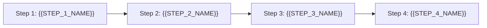

# Skill Optimization Blueprint Template

Template for generating new or refactored skill definitions adhering to the agentskills.io standard.

---

````markdown
---
name: {{SKILL_NAME}}
description: >
  {{THIRD_PERSON_CONCISE_DESCRIPTION_STATING_WHAT_IT_DOES_AND_WHEN_TO_TRIGGER_UNDER_1024_CHARS}}
---

# {{HUMAN_READABLE_TITLE}}

{{CONCISE_SUMMARY_OF_CAPABILITY_AND_PURPOSE}}

---

## When to Use

- {{EXPLICIT_USER_TRIGGER_PHRASE_1}}
- {{EXPLICIT_USER_TRIGGER_PHRASE_2}}
- {{SCENARIO_OR_EDGE_CASE_DESCRIPTION}}

---

## Workflow & Operations



### 1. {{STEP_1_NAME}}
- {{STEP_1_RULES_AND_COMMANDS}}

### 2. {{STEP_2_NAME}}
- {{STEP_2_RULES_AND_COMMANDS}}

---

## Script Helpers & Execution

| Utility | Location | Invocation Syntax | Purpose |
|---|---|---|---|
| `{{SCRIPT_NAME}}` | `scripts/{{SCRIPT_FILENAME}}` | `scripts/{{SCRIPT_FILENAME}} [options]` | {{BRIEF_DESCRIPTION}} |

---

## Output Contract & Verification

- {{EXPLICIT_SUCCESS_CRITERIA_AND_RETURN_FORMAT}}
````
