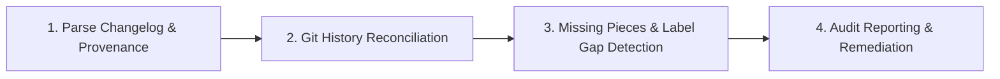

# Changelog Audit Skill

Standard Operating Procedure for auditing `CHANGELOG.md` files against Git history, verifying commit range continuity, and detecting missing commits, unrecorded PR labels, and version drift.

## When to use

- Auditing an existing `CHANGELOG.md` to ensure zero missing commits between releases.
- Verifying whether all commits in a Git range (`<base>..<head>`) were categorized or listed in the omission ledger.
- Detecting unrecorded pull requests or misclassified labels (e.g. `breaking` changes hidden in bug fixes).
- Validating version continuity and ensuring no untracked commit gaps exist between consecutive releases.
- Pre-release gate checks to certify that release notes accurately represent repository changes.
- Generating formal markdown changelog audit reports for release sign-offs.

## Changelog Audit Lifecycle Workflow



### Phase 1: Parse Changelog & Provenance
1. Load `CHANGELOG.md` and parse version sections, dates, and embedded `changelog-provenance` YAML blocks.
2. Verify format compliance against Keep a Changelog (1.1.0) and ISO 8601 date standards (`YYYY-MM-DD`).
3. Extract documented PR numbers, compare URLs, and declared omission ledgers.
4. Read `@references/audit-methodology.md`.

### Phase 2: Git History Reconciliation
1. For each release entry, run `git log <base_commit>..<head_commit>` to extract all commits in that release window.
2. Check continuity between consecutive releases (`base_commit(N) == head_commit(N-1)`).
3. Identify untracked commit gaps between tags.
4. Read `@references/gap-detection.md`.

### Phase 3: Missing Pieces & Label Gap Detection
1. Compare Git commits against documented PRs, commit SHAs, and the `omitted_or_internal` ledger.
2. Flag unaccounted commits and rank by severity (`High` for features/fixes, `Critical` for breaking changes).
3. Cross-reference repository labels: verify that PRs tagged `breaking`, `security`, or `enhancement` are placed in the correct sections.

### Phase 4: Audit Reporting & Remediation
1. Generate an actionable Markdown audit report with executive summary, missing commits table, and remediation checklist.
2. Provide concrete diffs to update `CHANGELOG.md` or add internal chores to the omission ledger.
3. Certify whether the changelog passes the release readiness gate.

## Templates & Tooling

| Resource | Path | Purpose |
|---|---|---|
| **Audit Report Template** | `templates/changelog-audit-report.md` | Formal audit report with executive summary, missing pieces table, and checklist |
| **Audit Script** | `@scripts/audit-changelog.py` | CLI tool to audit changelogs against Git logs and detect missing commits |

## Script Invocations

Audit changelog files using the bundled helper:

```bash
# Audit CHANGELOG.md in the current repository
python3 <skill-dir>/scripts/audit-changelog.py

# Audit a specific release version
python3 <skill-dir>/scripts/audit-changelog.py --version 1.2.0

# Generate a formal markdown audit report
python3 <skill-dir>/scripts/audit-changelog.py --report docs/changelog-audit-report.md

# Audit a monorepo package changelog with path filtering
python3 <skill-dir>/scripts/audit-changelog.py --changelog packages/cli/CHANGELOG.md --path packages/cli

# Run in strict mode as a CI gate (exits with code 1 if missing commits are found)
python3 <skill-dir>/scripts/audit-changelog.py --strict
```
