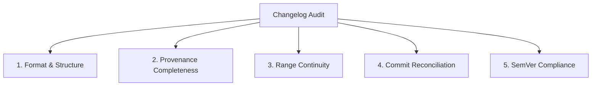

# Changelog Audit Methodology Reference

This document outlines the systematic verification procedure for auditing `CHANGELOG.md` files against repository Git history, commit ranges, and PR metadata.

---

## 1. Audit Dimensions

A comprehensive changelog audit evaluates five distinct quality dimensions:

### Dimension 1: Format & Structure
- Conforms to Keep a Changelog (1.1.0) heading hierarchies (`## [Version] - YYYY-MM-DD`).
- Valid ISO 8601 release dates.
- Valid Markdown compare link references matching `[Version]: https://.../compare/...`.

### Dimension 2: Provenance Completeness
- Presence of the machine-readable `<!-- changelog-provenance: ... -->` block.
- Base commit SHA and Head commit SHA match valid Git references.
- Recorded PR numbers match issue links in the release entry narrative.
- Non-empty `labels_recorded` mapping verifying PR classification.

### Dimension 3: Range Continuity
- The `base_commit` of version `N` must equal the `head_commit` of version `N-1`.
- Any disjoint range represents an **untracked commit gap** where changes occurred without documentation.

### Dimension 4: Commit Reconciliation (Gap Detection)
- Execute `git log <base_commit>..<head_commit>` to retrieve every commit in the release window.
- Partition commits into:
  1. **Documented in narrative**: Mentioned via PR number, commit SHA, or description.
  2. **Audited in omission ledger**: Present in `omitted_or_internal` with an explicit reason.
  3. **Unaccounted / Missing**: Neither documented nor audited.

### Dimension 5: SemVer Compliance
- If breaking changes are recorded (`### Breaking Changes` or PR label `breaking`), verify the version bump is MAJOR (`X.0.0`).
- If new features are added without breaking changes, verify MINOR (`0.Y.0`).
- If only bug fixes/security patches exist, verify PATCH (`0.0.Z`).

---

## 2. Severity Classification for Audit Findings

| Finding Type | Severity | Description | Remediation |
|---|---|---|---|
| **Missing User-Facing Feature / Fix** | **High** | A `feat:` or `fix:` commit exists in Git history but is absent from the changelog. | Add entry to changelog narrative with PR link. |
| **Missing Breaking Change** | **Critical** | Breaking change or API modification merged without changelog callout. | Immediate documentation; evaluate if SemVer bump required. |
| **Commit Range Gap** | **High** | Commit range between releases has an uninspected gap of commits. | Re-run history extraction across gap to capture missed work. |
| **Missing Omission Ledger Entry** | **Low** | Internal chore commit (`ci:`, `chore:`) not listed in provenance block. | Append commit SHA to `omitted_or_internal`. |
| **Broken Compare Reference Link** | **Medium** | Compare URL has incorrect tag name or 404 target. | Correct link definition at the bottom of the changelog. |
| **Non-ISO Date Format** | **Low** | Date formatted as `10/02/2026` instead of `2026-10-02`. | Standardize to ISO 8601. |
