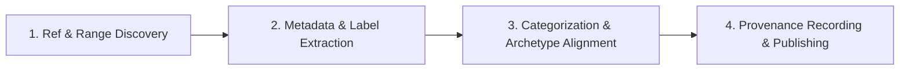

# Changelog Authoring Skill

Standard Operating Procedure for authoring, updating, and maintaining release changelogs conforming to [Keep a Changelog](https://keepachangelog.com/en/1.1.0/) and [Semantic Versioning](https://semver.org/spec/v2.0.0.html), backed by verifiable Git provenance records (commit ranges, SHAs, comparison URLs, and PR labels).

## When to use

- Scaffolding a brand-new `CHANGELOG.md` file for any repository.
- Generating a changelog draft or release notes from Git commit history across a range (`<base>..<head>`).
- Updating `[Unreleased]` changes or preparing a tagged version release.
- Recording commit ranges, PR numbers, and classification labels to guarantee auditability for missing pieces.
- Adapting changelog formats to specific project archetypes (Libraries/SDKs, CLI tools, SaaS/APIs, Monorepos).
- Classifying conventional commits into user-facing narratives vs audited internal chores.

## Changelog Lifecycle Workflow



### Phase 1: Ref & Range Discovery
1. Identify the base tag or commit ref and target revision (`HEAD` or release branch).
2. For monorepos, determine package path boundaries (e.g. `packages/core/**`).
3. Confirm target versioning scheme (SemVer `MAJOR.MINOR.PATCH` or CalVer `YYYY-MM-DD`).
4. Read `@references/changelog-standards.md`.

### Phase 2: Metadata & Label Extraction
1. Extract commit subjects, bodies, authors, and dates across the revision range.
2. Detect PR numbers and resolve associated labels via `gh pr view` or conventional scopes.
3. Separate user-facing changes from internal chores (`ci:`, `test:`, `chore:`).
4. Read `@references/provenance-recording.md`.

### Phase 3: Categorization & Archetype Alignment
1. Group user-facing items into canonical sections: `Breaking Changes ⚠️`, `Added`, `Changed`, `Deprecated`, `Removed`, `Fixed`, `Security`.
2. Apply project-specific conventions (e.g. commands/flags for CLIs, migration guides for SDKs, deployment preconditions for services).
3. Draft clear, human-centric descriptions with issue/PR markdown links.
4. Read `@references/project-archetypes.md`.

### Phase 4: Provenance Recording & Publishing
1. Embed the machine-readable `changelog-provenance` block recording the exact commit range, base/head SHAs, compare URL, and omitted commit ledger.
2. Add reference comparison links at the bottom of the changelog.
3. Prepend the new release section immediately below `[Unreleased]` (or initialize a fresh file).

## Templates & Tooling

| Resource | Path | Purpose |
|---|---|---|
| **Keep a Changelog** | `templates/changelog-keepachangelog.md` | Standard format with Unreleased, version entries, and provenance block |
| **Library / SDK** | `templates/changelog-library-semver.md` | SemVer format with Breaking Changes, migration guides, and API contracts |
| **CLI & Tooling** | `templates/changelog-cli-tool.md` | Commands, subcommands, flags, environment variables, and OS support |
| **Service & Web App** | `templates/changelog-service-webapp.md` | Release trains, user features, schema migrations, and operational notes |
| **Monorepo** | `templates/changelog-monorepo.md` | Multi-package workspace changelog with package scopes and root tooling |
| **Scaffold Script** | `@scripts/create-changelog.py` | Initializes `CHANGELOG.md` with chosen template and detected git remote |
| **Extraction Script** | `@scripts/extract-git-history.py` | Extracts git commits, resolves PR labels, groups entries, and builds provenance |

## Script Invocations

Scaffold or extract changelogs using the bundled helpers:

```bash
# Scaffold a new CHANGELOG.md using the standard Keep a Changelog template
python3 <skill-dir>/scripts/create-changelog.py --template keepachangelog

# Scaffold for a CLI tool or dotfiles repository
python3 <skill-dir>/scripts/create-changelog.py --template cli --repo warpcode/dotfiles

# Extract git history from previous tag to HEAD and generate a markdown release draft
python3 <skill-dir>/scripts/extract-git-history.py --version 1.3.0

# Extract git history for a specific commit range without gh CLI network calls
python3 <skill-dir>/scripts/extract-git-history.py --from-ref v1.2.0 --to-ref HEAD --no-gh

# Output raw JSON provenance metadata for CI pipelines or verification
python3 <skill-dir>/scripts/extract-git-history.py --from-ref v1.2.0 --to-ref v1.3.0 --json
```
