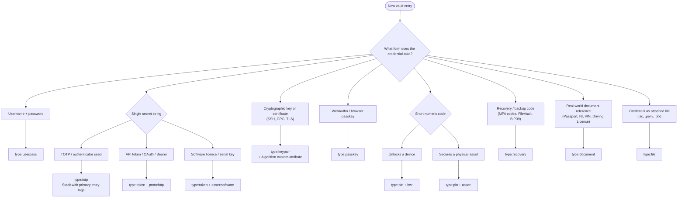

# KeePass Classification Skill

Classify KeePass entries using a flat tag taxonomy anchored on `type:`. All
other tags add context to the anchor — they do not stand alone.

These rules are **defaults, not absolutes**. Apply them unless the user
explicitly overrides a rule for a specific entry.

---

## Tag Namespaces

| Namespace | Role | Valid values |
|-----------|------|-------------|
| `type:` | **Anchor** — credential format | `userpass` `token` `keypair` `totp` `passkey` `pin` `recovery` `document` `file` |
| `env:` | Network perimeter | `cloud` `homelab` `local` |
| `proto:` | Connection protocol | `http` `ssh` `mysql` `gui` `console` |
| `hw:` | Physical hardware target | `laptop` `server` `phone` `tablet` |
| `org:` | Ownership context | `personal` `work` `family` |
| `cat:` | Non-technical category | `finance` `media` `ident` |
| `loc:` | Physical storage location | `safe` `filing-cabinet` `wallet` |
| `asset:` | Physical asset type | `card` `vehicle` `wallet` `software` |

---

## Classification Flow

Determine `type:` first, then apply the contextual tags defined in the rules below.



---

## Type Rules

### `type:userpass`

Standard username + password login.

- `env:` — MUST include
- `proto:` — MUST include
- `org:` — MUST include
- `hw:` — MUST include ONLY IF `proto:` is `gui` or `console` (OS login to physical hardware); MUST NOT include otherwise
- `cat:` — MAY include for non-technical grouping
- `loc:`, `asset:` — MUST NOT include

**Example:** `type:userpass` `env:homelab` `proto:mysql` `org:personal`

---

### `type:token`

Single-string secrets: API tokens, Bearer tokens, OAuth tokens, software licence keys.

- `env:` — MUST include
- `org:` — MUST include
- `proto:http` — MUST include IF the token authenticates to an HTTP/REST API
- `asset:software` — MUST include IF the token is a static software serial or licence key; use INSTEAD OF `proto:`, not alongside it
- `hw:` — MUST NOT include

**Example (API):** `type:token` `env:cloud` `proto:http` `org:work`  
**Example (licence):** `type:token` `env:local` `asset:software` `org:personal`

---

### `type:keypair`

Cryptographic key material: SSH keys, GPG keys, TLS certificates.

- `env:` — MUST include
- `proto:` — MUST include (`ssh` or `http`)
- `org:` — MUST include
- Custom attribute `Algorithm` — MUST include (e.g. `RSA`, `Ed25519`, `ECDSA`)
- `hw:server` — MAY include IF the key is scoped to specific infrastructure
- `asset:`, `loc:`, `cat:` — MUST NOT include

**Example:** `type:keypair` `env:homelab` `proto:ssh` `org:personal`

---

### `type:totp`

Base32 TOTP authenticator seed. This is a **stacking type** — it is added to an
existing `type:userpass` entry, never used in isolation.

- Stack with whatever tags the parent `type:userpass` entry carries
- MUST NOT appear as a standalone entry without a primary type
- `loc:`, `asset:` — MUST NOT include

**Example:** `type:userpass` `type:totp` `env:cloud` `proto:http` `org:personal`

---

### `type:passkey`

WebAuthn native credential managed by the browser.

- `env:` — MUST include (`cloud` or `homelab` only — passkeys are web-only)
- `proto:http` — MUST include
- `org:` — MUST include
- `hw:`, `asset:`, `loc:`, `cat:` — MUST NOT include

**Example:** `type:passkey` `env:cloud` `proto:http` `org:work`

---

### `type:pin`

Short, static, numeric-only code.

- `org:` — MUST include
- IF unlocking a physical device: MUST include `hw:` + `env:local`
- IF securing a physical asset: MUST include `asset:`
- `proto:` — MUST NOT include
- `env:cloud`, `env:homelab` — MUST NOT include

**Example (bank card):** `type:pin` `asset:card` `org:personal`  
**Example (tablet unlock):** `type:pin` `hw:tablet` `env:local` `org:family`

---

### `type:recovery`

Break-glass secrets: MFA backup codes, FileVault / BitLocker keys, BIP39 seeds.

- `org:` — MUST include
- IF the secret recovers a digital account or encrypted drive: include `env:` (`cloud` or `local`)
- IF the seed physically exists in the real world (etched metal, printed paper): include `loc:` instead of (or alongside) `env:`
- IF recovering a physical crypto device: include `asset:wallet`
- `proto:`, `cat:` — MUST NOT include

**Example (AWS MFA backup):** `type:recovery` `env:cloud` `org:work`  
**Example (MacBook FileVault):** `type:recovery` `env:local` `hw:laptop` `org:personal`

---

### `type:document`

Text records of real-world identifiers: passports, National Insurance numbers,
VINs, driving licences.

- `org:` — MUST include
- `loc:` — SHOULD include to record where the physical document lives
- `cat:ident` — SHOULD include for government or identity documents
- `asset:vehicle` — MAY include IF the entry is a VIN or V5C logbook record
- `env:`, `proto:` — MUST NOT include (documents do not execute on networks)

**Example (passport):** `type:document` `loc:safe` `cat:ident` `org:personal`

---

### `type:file`

Credential delivered as an attached binary or text file (`.lic`, `.pem`, `.pfx`).

- `env:` — MUST include
- `org:` — MUST include
- `asset:software` — SHOULD include IF it is a licence file
- `proto:` — MAY include IF the file is a certificate for a specific protocol
- `hw:`, `loc:` — MUST NOT include

**Example (VMware licence file):** `type:file` `env:homelab` `asset:software` `org:personal`

---

## Compatibility Matrix

`✓` = allowed / required per rules above &nbsp;&nbsp; `✗` = MUST NOT use &nbsp;&nbsp; `—` = not applicable

| Type | `env:` | `proto:` | `hw:` | `org:` | `cat:` | `loc:` | `asset:` |
|------|:------:|:--------:|:-----:|:------:|:------:|:------:|:--------:|
| `userpass` | MUST | MUST | IF gui/console | MUST | MAY | ✗ | ✗ |
| `token` | MUST | IF API | ✗ | MUST | ✗ | ✗ | IF software |
| `keypair` | MUST | MUST | IF server | MUST | ✗ | ✗ | ✗ |
| `totp` | inherit | inherit | inherit | inherit | inherit | ✗ | ✗ |
| `passkey` | MUST | MUST (http) | ✗ | MUST | ✗ | ✗ | ✗ |
| `pin` | IF device | ✗ | IF device | MUST | ✗ | ✗ | IF asset |
| `recovery` | IF digital | ✗ | MAY | MUST | ✗ | IF physical | IF wallet |
| `document` | ✗ | ✗ | ✗ | MUST | MAY (ident) | MAY | IF vehicle |
| `file` | MUST | MAY | ✗ | MUST | ✗ | ✗ | MAY (software) |

---

## Ambiguity Resolution

### `proto:` vs `asset:` on `type:token`

```
IF token is submitted in an HTTP Authorization: Bearer header
    THEN use proto:http

IF token is a static string entered into a licence dialog or activation UI
    THEN use asset:software

MUST NOT use both proto: and asset: simultaneously on type:token
```

### `loc:` vs `env:` on `type:recovery`

```
IF the secret is stored digitally in the vault (recovery code for a cloud account)
    THEN use env:

IF the seed physically exists in the real world (etched, printed, laminated)
    THEN use loc:

IF the same secret exists in both digital and physical forms
    THEN MAY combine env: AND loc:
```

### `hw:` on `type:userpass`

```
IF proto: is gui OR proto: is console
    THEN hw: MUST be included

IF proto: is http, ssh, or mysql
    THEN hw: MUST NOT be included
    (even when the target server is known hardware)
```

---

## Canonical Examples

| Credential | Tags |
|-----------|------|
| Homelab MySQL login | `type:userpass` `env:homelab` `proto:mysql` `org:personal` |
| GitHub API token | `type:token` `env:cloud` `proto:http` `org:personal` |
| VMware licence key (string) | `type:token` `env:local` `asset:software` `org:personal` |
| SSH key (homelab server) | `type:keypair` `env:homelab` `proto:ssh` `org:personal` |
| Google account + MFA seed | `type:userpass` `type:totp` `env:cloud` `proto:http` `org:personal` |
| GitHub passkey | `type:passkey` `env:cloud` `proto:http` `org:personal` |
| Bank card PIN | `type:pin` `asset:card` `org:personal` |
| Tablet unlock PIN | `type:pin` `hw:tablet` `env:local` `org:family` |
| AWS MFA backup codes | `type:recovery` `env:cloud` `org:work` |
| MacBook FileVault key | `type:recovery` `env:local` `hw:laptop` `org:personal` |
| BIP39 seed (physical copy) | `type:recovery` `loc:safe` `asset:wallet` `org:personal` |
| Passport record | `type:document` `loc:safe` `cat:ident` `org:personal` |
| National Insurance number | `type:document` `loc:filing-cabinet` `cat:ident` `org:personal` |
| VMware licence file (.lic) | `type:file` `env:homelab` `asset:software` `org:personal` |
