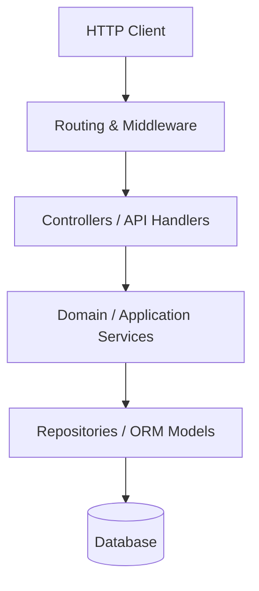

# Code Architecture & Design Skill

Standard Operating Procedure for mapping application architecture, discovering route/middleware pipelines, enforcing clean layering, and eliminating architectural dead code.

## When to use

- Reverse-engineering an unfamiliar codebase's application architecture and entrypoints.
- Auditing HTTP route definitions, URL patterns, controller dispatching, and middleware chains.
- Evaluating architectural compliance (SOLID principles, Domain/Service/Repository separation).
- Identifying and safely purging dead code, orphaned routes, and unused controllers.
- Planning module reorganizations and code modernization.

## Architecture Mapping Workflow

```
┌─────────────────┐     ┌──────────────────────┐     ┌─────────────────────┐
│ 1. Entrypoint & │ ──► │ 2. Layer & Boundary  │ ──► │ 3. Dead Code &      │
│    Route Mapping│     │    Inspection        │     │    Refactor Plan    │
└─────────────────┘     └──────────────────────┘     └─────────────────────┘
```

### Phase 1: Entrypoint & Route Mapping
1. Identify framework entrypoints (`public/index.php`, `server.ts`, `main.go`, `app.py`).
2. Catalog route definitions and API contracts across web, API, and console channels.
3. Map middleware pipelines applied to route groups (Auth, RateLimiting, CORS, Logging).
4. Read `@references/routing-and-controllers.md`.

### Phase 2: Layer & Boundary Inspection
1. Analyze separation of concerns:
   - **Presentation Layer**: Controllers, API Handlers, CLI Commands.
   - **Application Layer**: Use Cases, Action Classes, Event Handlers.
   - **Domain Layer**: Entities, Value Objects, Domain Services.
   - **Infrastructure Layer**: Repositories, Third-Party API Clients, DB Drivers.
2. Check for leaky abstractions (e.g. database transactions or raw SQL inside presentation controllers).
3. Read `@references/clean-layers-and-solid.md`.

### Phase 3: Dead Code & Modernization
1. Identify unreferenced functions, unreachable branches, and orphaned controller actions.
2. Formulate a safe, incremental refactoring plan using the guidance in `@references/dead-code-and-refactoring.md`.

## Output Contract: Application Topology

```markdown
### Application Architecture Overview
- **Framework & Runtime**: [e.g. Laravel 11 / PHP 8.3 / Vue 3]
- **Architecture Pattern**: [e.g. Layered MVC / Hexagonal / Action-Domain-Responder]
- **Primary Entrypoints**: `public/index.php`, `routes/api.php`

### Module & Layer Map



### Key Architectural Findings
- **Strengths**: [e.g. Strict validation through Form Requests, clear service layer separation]
- **Boundary Violations**: [e.g. Controller `BillingController` executes raw payment logic directly]
- **Dead Code Candidates**: [e.g. Unreferenced route group `/legacy/v1`]
```
