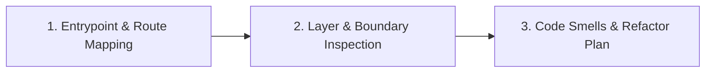
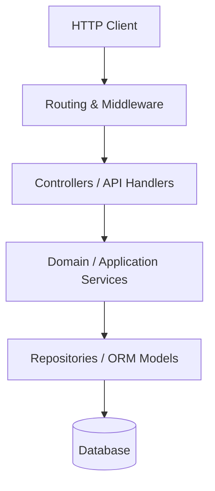

# Code Architecture & Design Skill

Standard Operating Procedure for mapping application architecture, discovering route/middleware pipelines, enforcing clean layering, designing accessible compound components, and eliminating architectural smells and dead code.

## When to use

- Reverse-engineering an unfamiliar codebase's application architecture and entrypoints.
- Auditing HTTP route definitions, URL patterns, controller dispatching, and middleware execution order.
- Synchronizing route definitions with OpenAPI/Swagger contracts and detecting API contract drift.
- Evaluating architectural compliance (SOLID principles, GoF design patterns, Domain/Service/Repository separation).
- Auditing frontend client layers, WCAG 2.1 Level AA accessibility compliance, and UI compound components.
- Identifying and refactoring Fowler code smells, reducing cyclomatic/cognitive complexity, and safely purging dead code.
- Planning module reorganizations and code modernization.

## Architecture Mapping Workflow



### Phase 1: Entrypoint, Route & Contract Mapping
1. Identify backend entrypoints (`public/index.php`, `server.ts`, `main.go`, `app.py`) and frontend build configuration entrypoints (Vite, Webpack, Laravel Mix).
2. Detect hybrid rendering strategies (SPA container routes vs SSR Blade/Twig templates) and multi-frontend / monorepo sub-applications (`package.json` trees).
3. Catalog route definitions and verify middleware execution order against canonical pipeline stages (network → headers/CORS → compression → body parsing → session → auth → authorization/throttling → route dispatch).
4. Audit OpenAPI / Swagger specifications against controller routes to detect contract drift, undocumented endpoints, and breaking changes.
5. Read `@references/routing-and-controllers.md` and `@references/api-contracts-openapi.md`.

### Phase 2: Layer, Pattern & Accessibility Inspection
1. Analyze separation of concerns across architectural layers:
   - **Presentation Layer**: Controllers, API Handlers, CLI Commands, View Templates.
   - **Frontend Client Layer**: Centralized HTTP clients, auth token injection, CSRF interceptors, error normalizers, and WCAG 2.1 AA compliant UI compound components.
   - **Application Layer**: Use Cases, Action Classes, Event Handlers.
   - **Domain Layer**: Entities, Value Objects, Domain Services.
   - **Infrastructure Layer**: Repositories, Third-Party API Clients, DB Drivers.
2. Evaluate design pattern implementations (Factories, Builders, Adapters, Decorators, Facades, Strategies, Observers, Commands) against selection criteria.
3. Check for leaky abstractions (e.g. database transactions or raw SQL inside presentation controllers, direct HTTP calls inside UI components).
4. Read `@references/clean-layers-and-solid.md`, `@references/design-patterns.md`, and `@references/accessibility-wcag.md`.

### Phase 3: Code Smells, Complexity & Modernization
1. Audit for Fowler code smells (Feature Envy, Data Clumps, Primitive Obsession, Long Parameter Lists, Divergent Change, Shotgun Surgery).
2. Evaluate Cyclomatic and Cognitive complexity scores; apply guard clauses, early returns, method extractions, and table-driven strategies to flatten deep nesting.
3. Identify unreferenced functions, unreachable branches, and orphaned controller actions.
4. Formulate a safe, incremental refactoring plan using the guidance in `@references/dead-code-and-refactoring.md` and `@references/code-smells-and-complexity.md`.

## Output Contract: Application Topology

````markdown
### Application Architecture Overview
- **Framework & Runtime**: [e.g. Laravel 11 / PHP 8.3 / Vue 3]
- **Architecture Pattern**: [e.g. Layered MVC / Hexagonal / Action-Domain-Responder]
- **Primary Entrypoints**: `public/index.php`, `routes/api.php`

### Module & Layer Map



### Key Architectural Findings
- **Strengths**: [e.g. Strict validation through Form Requests, clear service layer separation]
- **Boundary Violations**: [e.g. Controller `BillingController` executes raw payment logic directly]
- **Design Pattern / Complexity Improvements**: [e.g. Replace cascading tax `switch` with Strategy Pattern]
- **Dead Code Candidates**: [e.g. Unreferenced route group `/legacy/v1`]
````
