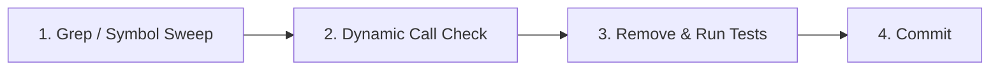

# Dead Code Detection & Modernization Protocol

SOP for safely locating, confirming, and removing dead code and modernizing legacy codebases.

---

## 1. Dead Code Detection Categories

1. **Unreferenced Classes & Methods**:
   - Private or protected methods that are never invoked anywhere in the class hierarchy.
   - Classes never imported, instantiated, or bound in service containers.
2. **Orphaned Routes & Controllers**:
   - Controller classes whose corresponding routes were commented out or deleted from route manifests.
3. **Dead Feature Flags & Unreachable Branches**:
   - Conditionals evaluating flags that have been permanently enabled or disabled in production.
4. **Unused Dependencies**:
   - Packages declared in `composer.json` or `package.json` that are never imported in application code.

---

## 2. Safe Deletion Protocol

1. **Static Search**: Grep the entire repository for the symbol, method name, or class string.
2. **Check Dynamic Invocations**: Check for dynamic dispatch patterns (e.g. `call_user_func`, string variable method calls `$this->$method()`, event listeners, or DIC service bindings).
3. **Remove & Verify**: Delete the dead code and run unit/integration test suites to verify zero broken imports or side effects.
4. **Isolated Commit**: Commit dead code deletions separately from new feature work with clear commit messages (`refactor: remove unused LegacyBillingService`).

