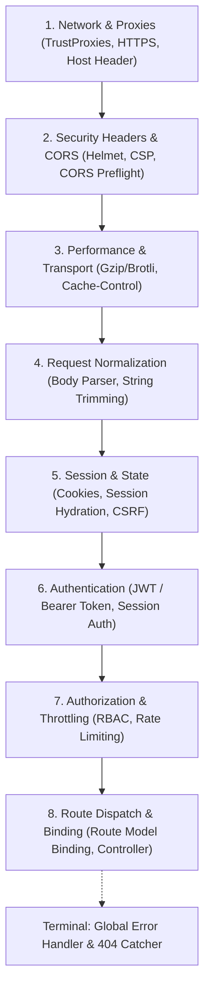

# Route Discovery & Controller Mapping

Reference guide for locating, cataloging, and auditing application HTTP routes, handlers, and middleware pipelines.

---

## 1. Route Manifest Locations by Ecosystem

| Framework | Default Route Files | CLI Route Lister |
|---|---|---|
| **Laravel (PHP)** | `routes/web.php`, `routes/api.php`, `routes/console.php` | `php artisan route:list` |
| **Express / Fastify (Node)** | `src/routes/`, `src/app.ts`, `server.ts` | Source inspection / AST |
| **Next.js / Nuxt** | `app/api/**/route.ts`, `pages/api/**`, `server/api/**` | File-system routing tree |
| **Django / FastAPI (Python)** | `urls.py`, `app/routers/` | `python manage.py show_urls` |
| **Gin / Echo (Go)** | `cmd/server/main.go`, `internal/router/` | Source inspection |

---

## 2. Route & Middleware Audit Checklist

1. **Authentication Gates**:
   - Verify every non-public route is protected by authentication middleware (e.g. `auth:sanctum`, `passport`, `jwt`, `session`).
2. **Rate Limiting (Throttling)**:
   - Ensure public APIs and authentication endpoints (`/login`, `/register`, `/password/reset`) enforce rate limiters (e.g. `throttle:60,1`).
3. **Parameter Validation**:
   - Ensure route parameters (e.g., `{id}`, `{uuid}`) are validated with regex constraints where supported (e.g., `whereUuid('id')`).
4. **Thin Controllers**:
   - Controllers should only orchestrate: validate input → call application/domain service → return formatted response.
   - Avoid placing multi-step business logic, third-party API calls, or heavy queries directly inside controller methods.

---

## 3. Canonical 8-Stage Middleware Pipeline Execution Order

To maintain security, performance, and deterministic request flow, middleware pipelines must execute in strict order:

### Stage Responsibilities
1. **Network & Proxies**: Trust forward headers (`X-Forwarded-For`, `X-Forwarded-Proto`), force HTTPS redirect, validate Host header.
2. **Security Headers & CORS**: Set baseline defensive headers (`X-Frame-Options`, `X-Content-Type-Options`, CSP), evaluate CORS preflight `OPTIONS` requests before stateful logic.
3. **Performance & Transport**: Response compression (`compression`, `GZipMiddleware`), caching headers (`ETag`, `Last-Modified`).
4. **Request Normalization & Body Parsing**: Parse JSON / URL-encoded bodies, trim strings, convert empty strings to null.
5. **Session & State Management**: Hydrate encrypted cookies, initialize session storage, verify CSRF tokens on state-changing requests (`POST`, `PUT`, `DELETE`).
6. **Authentication**: Resolve and verify caller identity (bearer tokens, session cookie), populate `req.user` / `request->user()`.
7. **Authorization & Throttling**: Validate permissions / roles (RBAC/ABAC), evaluate client rate limit quotas.
8. **Route Dispatch & Model Binding**: Resolve route parameters, perform route model binding, dispatch to target controller action.

### Middleware Ordering Anti-Patterns

| Anti-Pattern | Root Cause | Impact | Fix |
|---|---|---|---|
| **Body Parser before Security / Throttling** | Large payloads parsed prior to rate limits | Denial of Service (DoS) / memory exhaustion from unauthenticated requests | Place network filtering and rate limiting before heavy body parsers |
| **CORS after Authentication** | Pre-flight `OPTIONS` requests hit auth gates | Browsers receive 401 Unauthorized for CORS pre-flight, breaking SPA integrations | Place CORS middleware before authentication |
| **Auth before Session Hydration** | User session evaluated before session cookies are decrypted | Unauthenticated 401 errors despite valid session cookie | Ensure session middleware precedes authentication |
| **CSRF before Session Start** | CSRF token checked without session token store | CSRF mismatch errors on all valid forms | Place session startup before `VerifyCsrfToken` |
| **Error Handler before Routes** | Catch-all error middleware declared before route definitions | Uncaught exceptions inside controllers bubble up unhandled | Register 4-argument error handlers at the terminal end of the pipeline |

---

## 4. Hybrid Rendering Architectures

Audit controller return statements and presentation mechanisms to distinguish between rendering strategies:

1. **SPA Container Routes**:
   - Controller actions returning bare HTML shell views (e.g. `return view('app')`) or Inertia responses (e.g. `Inertia::render('Users/Index', $props)`).
   - Identify mounting points (`#app`, `#root`) and hydration state passed via initial page props, dataset attributes, or window globals.
2. **SSR / Server-Side Template Rendering**:
   - Controller actions rendering server-side templates (Blade `return view('users.index', compact('users'))`, Twig, Jinja2, ERB, EJS).
   - Audit view-model passing, server-rendered partials, and template inheritance trees.
3. **Pure API & JSON Endpoints**:
   - Controllers returning serialized data structures (`response()->json(...)`, API resource classes, DTOs).
   - Distinguish public API routes (`routes/api.php`) from internal SPA endpoints (`routes/web.php` with session authentication).

---

## 5. Multi-Frontend & Monorepo Detection

When applications host multiple distinct frontend applications or modular client packages:

1. **Nested Manifest Inspection**:
   - Scan for nested `package.json` files beyond the root directory (e.g. root `package.json`, `resources/js/admin_panel/package.json`, `frontend/`, `apps/web/`, `packages/*`).
   - Check for monorepo workspace configuration (`workspaces` in `package.json`, `pnpm-workspace.yaml`, `lerna.json`, `turbo.json`).
   - Catalog each sub-application's dependencies, framework version (e.g. Vue 2 legacy admin vs Vue 3 / React customer portal), and separate build scripts.

2. **Build Configuration Entrypoint Mapping**:
   - **Vite** (`vite.config.ts` / `vite.config.js`):
     - Inspect `build.rollupOptions.input` configurations or plugin entry definitions (e.g. `laravel({ input: ['resources/css/app.css', 'resources/js/app.ts', 'resources/js/admin.ts'] })`).
   - **Webpack / Laravel Mix** (`webpack.config.js`, `webpack.mix.js`):
     - Inspect entry object mappings (`entry: { app: './src/index.js', admin: './src/admin.js' }`) or chained Mix pipelines (`mix.js('resources/js/app.js', 'public/js').js('resources/js/admin.js', 'public/js/admin')`).
   - **Target Correlation**:
     - Map each compiled build target / bundle output back to its corresponding shell template, controller action, and user authentication role.
