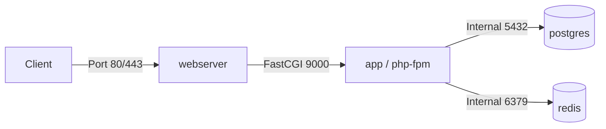

# Docker & Container Infrastructure Skill

Standard Operating Procedure for auditing, creating, and optimizing Dockerfiles, Docker Compose topologies, multi-stage builds, and container development environments.

## When to use

- Reviewing or creating `Dockerfile` definitions (multi-stage builds, layer caching, security hardening).
- Inspecting `docker-compose.yml` configurations (services, networks, volumes, environment variable resolution).
- Troubleshooting container build failures, bloated images, or permission issues with mounted volumes.
- Hardening container security (non-root execution, minimal base images, secrets isolation).

## Container Inspection Workflow

```
┌─────────────────┐     ┌──────────────────────┐     ┌─────────────────────┐
│ 1. Dockerfile   │ ──► │ 2. Compose & Network │ ──► │ 3. Volume & State   │
│    Hardening    │     │    Topology Audit    │     │    Persistence      │
└─────────────────┘     └──────────────────────┘     └─────────────────────┘
```

### Phase 1: Dockerfile Audit & Optimization
1. Verify multi-stage builds to separate build dependencies (compilers, npm build artifacts) from the lean runtime image.
2. Check layer caching: Ensure frequently changing files (`COPY . .`) appear after dependency installation steps (`package.json`, `composer.json`).
3. Audit security: Enforce non-root `USER` execution, pin explicit base image tags (avoid `:latest`), and check `.dockerignore` for credentials/artifacts.
4. Read `@references/dockerfile-best-practices.md`.

### Phase 2: Docker Compose & Network Topology
1. Inspect service definitions, container relationships (`depends_on` with `service_healthy`), and port bindings.
2. Map isolated networks (frontend, backend, db) to prevent unauthorized container communication.
3. Verify environment variables rely on `.env` hydration rather than hardcoded credentials.
4. Read `@references/compose-and-topology.md`.

### Phase 3: Volume Mounts & State Persistence
1. Verify named volumes for persistent data (MySQL, Postgres, Redis, Elasticsearch).
2. Audit bind mounts for development hot-reloading vs. production volume isolation.

## Output Contract: Container Topology

```markdown
### Container Infrastructure Overview
- **Base Images**: [e.g., `php:8.3-fpm-alpine`, `node:20-alpine`]
- **Multi-Stage Build**: [Yes / No]
- **Total Services**: [Count] (e.g., `app`, `webserver`, `db`, `redis`)

### Service Topology



### Optimization & Hardening Findings
- **Image Size Improvements**: [e.g. Multi-stage build can reduce final image by ~350MB]
- **Security Recommendations**: [e.g. Add non-root user `appuser`]
```
