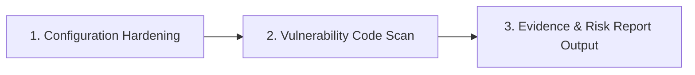

# Code Security Audit Skill

Standard Operating Procedure for performing static application security testing (SAST), vulnerability identification, and configuration hardening across web applications and backend services.

## When to use

- Conducting pre-merge or pre-deployment code security reviews.
- Auditing authentication, authorization, session management, or encryption layers.
- Investigating potential injection vectors (SQLi, XSS, Command Injection, Template Injection).
- Scanning for hardcoded secrets, exposed environment variables, or insecure configuration headers.
- Assessing compliance against OWASP Top 10 vulnerabilities.

## Audit Workflow



### Phase 1: Configuration & Environment Hardening
Inspect environment files, middleware definitions, and server configuration:
1. Check for committed secrets, credentials, or private keys in repository history and `.env` files.
2. Verify HTTP security headers (`Content-Security-Policy`, `Strict-Transport-Security`, `X-Frame-Options`, `X-Content-Type-Options`).
3. Inspect session cookie settings (`HttpOnly`, `Secure`, `SameSite=Lax/Strict`).
4. Audit application encryption keys, cipher configurations (`AES-256-CBC`/`GCM`), and encrypted model attributes.
5. Run dependency vulnerability and freshness audits (`composer audit`/`outdated`, `npm audit`/`outdated`).
6. Read `@references/configuration-hardening.md` for exhaustive checklists and regex patterns.

### Phase 2: Vulnerability Code Scan
Search codebase for common vulnerability anti-patterns:
1. **SQL Injection**: Unparameterized SQL queries, string interpolation in ORM `whereRaw` / raw queries.
2. **Cross-Site Scripting (XSS)**: Unescaped template output (`v-html`, `dangerouslySetInnerHTML`, raw blade `{!! !!}`).
3. **Cross-Site Request Forgery (CSRF)**: Missing middleware or excluded state-modifying POST/PUT/DELETE routes.
4. **Mass Assignment**: Unfiltered model updates binding directly to raw request payloads.
5. **Authorization / IDOR**: Missing ownership checks on resource retrieval and mutation.
6. **File Upload Vulnerabilities**: Unvalidated file types, client MIME trust, path traversal in filenames, executable upload directories.
7. Read `@references/vulnerability-patterns.md` for concrete detection rules.

### Phase 3: Calibrated Reporting
Document all findings citing exact file paths, line ranges, and reproduction snippets.

## Findings Output Format

````markdown
### Security Review Summary
- **Overall Posture**: `SECURE` | `ACTION_REQUIRED` | `CRITICAL_RISK`
- **Critical Vulnerabilities**: [Count]
- **High/Medium Warnings**: [Count]
- **Hardening Suggestions**: [Count]

### Findings

#### [SEVERITY: CRITICAL | HIGH | MEDIUM | LOW] [Vulnerability Name]
- **Location**: `path/to/file.ext:L123-L145`
- **CWE / OWASP Category**: [e.g., CWE-89: SQL Injection / OWASP A03:2021]
- **Vulnerability Explanation**: Detailed mechanism of how the vulnerability can be exploited.
- **Vulnerable Code Snippet**:
  ```lang
  // code excerpt
  ```
- **Remediation**: Concrete refactored code demonstrating the secure pattern.
````

