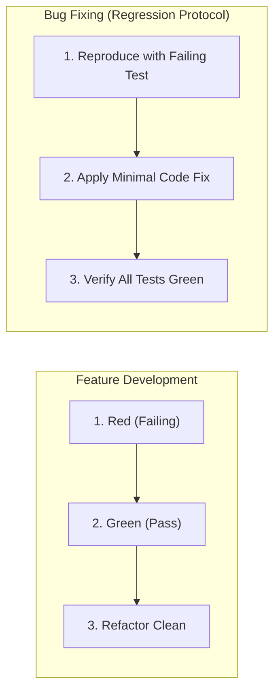

# Code TDD (Test-Driven Development) Skill

Standard Operating Procedure for practicing disciplined Test-Driven Development, regression-first bug fixing, and test suite health auditing.

## When to use

- Implementing new domain logic or features using the Red-Green-Refactor cycle.
- Fixing reported bugs by writing a reproducing regression test before applying code changes.
- Auditing existing test suites for brittle assertions, over-mocking, or slow execution.
- Designing test taxonomy (unit vs. integration vs. end-to-end) and boundary assertions.

## Core TDD Workflows

---

### Workflow A: The Red-Green-Refactor Cycle
1. **Red**: Write a focused, minimal test specifying the desired behavior or API contract. Run the test to confirm it fails for the expected reason.
2. **Green**: Write the simplest, most direct code that makes the test pass. Avoid speculative abstractions or premature optimization.
3. **Refactor**: Clean up the implementation (remove duplication, improve naming, align with codebase conventions) while keeping the test suite green.

---

### Workflow B: Bug Reproduction & Regression Protocol
1. **Isolate the Defect**: Read the stack trace or bug report and identify the boundary conditions causing failure.
2. **Write a Failing Regression Test**: Create an automated test that precisely triggers the reported bug without mutating production code.
3. **Confirm Failure**: Execute the test and verify it reproduces the defect.
4. **Implement Fix**: Apply the surgical bug fix.
5. **Verify**: Ensure the regression test and all existing test suites pass.
6. Read `@references/regression-protocol.md`.

---

### Workflow C: Test Suite Quality Audit
Inspect test suites for anti-patterns and code smells:
1. **Mock Hygiene**: Avoid over-mocking internal implementation details; mock only at system/I/O boundaries.
2. **Tautological Tests**: Remove tests that assert trivialities or verify mocked behavior against mocks.
3. **State Isolation**: Ensure tests are deterministic and do not depend on execution order or shared state.
4. Read `@references/test-smells.md` and `@references/test-taxonomy.md`.

