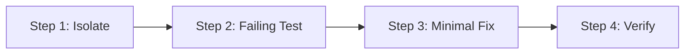

# Bug Regression Protocol

Step-by-step SOP for resolving bugs using test-driven regression reproduction.

---

## 4-Step Resolution Protocol

### Step 1: Isolate the Defect
- Analyze the bug description, user input, stack trace, and logs.
- Identify the exact inputs, state, and edge conditions that trigger the failure.
- Formulate a testable hypothesis of the root cause.

### Step 2: Write the Failing Regression Test
- Create a new test case targeting the defect before changing any application code.
- Ensure the test asserts the expected correct behavior rather than the buggy behavior.
- Run the test suite and confirm:
  1. The test **fails**.
  2. The failure message exactly reflects the reported defect.

### Step 3: Implement the Minimal Fix
- Make targeted changes to production code to resolve the defect.
- Follow the **least-churn principle**: fix the root cause without unprompted refactoring.

### Step 4: Verify & Lock Regression
- Run the newly written regression test to confirm it turns **green**.
- Run the entire existing test suite to ensure no unintended regressions were introduced.
- Commit the test alongside the fix to prevent future regressions.

