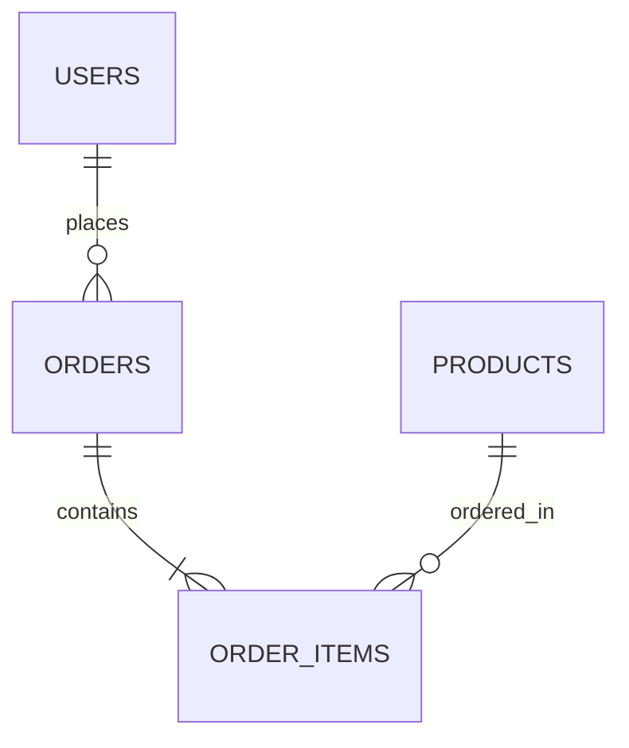

# Database Architecture Skill

Standard Operating Procedure for discovering data models, auditing ORM architectures, verifying migration safety, and generating Entity-Relationship Diagrams (ERDs).

## When to use

- Reverse-engineering an unfamiliar codebase's database schema and domain models.
- Auditing ORM usage and data access patterns across controllers and service layers.
- Designing or reviewing database migrations for safety (locks, zero-downtime, reversibility).
- Generating Mermaid ERDs documenting relationships (1:1, 1:N, N:M, polymorphic).

## Architecture Mapping Workflow

```
┌─────────────────┐     ┌──────────────────────┐     ┌─────────────────────┐
│ 1. Model & ORM  │ ──► │ 2. Relationship &    │ ──► │ 3. Migration Safety │
│    Discovery    │     │    ERD Extraction    │     │    & Schema Audit   │
└─────────────────┘     └──────────────────────┘     └─────────────────────┘
```

### Phase 1: Model & ORM Discovery
1. Identify the data access layer and ORM technology (Eloquent, Prisma, TypeORM, SQLAlchemy, GORM, raw SQL).
2. Catalog all model entities, table mappings, and attributes.
3. Read `@references/orm-patterns.md`.

### Phase 2: Relationship Extraction & ERD Modeling
1. Inspect relationship definitions on model classes:
   - One-to-One (`hasOne`, `belongsTo`, `@OneToOne`)
   - One-to-Many (`hasMany`, `belongsTo`, `@OneToMany`)
   - Many-to-Many (`belongsToMany`, `@ManyToMany`, pivot tables)
   - Polymorphic / Discriminator relationships
2. Generate structured Mermaid ERDs following the guidelines in `@references/erd-generation.md`.

### Phase 3: Migration Safety & Hygiene
1. Verify migrations are reversible with accurate `down()` / rollback methods.
2. Check for unsafe DDL operations (e.g. dropping columns directly, non-concurrent index creation on large tables).
3. Verify foreign key constraints and cascade rules.
4. Read `@references/migration-hygiene.md`.

## Output Contract: Schema Documentation & ERD

```markdown
### Database Schema & Model Overview
- **ORM / Driver**: [e.g., Eloquent / PostgreSQL]
- **Total Entities**: [Count]
- **Key Domain Clusters**: [Identity, Billing, Catalog]

### Entity-Relationship Diagram



### Entity Catalog
- **`users`** (`App\Models\User`): Core user entity (fields: `id`, `email`, `role`, `created_at`).
- **`orders`** (`App\Models\Order`): Customer orders (fields: `id`, `user_id`, `status`, `total_cents`).
```

