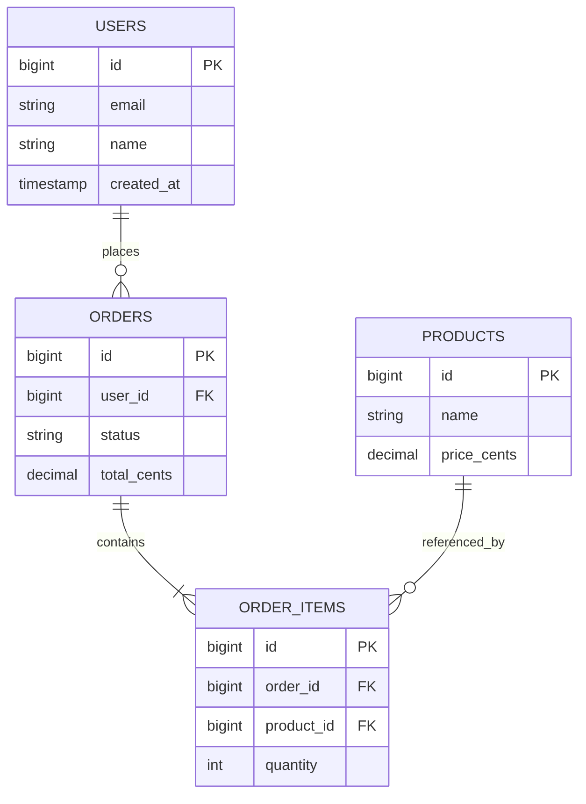

# ERD Generation & Relationship Mapping

Guide for extracting data relationships and drafting Mermaid Entity-Relationship Diagrams.

---

## 1. Relationship Extraction Heuristics

When analyzing model classes, look for:

- **1:1 (One-to-One)**: `hasOne` / `belongsTo`
- **1:N (One-to-Many)**: `hasMany` / `belongsTo`
- **N:M (Many-to-Many)**: `belongsToMany` or explicit pivot table models
- **Polymorphic**: `morphTo`, `morphMany`, or discriminator column mappings

---

## 2. Mermaid ERD Syntax & Formatting

Use valid Mermaid `erDiagram` notation:

### Cardinality Legend
- `||--||` : Exactly one to exactly one
- `||--o{` : Exactly one to zero or more
- `||--|{` : Exactly one to one or more
- `o|--o{` : Zero or one to zero or more

