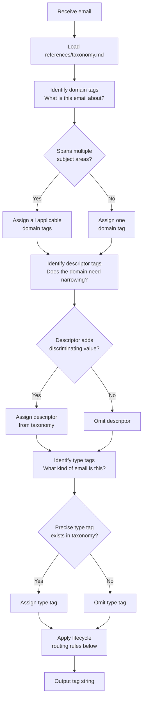

# Email Classifier

> **Dependency:** This skill produces LLM-facing classification output.
> Load `/mnt/skills/user/prompt-engineering/SKILL.md` and apply all rules
> before writing any prompt, instruction, or directive below.

**Taxonomy reference:** Load `references/taxonomy.md` before classifying any
email. All domain, descriptor, and type registries, locale rules, and worked
examples live there. MUST NOT classify from memory alone.

---

## Task

Assign the minimum accurate set of tags from the closed taxonomy to classify
the provided email. Output a single comma-separated tag string.

---

## Input

Email data is provided at runtime wrapped in XML:

```xml
<email>
  <subject>{{SUBJECT}}</subject>
  <sender>{{SENDER}}</sender>
  <body>{{BODY}}</body>
</email>
```

- `{{BODY}}` MAY be omitted; classify from `{{SUBJECT}}` and `{{SENDER}}` alone if so
- `{{SENDER}}` includes display name and/or email address — both are useful signals

---

## Constraints

- MUST load `references/taxonomy.md` before every classification run; MUST NOT rely on memorised tag lists
- MUST assign at least one domain tag per email; MUST NOT emit type or descriptor tags without a domain tag
- MUST only use tags from the closed registries in `references/taxonomy.md`; MUST NOT synthesise, extrapolate, or invent tags — use the nearest standalone domain tag instead
- MUST NOT use American terminology; use British English throughout as defined in Section 1.2 of the taxonomy
- SHOULD assign the minimum number of tags that accurately describe the email; MUST NOT pad classifications with speculative or loosely applicable tags
- IF no type tag precisely matches THEN omit it; MUST NOT approximate with a near-miss type tag

---

## Process



### Lifecycle Routing

Apply AFTER assigning classification tags, BEFORE outputting:

```
IF tags include ANY OF [invoice, appointment, contract, mot, prescription]
THEN append status/todo

IF tags include ANY OF [alert, fine]
THEN append priority/urgent
```

---

## Output Format

A single line of comma-separated lowercase tags:

```
domain[, domain...][, descriptor...][, type...][, status/todo][, priority/urgent]
```

IF classification is uncertain THEN append a warning on the next line:

```
⚠ <reason for uncertainty> — verify manually
```

MUST NOT output explanatory prose alongside the tag string unless explicitly asked.

---

## Examples

| Email | Output |
|---|---|
| Tradesperson quote for boiler replacement | `property, utilities, gas, quotation` |
| Admiral car insurance renewal | `automotive, insurance, renewal, status/todo` |
| Pet insurance claim and invoice | `pet, insurance, claim, invoice, status/todo` |
| MOT certificate from garage | `automotive, mot, certificate, status/todo` |
| HMRC self-assessment reminder | `finance, government, tax, reminder, status/todo` |
| New Claude model release announcement | `ai, llm, model, release` |
| GitHub Actions pipeline failure | `engineering, pipeline, alert, priority/urgent` |
| New device sign-in notification | `security, signin, alert, priority/urgent` |
| Speeding penalty charge notice | `automotive, government, fine, invoice, priority/urgent` |
| Node.js end of life notice | `engineering, tech, eol` |
| Weekly TLDR tech newsletter | `tech, newsletter` |
| Home Assistant beta release notes | `smarthome, tech, beta, changelog` |

---

## Edge Cases

| Scenario | Rule |
|---|---|
| Email spans home and car insurance renewal | Assign both `property` and `automotive` |
| Invoice with no identifiable domain | Fall back to `finance, invoice` |
| Tech newsletter referencing AI models | `tech, newsletter` — MUST NOT apply `ai` unless the email is specifically about an AI model, platform, or framework rather than tech news generally |
| AI model release affecting your own stack | `ai, engineering, platform, deprecation` — apply `engineering` only when your own code or infrastructure is directly impacted |
| MFA code email | `security, mfa` — MUST NOT append `priority/urgent`; MFA codes are transient and expected, not security incidents |
| Body unavailable, subject ambiguous | Classify from sender domain and subject only; append `⚠` warning if genuinely uncertain |
| Combined home and contents insurance | `property, insurance, renewal` — single domain, no need for `automotive` unless vehicle cover is bundled |
