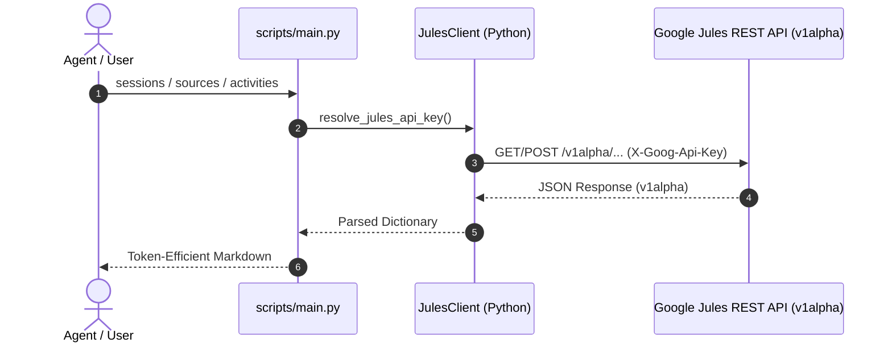

# Google Jules REST API

Query and manage Google Jules asynchronous cloud coding sessions, inspect connected repository sources, review step-by-step plans, track task progress timelines, and extract git diff patches via the Jules REST API (`jules.googleapis.com/v1alpha`).



---

## Execution Protocol

### 1. Authentication & Secret Resolution
- All requests require a valid Google Jules API key passed in the `X-Goog-Api-Key` header.
- The bundled CLI (`scripts/main.py`) and client (`jules.client.JulesClient`) automatically resolve the secret via `JULES_API_KEY` in the environment.
- You can override or explicitly pass a token using the `--token <KEY>` flag.
- If credentials cannot be resolved, stop and prompt the user to provide or set `JULES_API_KEY`.

### 2. Progressive Disclosure & Documentation
- For exhaustive endpoint parameters, request bodies, and schema specifications, consult `@references/api-reference.md`.
- For execution lifecycle stages and VM state transitions, consult `@references/session-lifecycle.md`.

---

## Commands & CLI Reference

Run commands via the bundled `@scripts/main.py` script relative to this skill's root directory (`<skill-dir>/scripts/main.py` e.g. `.github/skills/google-jules-api/scripts/main.py`). By default, all commands output token-efficient Markdown tables and summaries.

### 1. Connected Sources (`sources`, `source`)
Inspect authorized GitHub repositories connected to Jules.

```bash
# List all connected repositories
python3 <skill-dir>/scripts/main.py sources

# Filter sources by repository name
python3 <skill-dir>/scripts/main.py sources --filter "name=sources/github/warpcode/cloakenv"

# Get details for a specific repository source
python3 <skill-dir>/scripts/main.py source github/warpcode/cloakenv
```

### 2. Task Sessions (`sessions`, `session`, `create-session`)
List, inspect, and spawn asynchronous cloud task sessions.

```bash
# List recent sessions (default or paginated)
python3 <skill-dir>/scripts/main.py sessions --page-size 10

# Fetch full summary and outputs for a specific session
python3 <skill-dir>/scripts/main.py session 4475409647262242777

# Create a new coding session
python3 <skill-dir>/scripts/main.py create-session \
  "Refactor sensitive memory buffers to use ZeroBytes" \
  --source github/warpcode/cloakenv \
  --branch main \
  --title "Memory Scrubbing Refactor"

# Create a session requiring explicit plan approval
python3 <skill-dir>/scripts/main.py create-session \
  "Upgrade Go dependencies and verify test suite" \
  --source github/warpcode/cloakpkg \
  --require-approval
```

### 3. Session Activities & Timelines (`activities`, `activity`)
Inspect the chronological audit log of events, agent messages, plans, and diffs emitted during execution.

```bash
# List activity events for a session
python3 <skill-dir>/scripts/main.py activities 4475409647262242777 --page-size 20

# View single activity details (e.g., plan steps, message body, or git diff)
python3 <skill-dir>/scripts/main.py activity 4475409647262242777 <ACTIVITY_ID>
```

### 4. Human-in-the-Loop Interaction (`approve-plan`, `send-message`)
Approve pending implementation plans or send steering instructions to a running session.

```bash
# Approve a generated plan
python3 <skill-dir>/scripts/main.py approve-plan 4475409647262242777 <PLAN_ID>

# Send clarifying message / guidance
python3 <skill-dir>/scripts/main.py send-message 4475409647262242777 \
  "Please preserve existing test assertions in internal/utils/zero_test.go"
```

### 5. Direct REST Escape Hatch (`call`)
Execute arbitrary REST requests against any endpoint under `/v1alpha`.

```bash
# Direct GET call
python3 <skill-dir>/scripts/main.py call GET sources

# Direct POST call with payload
python3 <skill-dir>/scripts/main.py call POST sessions '{"prompt":"Fix typo","sourceContext":{"source":"sources/github/owner/repo"}}'
```

---

## Python Programmatic Client

For custom automation pipelines, import `JulesClient` directly:

```python
from jules.client import JulesClient
from jules.auth import resolve_jules_api_key

api_key = resolve_jules_api_key()
client = JulesClient(api_key=api_key)

# Query sources and sessions
sources = client.list_sources()
sessions = client.list_sessions(page_size=5)

# Inspect a completed session
session = client.get_session("4475409647262242777")
print(session.get("outputs"))
```

---

## Constraints & Guardrails

1. **Pre-Action Safety Gate**:
   - Creating a new session (`create-session`) or approving a plan (`approve-plan`) triggers cloud VM resources and GitHub repository changes. ALWAYS confirm parameters with the user when performing write actions.
2. **Secrets Blindness**:
   - NEVER print, log, or hardcode API keys. Rely exclusively on `JULES_API_KEY` or `--token`.
3. **No Unrequested Refactoring**:
   - Do NOT modify existing scripts or templates unless explicitly tasked.
4. **Token Efficiency**:
   - Limit list queries with `--page-size` (default 5–10 items) to prevent context overflow.

---

## Validation Checklist

- [ ] `JULES_API_KEY` is present in the environment or passed via `--token`.
- [ ] Read-only operations (`sources`, `sessions`, `activities`) are used during research and triage.
- [ ] Session creation targets a verified source discovered via `sources`.
- [ ] Task prompts provided to `create-session` are self-contained and specify clear acceptance criteria.
- [ ] Output is synthesized into concise markdown tables or summaries.
