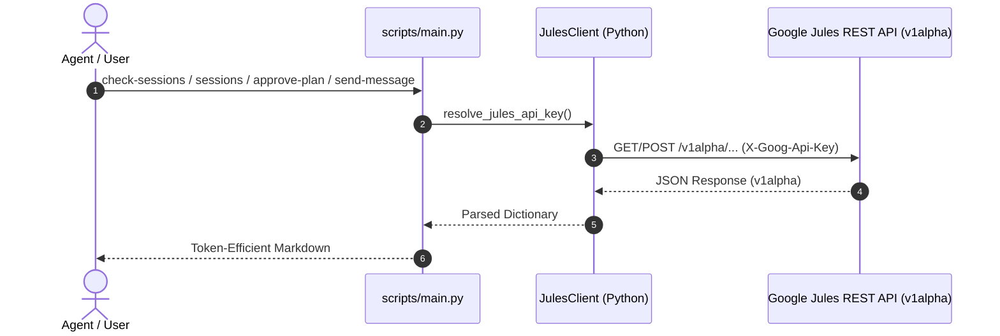

# Google Jules REST API

Query and manage Google Jules asynchronous cloud coding sessions, inspect connected repository sources, audit running tasks, review step-by-step plans, track task progress timelines, and extract git diff patches via the Jules REST API (`jules.googleapis.com/v1alpha`).



---

## Execution Protocol

### 1. Authentication & Secret Resolution
- All requests require a valid Google Jules API key passed in the `X-Goog-Api-Key` header.
- The bundled CLI (`scripts/main.py`) and client (`jules.client.JulesClient`) automatically resolve the secret via `JULES_API_KEY` in the environment.
- You can override or explicitly pass a token using the `--token <KEY>` flag.
- If credentials cannot be resolved, stop and prompt the user to provide or set `JULES_API_KEY`.

### 2. Progressive Disclosure & Documentation
- For session health assessment and stalled runner remediation, consult `@references/session-audit-workflow.md`.
- For execution lifecycle stages and VM state transitions, consult `@references/session-lifecycle.md`.
- For exhaustive endpoint parameters, request bodies, and schema specifications, consult `@references/api-reference.md`.
- Reusable report templates live under `templates/session-audit.md` and `templates/session-summary.md`.

---

## Commands & CLI Reference

Run commands via the bundled `@scripts/main.py` script relative to this skill's root directory (`<skill-dir>/scripts/main.py` e.g. `.github/skills/google-jules-api/scripts/main.py`). By default, all commands output token-efficient Markdown tables and summaries.

### 1. Connected Sources (`sources`, `source`)
Inspect authorized GitHub repositories connected to Jules.

```bash
# List all connected repositories
python3 <skill-dir>/scripts/main.py sources

# Filter sources by repository name
python3 <skill-dir>/scripts/main.py sources --filter "name=sources/github/warpcode/cloakenv"

# Get details for a specific repository source
python3 <skill-dir>/scripts/main.py source github/warpcode/cloakenv
```

### 2. Task Sessions (`sessions`, `session`, `create-session`)
List, inspect, and spawn asynchronous cloud task sessions.

```bash
# List recent sessions (default or paginated)
python3 <skill-dir>/scripts/main.py sessions --page-size 10

# Fetch full summary and outputs for a specific session
python3 <skill-dir>/scripts/main.py session 4475409647262242777

# Create a new coding session
python3 <skill-dir>/scripts/main.py create-session \
  "Refactor sensitive memory buffers to use ZeroBytes" \
  --source github/warpcode/cloakenv \
  --branch main \
  --title "Memory Scrubbing Refactor"

# Create a session requiring explicit plan approval
python3 <skill-dir>/scripts/main.py create-session \
  "Upgrade Go dependencies and verify test suite" \
  --source github/warpcode/cloakpkg \
  --require-approval
```

### 3. Session Health Audit & Triage (`check-sessions`)
Audit the health, elapsed inactivity duration, latest activity, and plan status for recent sessions. Sessions over 30 days old are considered inactive and automatically ignored by default (`--max-age-days 30`).

```bash
# Audit recent sessions (identifies stalled runs, plan gates, and inactive tasks)
python3 <skill-dir>/scripts/main.py check-sessions --page-size 10

# Audit a specific session (shows full conversation transcript)
python3 <skill-dir>/scripts/main.py check-sessions 4475409647262242777

# Audit and automatically nudge stalled sessions (>60m without status updates)
python3 <skill-dir>/scripts/main.py check-sessions --nudge --stale-threshold-mins 60

# Audit sessions with custom age cutoff in days (0 to disable filtering)
python3 <skill-dir>/scripts/main.py check-sessions --max-age-days 14

# Full audit with history + detect CLOSED_NO_PR sessions that have deliverables
python3 <skill-dir>/scripts/main.py check-sessions --page-size 20 --history --flag-unmerged
```

**Options:**
- `--flag-unmerged` — Scan conversation history of CLOSED_NO_PR sessions for completion markers (e.g., "Completed pre-commit steps", "Code review: Code reviewed") and flag sessions that did work but didn't create a PR
- `--history` — Include full conversation transcript in output
- `--nudge` — Auto-send progress check messages to STALLED sessions
- `--stale-threshold-mins N` — Minutes before session considered stale (default: 60)

### 4. Session Activities & Timelines (`activities`, `activity`)
Inspect the chronological audit log of events, agent messages, plans, and diffs emitted during execution.

```bash
# List activity events for a session
python3 <skill-dir>/scripts/main.py activities 4475409647262242777 --page-size 20

# View single activity details (e.g., plan steps, message body, or git diff)
python3 <skill-dir>/scripts/main.py activity 4475409647262242777 <ACTIVITY_ID>
```

### 5. Human-in-the-Loop Interaction (`approve-plan`, `send-message`, `nudge`)
Approve pending implementation plans or send steering instructions to a running session.

```bash
# Approve a generated plan (CLI wrapper - preferred)
python3 <skill-dir>/scripts/main.py approve-plan 4475409647262242777 <PLAN_ID>

# Or direct REST API (empty payload)
python3 <skill-dir>/scripts/main.py call POST "sessions/4475409647262242777:approvePlan" '{}'

# Send clarifying message / guidance
python3 <skill-dir>/scripts/main.py send-message 4475409647262242777 \
  "Please preserve existing test assertions in internal/utils/zero_test.go"

# Send standardized nudge using built-in templates
python3 <skill-dir>/scripts/main.py nudge 1251930828142707285 plan_stalled
python3 <skill-dir>/scripts/main.py nudge 9003048654216656491 progress_check
python3 <skill-dir>/scripts/main.py nudge 10786198163003828698 pr_reminder
```

**Nudge Templates:**
| Template | Message |
|---|---|
| `plan_stalled` | "The plan was approved but no implementation progress is visible. Please proceed with implementation per the approved plan." |
| `progress_check` | "What is your progress? Please provide a status update on this task." |
| `pr_reminder` | "This session appears to have completed work. Please create a pull request with the changes or provide a status update." |
| `custom` | Use `send-message` with your own text |

### 6. Direct REST Escape Hatch (`call`)
Execute arbitrary REST requests against any endpoint under `/v1alpha`.

```bash
# Direct GET call
python3 <skill-dir>/scripts/main.py call GET sources

# Direct POST call with payload
python3 <skill-dir>/scripts/main.py call POST sessions '{"prompt":"Fix typo","sourceContext":{"source":"sources/github/owner/repo"}}'
```

---

## Session Monitoring & Triage Workflows

### Workflow 1: Status Scan & Conversation Review
1. Run `python3 <skill-dir>/scripts/main.py check-sessions --page-size 10`. Sessions over 30 days old are considered inactive and ignored by default (`--max-age-days 30`). To view full dialogue threads across all turns, append `--history` or pass a specific session ID.
2. Review the complete conversation history, not just the latest message:
   - Check the `Dialogue` metric for unresponded user messages (`⚠️ N unreplied`) or pending agent questions (`❓ agent asked`).
   - Review prior user steering comments to ensure the agent complied with earlier guidance.
   - Verify intermediate testing and automated code review ratings (`#Correct#`, `#NeedsWork#`).
3. Evaluate the assessment status:
   - `⚠️ PLAN_GATE`: Jules is waiting for plan approval.
   - `💬 FEEDBACK_GATE`: Jules is awaiting user guidance or clarification.
   - `🚨 STALLED`: Runner has had no activity for $\ge 60$ minutes or failed to answer user inquiries.
   - `⚪ CLOSED_NO_PR`: Session completed without producing a pull request.
   - `🔵 ACTIVE`: Task is progressing normally.
   - `✅ COMPLETED`: Task finished with an attached pull request.
   - `💤 INACTIVE`: Session is over 30 days old and considered inactive (ignored by default).

### Workflow 2: Plan Review Gate & Approval
1. When a session is in `PLAN_GATE` / `AWAITING_PLAN_APPROVAL`, fetch the generated plan steps:
   `python3 <skill-dir>/scripts/main.py activity <session_id> <activity_id>` or review via `check-sessions`.
2. Evaluate plan against repository standards:
   - Scope is surgical and matches prompt.
   - Unit tests and verification commands (`go test`, `pytest`) are included.
   - Cross-platform considerations and security invariants are preserved.
3. If approved, execute:
   `python3 <skill-dir>/scripts/main.py approve-plan <session_id> <plan_id>`
   Follow up with a confirmation message via `send-message`.
4. If changes are needed, send revision feedback via `send-message`.

### Workflow 3: Stuck Runner & Premature Closure Remediation
1. For sessions marked `STALLED` ($\ge 60$ minutes without updates) or closed prematurely without PR:
2. Send a progress inquiry to prompt the cloud runner:
   `python3 <skill-dir>/scripts/main.py send-message <session_id> "What is your progress? Please provide a status update on this task."`
   Alternatively, pass `--nudge` to `check-sessions` to auto-nudge all stalled sessions.
   Or use the built-in nudge templates:
   `python3 <skill-dir>/scripts/main.py nudge <session_id> plan_stalled`

### Workflow 4: Comprehensive Audit & Unmerged Work Detection
1. Run full audit with deliverable detection:
   `python3 <skill-dir>/scripts/main.py check-sessions --page-size 20 --history --flag-unmerged`
2. Review output for:
   - `⚠️ PLAN_GATE` — Sessions awaiting plan approval (review with Workflow 2)
   - `🚨 STALLED` — Sessions inactive ≥60min (remediate with Workflow 3)
   - `⚪ CLOSED_NO_PR` with **DELIVERABLES FOUND** — Sessions that completed work but didn't create PR
   - `🔵 ACTIVE` with **unreplied messages** — Sessions where user steering was ignored
3. For each `CLOSED_NO_PR` with deliverables:
   - Fetch full history: `python3 <skill-dir>/scripts/main.py check-sessions <session_id> --history`
   - Verify completion markers: "Completed pre-commit steps", "Code review: Code reviewed", "Code review: Completed"
   - Request PR creation: `python3 <skill-dir>/scripts/main.py nudge <session_id> pr_reminder`
   - Or create PR manually from session outputs

### Workflow 5: Plan Assessment & Review
When a session is in `PLAN_GATE` / `AWAITING_PLAN_APPROVAL`:

1. **Fetch the plan**:
   `python3 <skill-dir>/scripts/main.py check-sessions <session_id> --history`
   Or: `python3 <skill-dir>/scripts/main.py activities <session_id> --page-size 20`
   Find the `plan_generated` activity ID, then:
   `python3 <skill-dir>/scripts/main.py activity <session_id> <plan_activity_id>`

2. **Evaluate against repository standards** (from AGENTS.md):
   - [ ] Scope is surgical and matches prompt (no unrequested refactors)
   - [ ] Unit tests and verification commands included (`go test -race ./...`, `go vet ./...`, `make fmt`)
   - [ ] Cross-platform considerations addressed (Linux, macOS, Windows)
   - [ ] Security invariants preserved (no secret logging, no plaintext disk writes)
   - [ ] No new dependencies without approval
   - [ ] Provider Development Checklist followed (if adding new provider)

3. **Decision**:
   - **Approve**: `python3 <skill-dir>/scripts/main.py approve-plan <session_id> <plan_id>` + `nudge <session_id> "Plan approved. Proceed with implementation."`
   - **Request changes**: `python3 <skill-dir>/scripts/main.py send-message <session_id> "Plan needs revision: [specific feedback]"`

### Workflow 6: Duplicate Work Detection
Before creating a new session:
1. Search recent sessions for similar titles:
   `python3 <skill-dir>/scripts/main.py check-sessions --page-size 30 --history`
2. Look for sessions with matching keywords in title/activity
3. If found, prefer nudging existing session over creating duplicate:
   `python3 <skill-dir>/scripts/main.py nudge <session_id> progress_check`
4. If existing session is `CLOSED_NO_PR` with deliverables, request PR instead of spawning new work

---

## Python Programmatic Client

For custom automation pipelines, import `JulesClient` directly:

```python
from jules.client import JulesClient
from jules.auth import resolve_jules_api_key

api_key = resolve_jules_api_key()
client = JulesClient(api_key=api_key)

# Query sources and sessions
sources = client.list_sources()
sessions = client.list_sessions(page_size=5)

# Inspect a completed session
session = client.get_session("4475409647262242777")
print(session.get("outputs"))
```

---

## Constraints & Guardrails

1. **Pre-Action Safety Gate**:
   - Creating a new session (`create-session`) or approving a plan (`approve-plan`) triggers cloud VM resources and GitHub repository changes. ALWAYS confirm parameters with the user when performing write actions.
2. **Secrets Blindness**:
   - NEVER print, log, or hardcode API keys. Rely exclusively on `JULES_API_KEY` or `--token`.
3. **No Unrequested Refactoring**:
   - Do NOT modify existing scripts or templates unless explicitly tasked.
4. **Token Efficiency**:
   - Limit list queries with `--page-size` (default 5–10 items) to prevent context overflow.
5. **Follow Documented Workflows**:
   - Always execute Workflow 1 (Status Scan) → Workflow 2 (Plan Review) → Workflow 5 (Plan Assessment) before approving plans. The `check-sessions --flag-unmerged --history` command detects sessions with deliverables awaiting PR.
6. **Stale State Warning**:
   - The `check-sessions` summary table can show outdated state. Always verify with direct session API call (`call GET sessions/{id}`) before assessing session health.
7. **Session Timeout**:
   - Sessions in `AWAITING_PLAN_APPROVAL` auto-complete after ~20-30 min. Approve plans promptly or nudge.

---

## Validation Checklist

- [ ] `JULES_API_KEY` is present in the environment or passed via `--token`.
- [ ] Read-only operations (`sources`, `sessions`, `activities`) are used during research and triage.
- [ ] Session creation targets a verified source discovered via `sources`.
- [ ] Task prompts provided to `create-session` are self-contained and specify clear acceptance criteria.
- [ ] Output is synthesized into concise markdown tables or summaries.
- [ ] `--flag-unmerged` used during audits to detect CLOSED_NO_PR sessions with deliverables
- [ ] Plan assessment follows Workflow 5 checklist before approve-plan
- [ ] Duplicate work check (Workflow 6) performed before create-session
- [ ] Standardized nudge templates used for consistent communication
