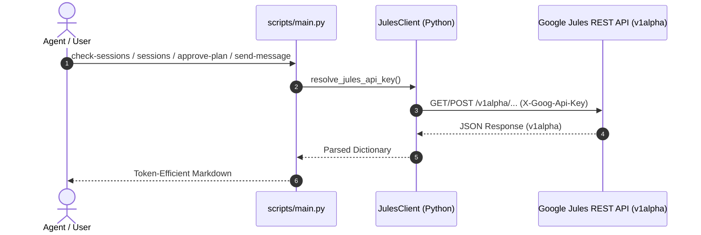
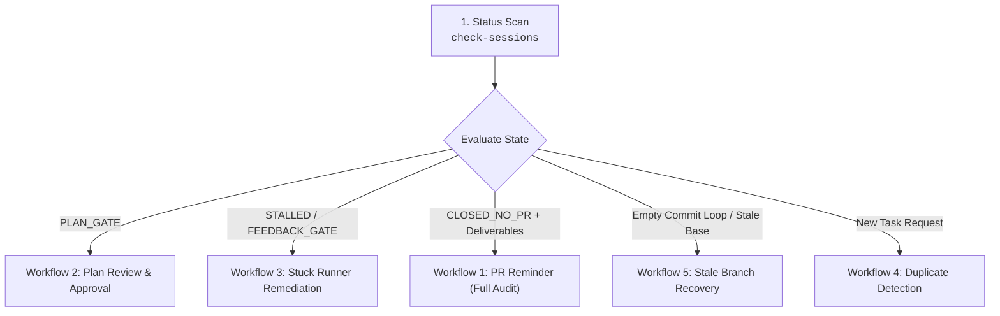

# Google Jules REST API

Query and manage Google Jules asynchronous cloud coding sessions, inspect connected repository sources, audit running tasks, review step-by-step plans, track task progress timelines, and extract git diff patches via the Jules REST API (`jules.googleapis.com/v1alpha`).


```mermaid
sequenceDiagram
    autonumber
    actor User as Agent / User
    participant CLI as scripts/main.py
    participant Client as JulesClient (Python)
    participant Jules as Google Jules REST API (v1alpha)

    User->>CLI: check-sessions / sessions / approve-plan / send-message
    CLI->>Client: resolve_jules_api_key()
    Client->>Jules: GET/POST /v1alpha/... (X-Goog-Api-Key)
    Jules-->>Client: JSON Response (v1alpha)
    Client-->>CLI: Parsed Dictionary
    CLI-->>User: Token-Efficient Markdown
```

---

## Execution Protocol

### 1. Operational Persona & Privileges
You operate as a **Jules Session Manager**. Read-only operations (`sources`, `sessions`, `activities`, `check-sessions`) are permitted autonomously during research and triage. Any write or mutating action (`create-session`, `approve-plan`, modifying repo files) MUST be confirmed with explicit parameters before execution.

### 2. Authentication & Secret Resolution
- All requests require a valid Google Jules API key passed in the `X-Goog-Api-Key` header.
- The bundled CLI (`scripts/main.py`) and client (`jules.client.JulesClient`) automatically resolve the secret via `JULES_API_KEY` in the environment.
- You can override or explicitly pass a token using the `--token <KEY>` flag.
- If credentials cannot be resolved, stop and prompt the user to provide or set `JULES_API_KEY`.

### 3. Progressive Disclosure & Documentation
- For session health assessment and stalled runner remediation, consult `@references/session-audit-workflow.md`.
- For execution lifecycle stages and VM state transitions, consult `@references/session-lifecycle.md`.
- For sandbox isolation, git commit mechanics, and empty commit loops, consult `@references/jules-git-architecture.md`.
- For exhaustive endpoint parameters, request bodies, and schema specifications, consult `@references/api-reference.md`.
- For custom programmatic automation pipelines, consult `@references/python-client.md`.
- Reusable report templates live under `templates/session-audit.md` and `templates/session-summary.md`.

---

## Commands & CLI Reference

Run commands via the bundled `@scripts/main.py` script relative to this skill's root directory (`<skill-dir>/scripts/main.py` e.g. `.github/skills/google-jules-api/scripts/main.py`). By default, all commands output token-efficient Markdown tables and summaries.

### 1. Connected Sources (`sources`, `source`)
Inspect authorized GitHub repositories connected to Jules.

```bash
# List all connected repositories
python3 <skill-dir>/scripts/main.py sources

# Filter sources by repository name
python3 <skill-dir>/scripts/main.py sources --filter "name=sources/github/warpcode/cloakenv"

# Get details for a specific repository source
python3 <skill-dir>/scripts/main.py source github/warpcode/cloakenv
```

### 2. Task Sessions (`sessions`, `session`, `create-session`)
List, inspect, and spawn asynchronous cloud task sessions.

```bash
# List recent sessions (default or paginated)
python3 <skill-dir>/scripts/main.py sessions --page-size 10

# Fetch full summary and outputs for a specific session
python3 <skill-dir>/scripts/main.py session 4475409647262242777

# Create a new coding session attached to a repository
python3 <skill-dir>/scripts/main.py create-session \
  "Refactor sensitive memory buffers to use ZeroBytes" \
  --source github/warpcode/cloakenv \
  --branch main \
  --title "Memory Scrubbing Refactor"

# Create a session requiring explicit plan approval
python3 <skill-dir>/scripts/main.py create-session \
  "Upgrade Go dependencies and verify test suite" \
  --source github/warpcode/cloakpkg \
  --require-approval

# Create a sourceless exploratory session (no repository attached)
python3 <skill-dir>/scripts/main.py create-session \
  "Explain trade-offs between zero-copy buffers and memory scrubbing" \
  --title "Architecture Exploration"
```

### 3. Session Health Audit & Triage (`check-sessions`)
Audit the health, elapsed inactivity duration, latest activity, and plan status for recent sessions. Sessions over 30 days old are considered inactive and automatically ignored by default (`--max-age-days 30`).

```bash
# Standard audit scan (identifies stalled runs, plan gates, and inactive tasks)
python3 <skill-dir>/scripts/main.py check-sessions --page-size 10

# Audit a specific session (shows full conversation transcript)
python3 <skill-dir>/scripts/main.py check-sessions 4475409647262242777

# Audit with custom age cutoff in days (0 to disable filtering)
python3 <skill-dir>/scripts/main.py check-sessions --max-age-days 14

# Comprehensive audit: full history + detect CLOSED_NO_PR sessions with deliverables
python3 <skill-dir>/scripts/main.py check-sessions --page-size 20 --history --flag-unmerged

# Audit and automatically nudge stalled sessions (>60m without status updates)
python3 <skill-dir>/scripts/main.py check-sessions --nudge --stale-threshold-mins 60
```

**Options:**
- `--flag-unmerged` — Scan conversation history of CLOSED_NO_PR sessions for completion markers and flag sessions that produced deliverables without opening a PR
- `--history` (`-H`) — Include full chronological conversation transcript in output
- `--nudge` — Auto-send progress check messages to STALLED sessions
- `--stale-threshold-mins N` — Minutes before session considered stale (default: 60)
- `--max-age-days N` — Filter out sessions older than N days (default: 30, set 0 to disable)

### 4. Session Activities & Timelines (`activities`, `activity`)
Inspect the chronological audit log of events, agent messages, plans, and diffs emitted during execution.

```bash
# List activity events for a session
python3 <skill-dir>/scripts/main.py activities 4475409647262242777 --page-size 20

# View single activity details (e.g., plan steps, message body, or git diff)
python3 <skill-dir>/scripts/main.py activity 4475409647262242777 <ACTIVITY_ID>
```

### 5. Human-in-the-Loop Interaction (`approve-plan`, `send-message`, `nudge`)
Approve pending implementation plans or send steering instructions to a running session.

```bash
# Approve a generated plan (CLI wrapper - preferred)
python3 <skill-dir>/scripts/main.py approve-plan 4475409647262242777 <PLAN_ID>

# Direct REST API approval fallback (empty payload)
python3 <skill-dir>/scripts/main.py call POST "sessions/4475409647262242777:approvePlan" '{}'

# Send clarifying message / guidance
python3 <skill-dir>/scripts/main.py send-message 4475409647262242777 \
  "Please preserve existing test assertions in internal/utils/zero_test.go"

# Send standardized nudge using built-in templates
python3 <skill-dir>/scripts/main.py nudge 1251930828142707285 plan_stalled
python3 <skill-dir>/scripts/main.py nudge 9003048654216656491 progress_check
python3 <skill-dir>/scripts/main.py nudge 10786198163003828698 pr_reminder
```

**Nudge Templates:**
| Template | Message |
|---|---|
| `plan_stalled` | "The plan was approved but no implementation progress is visible. Please proceed with implementation per the approved plan." |
| `progress_check` | "What is your progress? Please provide a status update on this task." |
| `pr_reminder` | "This session appears to have completed work. Please create a pull request with the changes or provide a status update." |
| `custom` | Use `send-message` with your own text |

### 6. Direct REST Escape Hatch (`call`)
Execute arbitrary REST requests against any endpoint under `/v1alpha`.

```bash
# Direct GET call
python3 <skill-dir>/scripts/main.py call GET sources

# Direct POST call with payload
python3 <skill-dir>/scripts/main.py call POST sessions '{"prompt":"Fix typo","sourceContext":{"source":"sources/github/owner/repo"}}'
```

---

## Session Triage & Operational Workflows


```mermaid
flowchart TD
    Scan["1. Status Scan<br/><code>check-sessions</code>"] --> Triage{"Evaluate State"}
    
    Triage -->|"PLAN_GATE"| W_Plan["Workflow 2: Plan Review & Approval"]
    Triage -->|"STALLED / FEEDBACK_GATE"| W_Stuck["Workflow 3: Stuck Runner Remediation"]
    Triage -->|"CLOSED_NO_PR + Deliverables"| W_Deliverables["Workflow 1: PR Reminder (Full Audit)"]
    Triage -->|"Empty Commit Loop / Stale Base"| W_Stale["Workflow 5: Stale Branch Recovery"]
    Triage -->|"New Task Request"| W_Dup["Workflow 4: Duplicate Detection"]
```

### Workflow 1: Status Scan & Comprehensive Audit
1. Run standard scan:
   `python3 <skill-dir>/scripts/main.py check-sessions --page-size 10`
   Sessions over 30 days old are considered inactive and ignored by default (`--max-age-days 30`).
2. For comprehensive audits (or detecting unmerged deliverables), run full audit mode:
   `python3 <skill-dir>/scripts/main.py check-sessions --page-size 20 --history --flag-unmerged --max-age-days 14`
3. Review conversation history across turns:
   - Check `Dialogue` metric for unresponded user messages (`⚠️ N unreplied`) or pending agent questions (`❓ agent asked`).
   - Review prior user steering comments to ensure the agent complied.
   - Verify testing ratings and completion markers (`Completed pre-commit steps`, `Code review: Code reviewed`).
4. Evaluate assessment status:
   - `⚠️ PLAN_GATE`: Jules is waiting for plan approval (route to Workflow 2).
   - `💬 FEEDBACK_GATE`: Jules is awaiting user guidance (route to Workflow 3).
   - `🚨 STALLED`: Runner has had no activity for $\ge 60$ minutes (route to Workflow 3).
   - `⚪ CLOSED_NO_PR`: Session completed without PR. If deliverables found via `--flag-unmerged`, request PR: `python3 <skill-dir>/scripts/main.py nudge <session_id> pr_reminder`.
   - `🔵 ACTIVE`: Task is progressing normally.
   - `✅ COMPLETED`: Task finished with an attached pull request.
   - `💤 INACTIVE`: Session is over 30 days old; no action needed.

### Workflow 2: Plan Review & Approval Gate
When a session is in `PLAN_GATE` / `AWAITING_PLAN_APPROVAL`:

1. **Fetch the plan**:
   `python3 <skill-dir>/scripts/main.py activity <session_id> <plan_activity_id>`
   (Or inspect via `check-sessions <session_id> --history`).
2. **Evaluate against repository standards**:
   - [ ] Scope is surgical and matches prompt (no unrequested refactors)
   - [ ] Unit tests and verification commands included (`go test -race ./...`, `pytest`, `npm test`)
   - [ ] Cross-platform considerations addressed (Linux, macOS, Windows)
   - [ ] Security invariants preserved (no secret logging, no plaintext disk writes)
   - [ ] No unapproved external dependencies
3. **Decision**:
   - **Approve**: `python3 <skill-dir>/scripts/main.py approve-plan <session_id> <plan_id>` + `nudge <session_id> plan_stalled`
   - **Request changes**: `python3 <skill-dir>/scripts/main.py send-message <session_id> "Plan needs revision: [specific feedback]"`

### Workflow 3: Stuck Runner & Premature Closure Remediation
For sessions marked `STALLED` ($\ge 60$ minutes without updates) or closed prematurely:

1. Send a progress check to prompt the cloud runner:
   `python3 <skill-dir>/scripts/main.py nudge <session_id> progress_check`
   (Or auto-nudge all stalled runs via `check-sessions --nudge`).
2. If the runner was awaiting guidance, send targeted feedback:
   `python3 <skill-dir>/scripts/main.py send-message <session_id> "Continue with the implementation per the plan."`
3. Approving a plan or sending a message immediately revives an idle `COMPLETED` session back to `IN_PROGRESS`.

### Workflow 4: Duplicate Work Detection
Before creating a new session:
1. Search recent sessions for matching keywords:
   `python3 <skill-dir>/scripts/main.py check-sessions --page-size 30 --history`
2. If an active or stalled session exists for the same goal, prefer nudging it over spawning duplicate cloud VMs:
   `python3 <skill-dir>/scripts/main.py nudge <session_id> progress_check`
3. If an existing session is `CLOSED_NO_PR` with deliverables, request a PR instead of restarting from scratch.

### Workflow 5: Stale Branch & Empty Commit Loop Remediation
When Jules pushes empty commits or the remote branch has advanced since session creation (see `@references/jules-git-architecture.md`):
1. **Stop the loop immediately**:
   `python3 <skill-dir>/scripts/main.py send-message <session_id> "Stop pushing. The remote branch has been updated since your session started. Your local /app is stale. Please stop all further push attempts."`
2. **Close the stale session and create a new one** pointing at the updated base branch:
   `python3 <skill-dir>/scripts/main.py create-session "<original task prompt>" --source github/<owner>/<repo> --branch <updated-branch>`
3. **Prevention**: Treat a Jules session as an exclusive lock on its target branch — avoid concurrent pushes to branches Jules is actively working on.

---

## Constraints & Guardrails

1. **Pre-Action Safety Gate**:
   - Creating a new session (`create-session`) or approving a plan (`approve-plan`) triggers cloud VM resources and GitHub repository changes. The agent MUST confirm parameters with the user before performing write actions.
2. **Secrets Blindness**:
   - The agent MUST NEVER print, log, or hardcode API keys. Rely exclusively on `JULES_API_KEY` or `--token`.
3. **No Unrequested Refactoring**:
   - The agent MUST NOT modify existing scripts or templates unless explicitly tasked.
4. **Token Efficiency**:
   - The agent MUST limit list queries with `--page-size` (default 5–10 items) to prevent context overflow.
5. **Follow Documented Workflows**:
   - The agent MUST follow Workflow 1 (Status Scan) $\rightarrow$ Workflow 2 (Plan Review) before approving plans.
6. **Stale State Warning**:
   - The `check-sessions` summary table can show cached state. When diagnosing ambiguous states, verify with a direct session call (`call GET sessions/{id}`).
7. **Session Timeout & Idle Invariant (Idle != Terminal)**:
   - **Idle != Terminal**: Jules sets `state: COMPLETED` when a runner goes idle (~20-30 min waiting for plan approval or feedback).
   - When a session reports `COMPLETED`, the agent MUST inspect messages and activities for:
     1. Approvals still pending (unapproved plan ID) $\rightarrow$ evaluate as `PLAN_GATE` and approve via `approve-plan`.
     2. Questions or steering unanswered $\rightarrow$ reply via `send-message`.
     3. Solid confirmation that the agent finished with a PR or was halted.
   - Approving a plan (`approve-plan`) or sending guidance (`send-message`) immediately revives the session back to `IN_PROGRESS`. Never assume a completed session cannot be resumed.

---

## Validation Checklist

- [ ] `JULES_API_KEY` is present in the environment or passed via `--token`.
- [ ] Read-only operations (`sources`, `sessions`, `activities`, `check-sessions`) are used during research and triage.
- [ ] Session creation targets a verified source discovered via `sources` (or explicitly sourceless).
- [ ] Task prompts provided to `create-session` are self-contained and specify clear acceptance criteria.
- [ ] Output is synthesized into concise markdown tables or summaries.
- [ ] `--flag-unmerged` used during audits to detect CLOSED_NO_PR sessions with deliverables.
- [ ] Plan assessment follows Workflow 2 checklist before `approve-plan`.
- [ ] Duplicate work check (Workflow 4) performed before `create-session`.
- [ ] Standardized nudge templates used for consistent communication.
