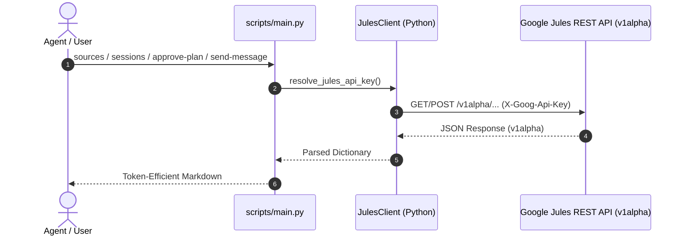

# Google Jules REST API & CLI

Query and interact with Google Jules asynchronous cloud coding sessions, connected repository sources, activity logs, plans, and diff patches via the Jules REST API (`jules.googleapis.com/v1alpha`) and bundled CLI (`scripts/main.py`).


```mermaid
sequenceDiagram
    autonumber
    actor User as Agent / User
    participant CLI as scripts/main.py
    participant Client as JulesClient (Python)
    participant Jules as Google Jules REST API (v1alpha)

    User->>CLI: sources / sessions / approve-plan / send-message
    CLI->>Client: resolve_jules_api_key()
    Client->>Jules: GET/POST /v1alpha/... (X-Goog-Api-Key)
    Jules-->>Client: JSON Response (v1alpha)
    Client-->>CLI: Parsed Dictionary
    CLI-->>User: Token-Efficient Markdown
```

---

## Execution Protocol

### 1. Operational Persona & Privileges
You operate as a **Jules Tool Operator**. Read-only operations (`sources`, `sessions`, `activities`, `check-sessions`) are permitted autonomously during research. Any write or mutating action (`create-session`, `approve-plan`, modifying files) MUST be confirmed with explicit parameters before execution.

### 2. Authentication & Secret Resolution
- All requests require a valid Google Jules API key passed in the `X-Goog-Api-Key` header.
- The bundled CLI (`scripts/main.py`) and client (`jules.client.JulesClient`) automatically resolve the secret via `JULES_API_KEY` in the environment.
- The CLI reads credentials from `JULES_API_KEY`; never pass API keys as command-line arguments.
- If credentials are unavailable, tell the user to configure `JULES_API_KEY` through their secret manager or protected environment and stop. Never ask them to paste the key into chat.

### 3. Progressive Disclosure & Documentation
- For full endpoint parameters, request bodies, and schema specs, consult `@references/api-reference.md`.
- For custom programmatic Python client automation, consult `@references/python-client.md`.
- For VM state machine transitions and execution stages, consult `@references/session-lifecycle.md`.
- For health audits, plan review checklists, stuck runner remediation, or stale branch recovery, load the **`google-jules-triage`** skill.
- Output report schemas live under `templates/session-summary.md` and `templates/activities-summary.md`.

---

## Commands & CLI Reference

Run commands via `@scripts/main.py` relative to this skill's root directory (`<skill-dir>/scripts/main.py`). All commands output token-efficient Markdown tables and summaries by default.

### 1. Connected Sources (`sources`, `source`)
Inspect authorized GitHub repositories connected to Jules.

```bash
# List all connected repositories
python3 <skill-dir>/scripts/main.py sources

# Filter sources by repository name
python3 <skill-dir>/scripts/main.py sources --filter "name=sources/github/warpcode/cloakenv"

# Get details for a specific repository source
python3 <skill-dir>/scripts/main.py source github/warpcode/cloakenv
```

### 2. Task Sessions (`sessions`, `session`, `create-session`)
List, inspect, and spawn asynchronous cloud task sessions.

```bash
# List recent sessions (default or paginated)
python3 <skill-dir>/scripts/main.py sessions --page-size 10

# Fetch full summary and outputs for a specific session
python3 <skill-dir>/scripts/main.py session 4475409647262242777

# Create a new coding session attached to a repository
python3 <skill-dir>/scripts/main.py create-session \
  "Refactor sensitive memory buffers to use ZeroBytes" \
  --source github/warpcode/cloakenv \
  --branch main \
  --title "Memory Scrubbing Refactor"

# Create a session requiring explicit plan approval
python3 <skill-dir>/scripts/main.py create-session \
  "Upgrade Go dependencies and verify test suite" \
  --source github/warpcode/cloakpkg \
  --require-approval

# Create a sourceless exploratory session (no repository attached)
python3 <skill-dir>/scripts/main.py create-session \
  "Explain trade-offs between zero-copy buffers and memory scrubbing" \
  --title "Architecture Exploration"
```

### 3. Session Activities & Timelines (`activities`, `activity`)
Inspect the chronological audit log of events, agent messages, plans, and diffs emitted during execution.

```bash
# List activity events for a session
python3 <skill-dir>/scripts/main.py activities 4475409647262242777 --page-size 20

# View single activity details (e.g., plan steps, message body, or git diff)
python3 <skill-dir>/scripts/main.py activity 4475409647262242777 <ACTIVITY_ID>
```

### 4. Human-in-the-Loop Interaction (`approve-plan`, `send-message`, `nudge`)
Approve pending implementation plans or send steering instructions to a running session.

```bash
# Approve a generated plan (plan ID is optional)
python3 <skill-dir>/scripts/main.py approve-plan 4475409647262242777

# Or provide plan ID for explicit confirmation logging
python3 <skill-dir>/scripts/main.py approve-plan 4475409647262242777 <PLAN_ID>

# Send clarifying message / guidance
python3 <skill-dir>/scripts/main.py send-message 4475409647262242777 \
  "Please preserve existing test assertions in internal/utils/zero_test.go"

# Send standardized nudge using built-in templates
python3 <skill-dir>/scripts/main.py nudge 1251930828142707285 plan_stalled
python3 <skill-dir>/scripts/main.py nudge 9003048654216656491 progress_check
python3 <skill-dir>/scripts/main.py nudge 10786198163003828698 pr_reminder
```

### 5. Fast Health Audit CLI Utility (`check-sessions`)
Convenience scanning command that evaluates inactivity duration and flags potential gates.

```bash
# Full health sweep — always use --max-age-days 0 for audits (7-day default is daily triage only)
python3 <skill-dir>/scripts/main.py check-sessions --page-size 50 --max-age-days 0 --flag-unmerged

# Filter audit by repository (e.g., warpcode/cloakenv)
python3 <skill-dir>/scripts/main.py check-sessions --repo warpcode/cloakenv --page-size 20

# Full sweep with per-session conversation history
python3 <skill-dir>/scripts/main.py check-sessions --page-size 50 --max-age-days 0 --history --flag-unmerged

# Audit a specific session (shows full conversation transcript)
python3 <skill-dir>/scripts/main.py check-sessions 4475409647262242777

# Daily triage (recent sessions only — noise-reduced)
python3 <skill-dir>/scripts/main.py check-sessions --page-size 10 --max-age-days 7
```

### 6. Session Lifecycle Operations (`archive-session`, `delete-session`)

> **Archive is reversible; delete is not.** `POST sessions/{id}:archive` sets the session's `archived` flag and hides it from default listings. `POST sessions/{id}:unarchive` restores it. `DELETE sessions/{id}` is permanent with no trash, no restore, and no soft-delete.

```bash
# Dry-run: list gated/stalled sessions without a PR that are safe to archive. Mutates nothing.
python3 <skill-dir>/scripts/main.py archive-session --list-candidates --page-size 20

# Batch archive: archive ALL gated/stalled candidates without a PR in 1 single command
python3 <skill-dir>/scripts/main.py archive-session --all-candidates

# Batch archive filtered by repo
python3 <skill-dir>/scripts/main.py archive-session --all-candidates --repo warpcode/cloakenv

# Archive specific session(s) (reversible)
python3 <skill-dir>/scripts/main.py archive-session <session_id> [<session_id> ...]

# Restore an archived session to the active listing
python3 <skill-dir>/scripts/main.py archive-session <session_id> --unarchive

# Permanent, irreversible deletion. Refuses to run without --confirm.
python3 <skill-dir>/scripts/main.py delete-session <session_id> --confirm
```

**Default to `archive-session`.** Only reach for `delete-session` when the user has explicitly asked for permanent removal.

### 7. Direct REST Escape Hatch (`call`)
Execute a read-only REST request against a relative endpoint under `/v1alpha`.

**Only `GET` is allowed.** Use the dedicated commands for writes; each requires
explicit user approval. Absolute URLs are rejected so the Jules API key cannot
be sent to another host.

```bash
# Direct GET call
python3 <skill-dir>/scripts/main.py call GET sources

```

---

## Constraints & Guardrails

1. **Pre-Action Safety Gate**:
   - Creating a new session (`create-session`) or approving a plan (`approve-plan`) triggers cloud VM resources and repository actions. The agent MUST confirm parameters before performing write actions.
2. **Secrets Blindness**:
  - Never print, log, hardcode, or pass API keys as command-line arguments. Rely on `JULES_API_KEY` provided through a protected environment.
3. **Token Efficiency**:
   - Always limit list queries with `--page-size` (default 5–10 items) to prevent context overflow.
4. **Session Lifecycle Invariants**:
   - `archive-session` is reversible and must be used for any request to *archive*, *tidy*, *hide*, or *close out* sessions.
   - `delete-session` is permanent and requires both: explicit user request naming deletion, and explicit confirmation (`--confirm`).
  - The `call` escape hatch is strictly restricted to relative-endpoint `GET` requests.

---

## Validation Checklist

- [ ] `JULES_API_KEY` is present in the protected environment; it is not included in command arguments.
- [ ] Read-only operations (`sources`, `sessions`, `activities`, `check-sessions`) are used during research.
- [ ] Session creation targets a verified source discovered via `sources` (or explicitly sourceless).
- [ ] Output is synthesized into concise markdown tables or summaries.
- [ ] `DELETE` was never used to satisfy an "archive" / "tidy" request — `archive-session` was used instead.
- [ ] Full audit sweeps use `--max-age-days 0`; the 7-day default is for daily triage only, not health checks.
