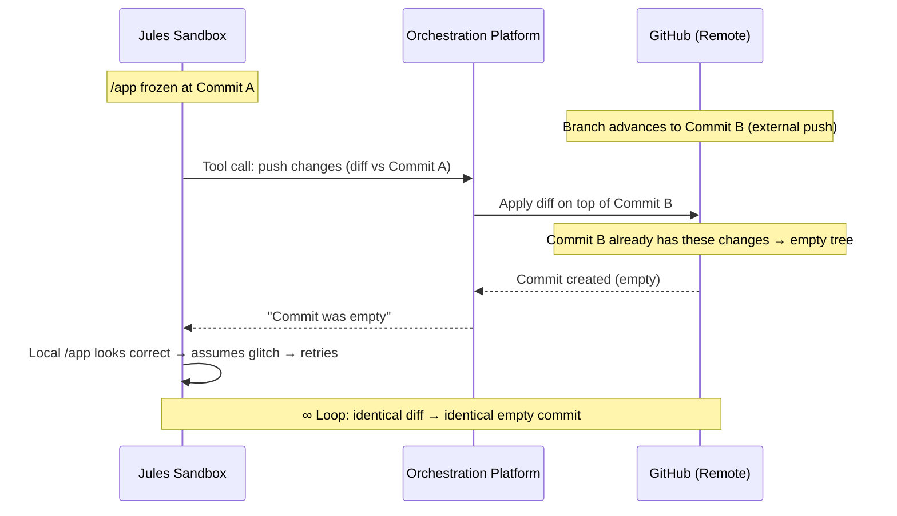

# Jules Git Architecture & Stale Branch Invariant

Technical reference documenting how Jules commits code, its sandbox git isolation, the empty-commit-loop root cause, and remediation procedures.

> [!IMPORTANT]
> Jules' sandbox has **no git remote**. All commits are created by the orchestration platform via the GitHub REST API. Jules cannot `git push`, `git fetch`, or `git pull`.

---

## How Jules Commits Code

Jules' sandbox is deliberately isolated from GitHub authentication. The code submission flow is:

1. Jules emits a **structured JSON tool call** containing `branch_name`, `commit_message`, `title`, and `description`
2. Jules does **NOT** run `git commit` or `git push` in bash
3. The **orchestration platform** (running outside the sandbox, holding GitHub App credentials) intercepts the tool call
4. The platform captures the current state of `/app` (extracting the diff or changed files vs. session-creation snapshot)
5. The platform constructs the commit via the **GitHub REST API** (Trees/Blobs/Commits) and pushes to the target branch
6. The platform surfaces an **approval prompt** in the UI to the user

This architecture ensures that code execution (the sandbox, where arbitrary/unsafe code may run) remains strictly isolated from the credentials used to write to the repository.

---

## Blocked Git Operations

`git remote -v` returns empty in the sandbox. The following remote-interacting git commands are **non-functional**:

| Command | Status | Reason |
|---|---|---|
| `git fetch` | ❌ Blocked | No remote configured |
| `git pull` | ❌ Blocked | No remote configured |
| `git push` | ❌ Blocked | No remote configured |
| `git ls-remote` | ❌ Blocked | No remote configured |

Local-only operations work normally: `git rebase`, `git reset`, `git stash`, `git log`, `git diff`, etc.

---

## The Empty Commit Loop (Stale Base Problem)

### Root Cause

When the remote branch advances after session creation, Jules' `/app` directory becomes stale:



### Mechanics

1. Jules makes changes locally. Local state now differs from Commit A (session clone point)
2. Jules triggers a code push. The platform calculates the diff (Jules' changes vs. Commit A)
3. The platform applies this diff to the remote branch (currently at Commit B)
4. If Commit B **already contains** these changes (e.g. a previous Jules commit was squashed/merged, or another developer fixed the same lines), the resulting git tree is identical to Commit B's tree
5. The GitHub API creates the commit (empty commits are allowed unless blocked by repo rules)
6. Jules is told the commit is empty
7. Jules looks at `/app`, sees the code is correct, has **zero visibility into Commit B**, concludes a platform glitch
8. Jules retries with the exact same diff → infinite loop

---

## Remediation

### Option 1: Session Restart (Recommended)

Terminate the stale session and create a new one at the current HEAD:

```bash
# Stop the loop
python3 <skill-dir>/scripts/main.py send-message <session_id> \
  "Stop pushing. The remote branch has been updated since your session started. Your local /app is stale. Please stop all further push attempts."

# Create a new session at the updated branch
python3 <skill-dir>/scripts/main.py create-session \
  "<original task prompt>" \
  --source github/<owner>/<repo> \
  --branch <updated-branch>
```

### Option 2: Manual Patch Hack (When Restart Is Not Possible)

Paste the `git diff` between Commit A and Commit B into the chat. Jules can apply it using `patch` in bash:

```
User: Here is the diff between the original base and current HEAD. Apply this first, then continue your work on top of it:
<paste git diff output>
```

> [!WARNING]
> Clearing or resetting Jules' workspace only reverts to Commit A, **not** forward to Commit B. This does not resolve the stale base problem.

---

## Prevention

Treat a Jules session as an **exclusive lock** on its target branch. Avoid concurrent pushes to branches Jules is actively working on until the session completes or is closed.
