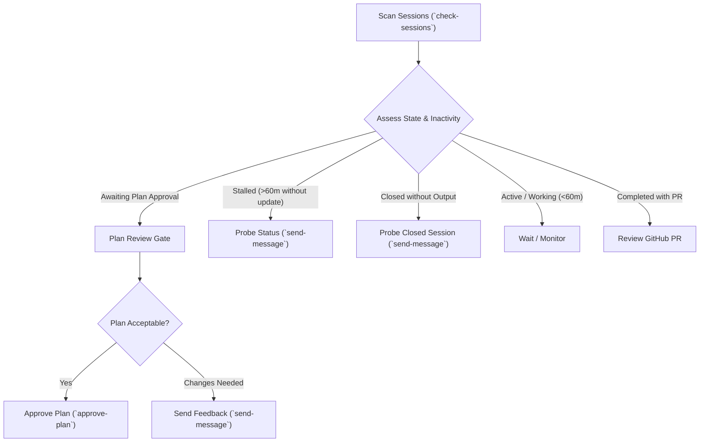

# Jules Session Health Audit & Triage Workflow

A structured standard operating procedure for auditing cloud coding sessions, conducting plan reviews, detecting stalled runners, and recovering stuck or prematurely closed tasks.



---

## 1. Session Health Assessment Protocol

When auditing sessions via `scripts/main.py check-sessions`:

| Assessment Badge | Trigger Conditions | Recommended Action |
|---|---|---|
| `⚠️ PLAN_GATE` | State is `AWAITING_PLAN_APPROVAL` or session is idle/completed with an unapproved plan | Review plan steps; approve via `approve-plan` or send revision feedback (resumes session) |
| `💬 FEEDBACK_GATE` | State is `AWAITING_USER_FEEDBACK` or session is idle/completed with agent question awaiting reply | Read agent's inquiry; reply with guidance via `send-message` (resumes session) |
| `🚨 STALLED` | State is `IN_PROGRESS` (or idle `COMPLETED`) with unreplied user messages or last activity $\ge 60$ minutes ago | Send progress check via `send-message` or auto-nudge with `--nudge` |
| `⚪ CLOSED_NO_PR` | State is `COMPLETED` with no PR, and verified no pending plans, unanswered questions, or deliverables | Probe session via `send-message` if work was expected, or verify explicit halt confirmation |
| `🔵 ACTIVE` | State is `IN_PROGRESS` and last activity was $< 60$ minutes ago | Task is progressing normally; monitor without interrupting |
| `✅ COMPLETED` | State is `COMPLETED` and pull request is present in `outputs` | Review PR against branch guidelines |
| `💤 INACTIVE` | Session age $> 30$ days | Considered inactive and ignored by default in scans; no action needed |

---

## 2. Activity Pagination Invariant

> [!IMPORTANT]
> The Jules REST API endpoint `GET /v1alpha/sessions/{sessionId}/activities` returns activities in **chronological order (oldest first)**.
> A single page (e.g. first 10-20 items) only shows the initial boot and exploration steps. To inspect the latest status, the client MUST follow `nextPageToken` until the final page is reached. The CLI's `check-sessions` and `get_all_activities()` handle this automatically.

---

## 3. Conversation History Review Protocol

> [!IMPORTANT]
> **Always review the complete conversation history, never just the latest message.**
> Inspecting only the most recent message risks missing prior instructions, unanswered questions, rejected plans, or failed verification steps. Always examine the full dialogue chain from initial prompt to present.
>
> **CRITICAL INVARIANT: Idle != Terminal**
> Jules sets `state: COMPLETED` when a session goes idle (~20 min) awaiting plan approval or feedback. When a session reports `COMPLETED`, you must ALWAYS verify:
> 1. Approvals still yet to be approved (unapproved plan ID) $\rightarrow$ evaluate as `PLAN_GATE` and approve via `approve-plan`.
> 2. Questions unanswered (agent asked or user asked) $\rightarrow$ evaluate as `FEEDBACK_GATE` or `STALLED` and reply via `send-message`.
> 3. Solid confirmation that the agent should halt immediately or has completed with a PR.
> Approving a plan or sending a message revives the session and transitions it back to `IN_PROGRESS`.

When auditing any session:
1. **Trace Dialogue Turns**:
   - Inspect all user steering inputs, agent progress statements, and plan presentations.
   - Use `python3 <skill-dir>/scripts/main.py check-sessions <session_id>` or pass `--history` to inspect the full transcript.
2. **Check for Unanswered User Inquiries**:
   - Note the `Dialogue` metric (e.g. `3U / 2A (1 unreplied)`).
   - If the user sent messages that the agent never acknowledged, determine if the cloud VM is stuck in an internal tool loop.
3. **Check for Pending Agent Inquiries**:
   - Identify whether the agent explicitly asked for confirmation, clarification, or plan approval.
   - Distinguish between an agent waiting for user guidance (`AWAITING_USER_FEEDBACK`) versus an inactive or stalled VM runner.
4. **Inspect Quality & Review Milestones**:
   - Trace whether tests were executed and passed.
   - Look for automated code review results (`progressUpdated`: `#Correct#`, `#NeedsWork#`).
   - If code review passed but no PR was produced, identify which pre-commit step stalled (e.g. memory recording, push permissions).

---

## 4. Plan Review Gate Protocol

When Jules generates a plan requiring approval:
1. **Fetch Plan Steps**: Inspect the step breakdown via `python3 <skill-dir>/scripts/main.py activity <session_id> <activity_id>` or `check-sessions`.
2. **Review Checklist**:
   - **Scope Check**: Does the plan make targeted changes matching the prompt without unrequested refactors?
   - **Testing Gate**: Does the plan include unit tests, test verification (`go test`, `pytest`), and pre-commit checks?
   - **Cross-Platform Compatibility**: Does the plan address OS-specific boundaries where appropriate?
   - **Security Invariants**: Does the plan avoid hardcoding credentials or introducing injection vectors?
3. **Execution**:
   - **Approve**: Run `python3 <skill-dir>/scripts/main.py approve-plan <session_id> <plan_id>` and send an explicit confirmation message.
   - **Request Changes**: Run `python3 <skill-dir>/scripts/main.py send-message <session_id> "<specific feedback>"`.

---

## 5. Stuck / Silent Session Recovery

Sessions may occasionally hang during pre-commit steps (such as memory recording or subagent dispatch):
1. **Identify Stalled Tasks**: Run `python3 <skill-dir>/scripts/main.py check-sessions --stale-threshold-mins 60`.
2. **Send Wakeup / Progress Inquiry**:
   ```bash
   python3 <skill-dir>/scripts/main.py send-message <session_id> \
     "What is your progress? Please provide a status update on this task."
   ```
   Or use the automated flag:
   ```bash
   python3 <skill-dir>/scripts/main.py check-sessions --nudge
   ```
3. **Prematurely Closed Sessions**:
   If a task transitioned to `COMPLETED` without producing a changeset or PR, sending a message via `send-message` will re-engage the Jules agent and prompt a status explanation or plan generation.

---

## 6. Inactive Session Invariant (>30 Days)

> [!IMPORTANT]
> **All sessions over 30 days old are considered inactive and should be ignored.**
>
> Cloud sessions left in `IN_PROGRESS` or awaiting actions from weeks prior represent abandoned or obsolete runs.
> - `audit_sessions()` and `check-sessions` automatically filter out sessions older than 30 days by default (`--max-age-days 30`).
> - Inactive sessions are never nudged or surfaced in actionable plan/feedback alerts.
> - To inspect an older session specifically, pass its session ID directly: `python3 <skill-dir>/scripts/main.py check-sessions <session_id>`.
