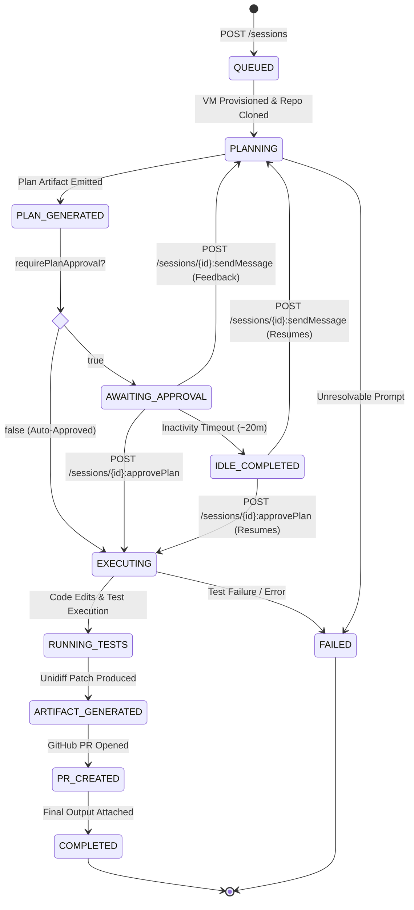

# Jules Session Lifecycle & Execution Model

Understanding the lifecycle stages of an asynchronous task delegated to Google Jules.

---

## Lifecycle Stages

### 1. Initiation & VM Provisioning
- Session is created via `POST /sessions` with `prompt` and `sourceContext`.
- Jules provisions an isolated cloud virtual machine with a fresh container environment.
- The target git repository and `startingBranch` are cloned securely.

### 2. Planning Phase
- Jules analyzes repository files, dependencies, and git log.
- Jules produces a structured `planGenerated` activity containing step-by-step tasks with IDs, titles, and descriptions.
- If `requirePlanApproval` was set to `true`, execution halts until the user approves via `approvePlan` or sends clarifying feedback via `sendMessage`.

### 3. Execution & Test Verification
- Jules executes commands in a bash session on the VM.
- Code modifications are made and verified by running project test suites (e.g. `go test`, `pytest`, `npm test`).
- Progress events are emitted as `progressUpdated` activities.

### 4. Patch Generation & Pull Request Automation
- Completed changes are recorded in an `artifacts` activity containing a unified git diff (`unidiffPatch`).
- Jules creates a dedicated git branch and opens a GitHub Pull Request with a structured description and suggested commit message.
- The session state transitions to `COMPLETED`.

### 5. Idle Timeout vs. Terminal State (Resumption)
- **Idle `COMPLETED`**: When a session halts at a plan approval gate or feedback prompt without user action for ~20 minutes, Jules marks the session as `COMPLETED`. This is an **idle** state, not a permanent termination.
- **Resumption**: Calling `approvePlan` or sending a guidance message (`sendMessage`) immediately revives the cloud runner and transitions the session state back to `IN_PROGRESS`.
- **Audit Rule**: Never treat a `COMPLETED` session as terminal without first verifying whether there are pending unapproved plans, unanswered inquiries, or solid confirmation that the task finished or should halt.
