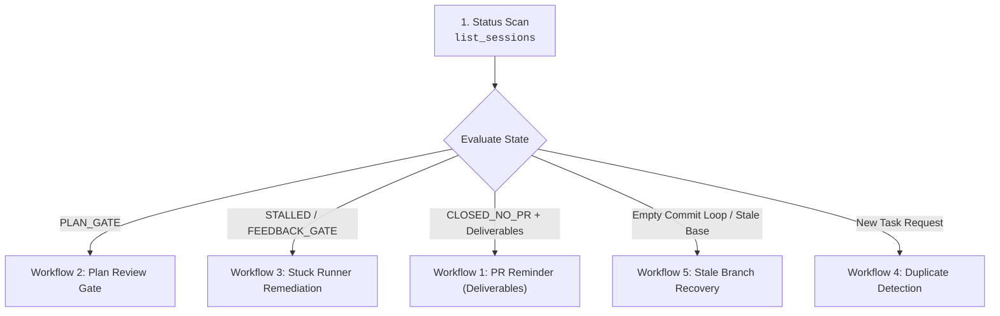

# Google Jules Triage & Health Management

A tool-agnostic Standard Operating Procedure for managing the health, review gates, and lifecycle of asynchronous Google Jules coding tasks.

---

## Required Operational Capabilities

This triage procedure is independent of any specific tooling or transport. It operates against the following standard capabilities:

| Operation | Purpose | Inputs | Expected Output |
|---|---|---|---|
| `list_sessions` | Enumerate recent sessions | Max count / age limit | List of sessions with state and activity timestamp |
| `get_session` | Inspect session details | Session ID | Prompt, status, repository target, and pull request link |
| `get_activities` | Fetch chronological history | Session ID | Sequential list of agent thoughts, messages, plans, and diffs |
| `approve_plan` | Authorize proposed plan | Session ID, Plan ID | Session transitions from plan gate to implementation |
| `send_message` | Send steering guidance | Session ID, Message text | Injects direction or answers into the runner |
| `archive_session` | Reversibly hide session | Session ID | Hides inactive session from default listings |

---

## Triage Workflows

### Workflow 1: Status Scan & Assessment Taxonomy
1. Query active sessions using `list_sessions`. Filter out sessions older than 30 days by default (consult `@references/lifecycle-states.md`).
2. Map each session to its health assessment badge:
   - `⚠️ PLAN_GATE`: Awaiting plan approval $\rightarrow$ proceed to Workflow 2.
   - `💬 FEEDBACK_GATE`: Agent inquiry awaiting user guidance $\rightarrow$ reply via `send_message`.
   - `🚨 STALLED`: Runner silent for $\ge 60$ minutes $\rightarrow$ proceed to Workflow 3.
   - `⚪ CLOSED_NO_PR`: Session closed without PR. If deliverables or test completion markers exist, send `pr_reminder` nudge.
   - `🔵 ACTIVE`: Normal execution in progress. Monitor without interrupting.
   - `✅ COMPLETED`: Task finished with an attached pull request. Review the PR.
3. Synthesize findings using the report template at `templates/session-audit.md`.

### Workflow 2: Plan Review & Approval Gate
When a session is awaiting plan approval (`PLAN_GATE`):
1. Retrieve the plan activity details via `get_activities` or `get_session`.
2. Evaluate against the criteria in `@references/plan-review-gate.md`:
   - [ ] Surgical scope aligned strictly with prompt (no unrequested refactors)
   - [ ] Verification test suite commands included (`go test`, `pytest`, `npm test`)
   - [ ] Cross-platform compatibility and security invariants preserved
3. If acceptable, execute `approve_plan`. If idle, follow with the `plan_stalled` nudge template from `@references/nudge-catalog.md`.
4. If revisions are required, send structured rejection feedback via `send_message`. Format evaluation with `templates/plan-assessment.md`.

### Workflow 3: Stuck Runner & Idle Invariant Remediation
When a session is marked `STALLED` ($\ge 60$ minutes without updates) or closed prematurely:
1. **Critical Invariant: Idle != Terminal**: Jules marks sessions as `COMPLETED` when its cloud VM runner goes idle (~20–30 min) waiting for plan approval or feedback.
2. Sending `send_message` or `approve_plan` **immediately revives the runner**, returning the session to `IN_PROGRESS`.
3. Dispatch the `progress_check` nudge from `@references/nudge-catalog.md`.
4. If the runner was awaiting guidance, reply directly to the agent's questions.

### Workflow 4: Duplicate Work Prevention
Before creating a new coding session:
1. List recent sessions targeting the same repository or task keywords.
2. If an active or stalled session exists for the same objective, prefer reviving or nudging the existing session over provisioning duplicate cloud VMs.

### Workflow 5: Stale Branch & Empty Commit Loop Remediation
When Jules pushes empty commits or the remote repository has advanced past the session's base snapshot:
1. Halt the runner immediately using the `stale_branch_halt` nudge from `@references/nudge-catalog.md`.
2. Follow the detailed recovery steps in `@references/stale-branch-remediation.md`: reversibly archive the stale session, and spawn a fresh session rooted on the updated base branch.

---

## Constraints & Guardrails

1. **Chronological Traversal Invariant**:
   - Jules activities are logged oldest-first. Always follow pagination to inspect the latest state before diagnosing a session.
2. **Review Full History**:
   - Never evaluate a session solely on its latest message. Inspect the dialogue turns to verify prior user instructions and testing results.
3. **Reversible Archival vs Irreversible Deletion**:
   - Reversibly archive sessions to hide them from triage sweeps. Never perform hard deletion unless explicitly requested and confirmed.
4. **Secrets Blindness**:
   - Never log, display, or commit authentication tokens or secrets during triage or reports.
