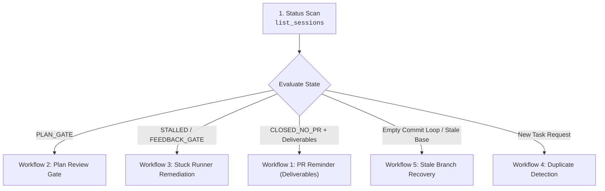

# Google Jules Triage & Health Management

A tool-agnostic Standard Operating Procedure for managing the health, review gates, and lifecycle of asynchronous Google Jules coding tasks.



---

## Required Operational Capabilities

This triage procedure is independent of any specific tooling or transport. It operates against the following standard capabilities:

| Operation | Purpose | Inputs | Expected Output |
|---|---|---|---|
| `list_sessions` | Enumerate recent sessions | Max count / age limit | List of sessions with state and activity timestamp |
| `get_session` | Inspect session details | Session ID | Prompt, status, repository target, and pull request link |
| `get_activities` | Fetch chronological history | Session ID | Sequential list of agent thoughts, messages, plans, and diffs |
| `approve_plan` | Authorize proposed plan | Session ID, Plan ID | Session transitions from plan gate to implementation |
| `send_message` | Send steering guidance | Session ID, Message text | Injects direction or answers into the runner |
| `archive_session` | Reversibly hide session | Session ID | Hides inactive session from default listings |
| `create_session` | Spawn replacement session | Prompt, source repo, branch, title | New session rooted on a rebuilt `tidy/` branch |

---

## Triage Workflows

### Workflow 1: Status Scan & Assessment Taxonomy
1. Query active sessions using `list_sessions`. Filter out sessions older than 30 days by default (consult `@references/lifecycle-states.md`).
2. Map each session to its health assessment badge:
   - `⚠️ PLAN_GATE`: Awaiting plan approval $\rightarrow$ proceed to Workflow 2.
   - `💬 FEEDBACK_GATE`: Agent inquiry awaiting user guidance $\rightarrow$ reply via `send_message`.
   - `🚨 STALLED`: Runner silent for $\ge 60$ minutes $\rightarrow$ proceed to Workflow 3.
   - `⚪ CLOSED_NO_PR`: Session closed without PR. If deliverables or test completion markers exist, send `pr_reminder` nudge.
   - `🔵 ACTIVE`: Normal execution in progress. Monitor without interrupting.
   - `✅ COMPLETED`: Task finished with an attached pull request. Review the PR.
   - `🗑️ JUNK`: Degenerate session — **archive immediately without nudging**. See signature below.
3. Synthesize findings using the report template at `templates/session-audit.md`.

**Junk Session Signature**: Sessions where all agent turns consist of single-character strings (`a`), garbled CJK fragments (`体`, `轻`, `部件`, `皮肤`), or non-sequitur language output followed by a rubber-stamped `Code review rating is #Correct#` are degenerate — the runner produced no real work. Archive immediately: `archive-session <id>`. Do not nudge.

### Workflow 2: Plan Review & Approval Gate
When a session is awaiting plan approval (`PLAN_GATE`):
1. Retrieve the plan activity details via `get_activities` or `get_session`.
2. Evaluate against the criteria in `@references/plan-review-gate.md`:
   - [ ] **Validity, Relevance & Utility**: Verify the problem/bug actually exists in the code (not a false premise or hallucination); verify the change is relevant and provides genuine utility rather than code churn or unneeded abstractions.
   - [ ] Surgical scope aligned strictly with prompt (no unrequested refactors)
   - [ ] Verification test suite commands included (`go test`, `pytest`, `npm test`)
   - [ ] Cross-platform compatibility and security invariants preserved
3. If acceptable, execute `approve_plan`. If idle, follow with the `plan_stalled` nudge template from `@references/nudge-catalog.md`.
4. If invalid, unnecessary, or revisions are required, send structured rejection feedback via `send_message`. Format evaluation with `templates/plan-assessment.md`.

### Workflow 3: Stuck Runner & Idle Invariant Remediation
When a session is marked `STALLED` ($\ge 60$ minutes without updates) or closed prematurely:
1. **Critical Invariant: Idle != Terminal**: Jules marks sessions as `COMPLETED` when its cloud VM runner goes idle (~20–30 min) waiting for plan approval or feedback.
2. Sending `send_message` or `approve_plan` **immediately revives the runner**, returning the session to `IN_PROGRESS`.
3. Dispatch the `progress_check` nudge from `@references/nudge-catalog.md`.
4. If the runner was awaiting guidance, reply directly to the agent's questions.

### Workflow 4: Duplicate Work Prevention
Before creating a new coding session:
1. List recent sessions targeting the same repository or task keywords.
2. If an active or stalled session exists for the same objective, prefer reviving or nudging the existing session over provisioning duplicate cloud VMs.

### Workflow 5: Stale Branch & Empty Commit Loop Remediation
When Jules pushes empty commits or the remote repository has advanced past the session's base snapshot:
1. **Count the empty commits first** (Workflow 6, step 1, or run `bash <skills-dir>/google-jules-triage/scripts/detect_empty_commits.sh <base-ref> <head-ref>`). If there are two or more, the session is wedged — go straight to Workflow 6 and do **not** nudge it. A nudge to an already-looping session was itself the trigger for the next empty push on warpcode/cloakenv#210.
2. Follow the detailed recovery steps in `@references/stale-branch-remediation.md`: reversibly archive the stale session, and spawn a fresh session rooted on the updated base branch.

### Workflow 6: Wedged PR Recovery (empty-commit / reverted-refactor loops)
Nudging or re-prompting the **same** session will not clear these. The runner keeps appending
commits, and an appended commit can never remove an existing one — so an empty-commit loop never
terminates on its own. Escalate to rebuilding the branch yourself, then hand off to a **new**
session.

**Do not push anything to the session's own branch.** Not a merge, not a rebase, not a fix-up
commit. Write to a fresh `tidy/` branch and start the replacement session there.

1. **Confirm it is genuinely wedged** — count empty commits above the merge base:
   ```bash
   git fetch origin pull/<n>/head:refs/remotes/origin/pr-<n> --force
   bash <skills-dir>/google-jules-triage/scripts/detect_empty_commits.sh origin/main origin/pr-<n>
   ```
   Or inline:
   ```bash
   for c in $(git rev-list origin/main..origin/pr-<n>); do
     s=$(git show --shortstat --format='' $c | tr -d ' \n')
     printf '%s [%s]\n' "$c" "${s:-EMPTY}"
   done
   ```
   Two or more `EMPTY` entries, or one that survives a claimed squash, means escalate.

2. **Isolate the real diff** — blob-hash each reported file against `origin/main`. Files that are
   already on `main` are merge-base noise, not this session's work. A production file identical to
   `main` while an earlier commit differs proves a **self-reverting refactor** (the refactor was
   written, then reverted by a later commit in the same branch — the PR title still promises it).

3. **Rebuild** in a throwaway worktree:
   ```bash
   git worktree add --detach /tmp/tidy-<n> origin/main
   cd /tmp/tidy-<n> && git merge --squash origin/pr-<n>
   ```
   Resolve conflicts by **keeping both sides' tests** — if `main` independently added tests to the
   same file, concatenate rather than choose. Then verify before committing:
   `go build ./...`, `go vet ./...`, `gofmt -l .`, `go test -race ./...` (or repository test/build equivalent).

4. **Commit once, push to `tidy/pr-<n>-<slug>`.** One non-empty commit above `main` permanently
   eliminates the empty-commit failure.

5. **Do NOT open a PR for the tidy branch.** It is handoff scaffolding, not a deliverable.
   Opening one pre-empts the replacement agent and exposes unreviewed code — including any
   unresolved High findings — as mergeable. Carry every review finding into the new session's
   **prompt** instead; the replacement agent never sees the old thread.

6. **Start the replacement session** on the tidy branch, building its prompt from
   `templates/replacement-session-prompt.md`. The prompt must state: the original goal,
   what is already complete (do not redo it), what remains as numbered findings by
   file:line, an explicit acceptance-criteria checklist, and — critically — that a
   previous attempt claimed to deliver work it did not. For a self-reverted refactor,
   tell the new session explicitly that the helpers it is asked to create **do not exist
   yet anywhere in the repo**. Keep the template's Delivery section intact — every clause
   in it maps to an observed failure, and the table in the template records which.

7. **Historical Cleanup Is Per-Stage, Not Deferred**: Clean up as soon as each stage succeeds — never batch it for later:
   - Close the superseded PR the moment its replacement PR exists (reference the new PR).
   - `archive-session` the stuck session the moment its successor is spawned.
   - Deleting the wedged remote branch is optional — keep it until the replacement PR is confirmed merged, so the real work is never unrecoverable.
   - Delete the temporary `tidy/*` branch once the replacement PR is merged or closed, so `tidy/*` never accumulates stale layers from successive escalations.

8. **Escalate further only on a demonstrated failure of this stage.** If the replacement session
   *also* loops empty, or completes without opening a PR, then take over directly: build another
   tidy branch off current `main`, squash the salvageable diff yourself, and open the PR.

Watch for CI-gate bypass artifacts in the rebuilt diff — filler files (`dummy.txt` containing
`Trigger rebuild`, justified in replies by their effect on CI gates rather than content), `.diff`/`.sh`
helper scripts, and placeholder comments added purely to satisfy the `Reject empty commit` gate.
All are symptoms of the same loop and must be removed before merge.

### Workflow 7: COMPLETED Without Delivery
A session can reach `COMPLETED` having written code, run the full test suite, and passed its own
code review — and still never push and never open a PR. The activity log ends with "All plan steps
completed" + an `Artifacts` event ("1 patch/artifact(s)"), while the source branch still points at
the commit it had before the session started.

**The session state is not evidence of delivery.** Verify with the remote, not the API. Run the bundled verification script in 1 step:

```bash
bash <skills-dir>/google-jules-triage/scripts/verify_delivery.sh <owner/repo> <source-branch> [base-branch]
```

Or manually:
```bash
git fetch origin <source-branch>
git log --format='%h %s' origin/main..origin/<source-branch>   # unchanged? nothing was pushed
gh pr list --state open --json number,headRefName              # no PR for this branch?
```

**The artifact is not recoverable via the API.** Both of these fail for a completed session:
- `activity <session> <artifact-id>` → 404 Not Found
- `call GET sessions/<id>` → returns only metadata (title, state, prompt, source context); there is
  no diff field and no artifact URL

The patch must be downloaded manually from the Jules web UI. So when a session finishes, check
`gh pr list` for a branch matching its source branch **before** treating the work as saved.

**Remediation.** Do not attempt to recover via the API. Respawn on the same source branch with an
explicit, unmissable delivery instruction in the prompt — see the Delivery section of
`templates/replacement-session-prompt.md`, and keep its wording intact:

> You MUST `git push -u origin HEAD` and `gh pr create`. Do not finish without both. If the harness
> offers to submit a patch artifact INSTEAD of pushing, decline it and push to the remote. A PR that
> exists only inside the session is not a deliverable.

Also state which attempts already failed and how, so the runner does not repeat them. Observed
twice in a row on warpcode/cloakenv: sessions `940024975768340826` and `10856745711762183052` both
reported success and pushed nothing.

---

## Constraints & Guardrails

1. **Chronological Traversal Invariant**:
   - Jules activities are logged oldest-first. Always follow pagination to inspect the latest state before diagnosing a session.
2. **Review Full History**:
   - Never evaluate a session solely on its latest message. Inspect the dialogue turns to verify prior user instructions and testing results.
3. **Reversible Archival vs Irreversible Deletion**:
   - Reversibly archive sessions to hide them from triage sweeps. Never perform hard deletion unless explicitly requested and confirmed.
4. **Secrets Blindness**:
   - Never log, display, or commit authentication tokens or secrets during triage or reports.
5. **Scrutinize Proposed Changes for Validity & Utility**:
   - Never assume changes proposed or requested by Jules are correct, relevant, or useful. Always scrutinize whether the underlying premise is valid and whether the change provides genuine utility before granting approval or merging work.
