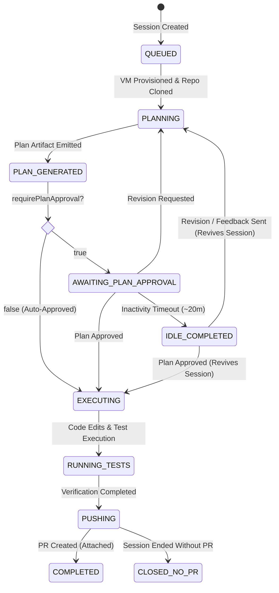

# Jules Session Lifecycle & Health States

Understanding the lifecycle stages, health assessment badges, and timeout mechanics of Google Jules coding sessions.

---

## 1. Health Assessment Badges

When auditing sessions, evaluate their current state and duration against this taxonomy:

| Assessment Badge | State & Trigger Conditions | Action Protocol |
|---|---|---|
| `⚠️ PLAN_GATE` | State is `AWAITING_PLAN_APPROVAL` or session went idle (`COMPLETED`) with an unapproved plan. | Review plan steps against repository standards. Approve plan or request revisions. |
| `💬 FEEDBACK_GATE` | State is `AWAITING_USER_FEEDBACK` or session is idle with agent questions awaiting response. | Read agent inquiry. Send steering feedback or answers to resume execution. |
| `🚨 STALLED` | State is `IN_PROGRESS` (or idle `COMPLETED`) with unreplied messages or $\ge 60$ minutes without updates. | Send progress check inquiry or probe status to wake up cloud runner. |
| `⚪ CLOSED_NO_PR` | State is `COMPLETED` with no attached PR, but deliverables or completed milestones were produced. | Request PR creation or investigate why pre-commit publishing halted. |
| `🔵 ACTIVE` | State is `IN_PROGRESS` and last activity was $< 60$ minutes ago. | Progressing normally; monitor without interrupting. |
| `✅ COMPLETED` | State is `COMPLETED` and pull request is present in outputs. | Review and audit the resulting GitHub PR. |
| `💤 INACTIVE` | Session created or updated $> 30$ days ago. | Abandoned or obsolete run; ignore by default in health sweeps. |

---

## 2. Critical Invariant: Idle != Terminal

> [!IMPORTANT]
> **Jules automatically marks a session as `COMPLETED` when its cloud VM runner goes idle (~20–30 minutes) while waiting for user interaction.**

A state of `COMPLETED` does **not** necessarily mean the coding task finished successfully:
1. **Pending Approvals**: If an unapproved plan exists, the session transitioned to `COMPLETED` due to plan approval timeout. It is functionally in `PLAN_GATE`.
2. **Pending Questions**: If the agent asked a clarifying question and the user hasn't replied, the session timed out waiting for input. It is functionally in `FEEDBACK_GATE`.
3. **Session Revival**: In the Jules execution engine, approving a plan or sending a message to a completed or idle session **immediately revives the runner**, returning the session to `IN_PROGRESS`.
4. Never assume a completed session cannot be continued or salvaged without first reviewing its chronological dialogue history.

---

## 3. Inactive Session Threshold (>30 Days)

All sessions older than 30 days are considered inactive. They represent stale, obsolete, or abandoned runs. Triage sweeps should ignore sessions $>30$ days by default to prevent context clutter and avoid waking ancient sessions.

