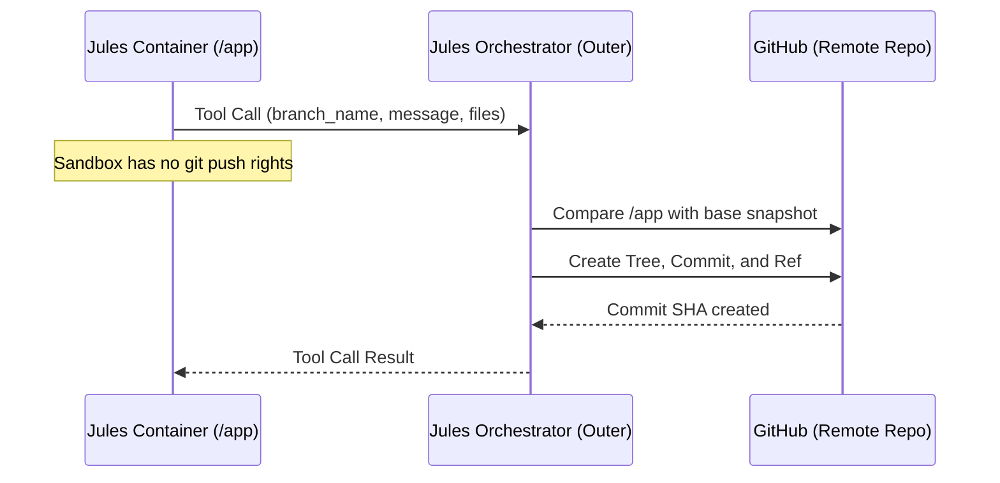

# Stale Branch & Git Sandbox Architecture

Technical reference detailing how Jules handles git operations, why sandbox isolation triggers empty commit loops, and the standard recovery procedure.

---

## 1. Jules Git Architecture

Jules' cloud sandbox has **no git remote credentials**. All commits and branches are managed by the outer orchestration platform directly on GitHub:



---

## 2. The Empty-Commit Loop Phenomenon

When the base branch in the GitHub repository is updated *after* a Jules session starts:
1. Jules' `/app` workspace is rooted on the older base commit snapshot.
2. If Jules attempts to submit changes, the platform compares Jules' filesystem against the snapshot.
3. If changes overlap or conflicts exist, or if Jules tries to reconcile without access to `git fetch`, the platform may push empty commits or repeatedly reject the diff.
4. Jules may enter an infinite loop attempting to "push" or resolve conflicts it cannot see.

---

## 3. Remediation Procedure

> ⚠️ **Do not lead with a nudge.** Observed on warpcode/cloakenv#210: a session already in an
> empty-commit loop was sent a halt nudge, and the nudge was itself the trigger for the next
> empty push. Four consecutive nudges produced four empty commits and none of the open review
> findings were touched. **First count the empty commits** (Workflow 6, step 1). If there are
> two or more, the session is wedged — skip straight to Workflow 6 and do **not** nudge at all.
> A nudge is only appropriate for a session that has *one* empty push and may still be healthy.

When a session enters an empty-commit loop or reports stale base branch errors:

1. **Confirm it is wedged** before acting:
   ```bash
   git fetch origin pull/<n>/head:refs/remotes/origin/pr-<n> --force
   for c in $(git rev-list origin/main..origin/pr-<n>); do
     s=$(git show --shortstat --format='' $c | tr -d ' \n')
     printf '%s [%s]\n' "$c" "${s:-EMPTY}"
   done
   ```
   Two or more `EMPTY` entries means skip to step 3 and follow **Workflow 6** in full — the
   nudge-based path below cannot recover a wedged branch, because appending a commit can never
   remove an earlier one.

2. **Halt the Runner** (only when NOT wedged):
   Send the `stale_branch_halt` nudge:
   `"Stop pushing. The remote branch has been updated since your session started. Your local environment is stale. Please stop all further push attempts."`

3. **Archive the Stale Session**:
   Reversibly archive the session so it no longer consumes attention or triggers alarms.

4. **Spawn a Fresh Session**:
   Create a new task session targeting the latest commit on the updated branch, carrying forward any salvageable plan or requirements from the halted session. When a `tidy/` branch was rebuilt, follow Workflow 6 steps 5–8 and build the prompt from
   `templates/replacement-session-prompt.md`.

5. **Concurrency Invariant**:
   Treat an active Jules task as having an exclusive lock on its target branch. Avoid landing unrelated commits onto a branch while Jules is actively working on it.
