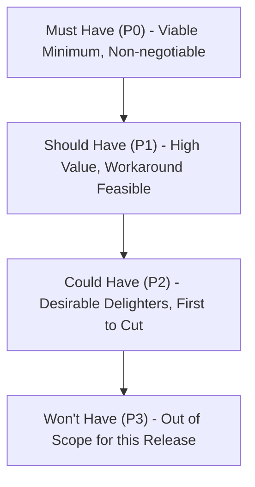

# Requirements Engineering & MoSCoW Prioritization

Methodology for authoring unambiguous functional requirements and applying disciplined MoSCoW prioritization.

---

## 1. Syntax for Functional Requirements (RFC 2119 / Earley's EARS)

Functional requirements specify behavior that the software must exhibit. Use clear, normative language:

### RFC 2119 Normative Keywords
- **MUST / SHALL**: Absolute requirement of the specification; mandatory for launch.
- **SHOULD / RECOMMENDED**: Valid reasons in particular circumstances may exist to ignore, but full implications must be understood and weighed.
- **MAY / OPTIONAL**: Truly optional capability.

### Easy Approach to Requirements Syntax (EARS)
Use structured EARS syntax patterns to avoid ambiguity:

1. **Ubiquitous (Always Active)**:  
   `The <system name> SHALL <system response>.`  
   *Example*: "The authentication service SHALL hash all passwords using Argon2id."

2. **Event-Driven (Triggered)**:  
   `WHEN <trigger>, the <system name> SHALL <system response>.`  
   *Example*: "WHEN the user clicks 'Export Audit Log', the system SHALL generate and stream an encrypted CSV within 3 seconds."

3. **State-Driven (In a specific condition)**:  
   `WHILE <in a state>, the <system name> SHALL <system response>.`  
   *Example*: "WHILE the payment gateway is in offline mode, the client SHALL queue transactions locally in encrypted storage."

4. **Optional Feature**:  
   `WHERE <feature is included>, the <system name> SHALL <system response>.`  
   *Example*: "WHERE multi-factor authentication is enabled, the login flow SHALL prompt for TOTP before token issuance."

---

## 2. MoSCoW Prioritization Framework

MoSCoW partitions requirements into four explicit delivery categories:

### Must Have (P0)
- The release cannot ship without this requirement.
- No legal, compliance, or functional workaround exists.
- If not delivered, the feature is useless or unsafe.

### Should Have (P1)
- Highly critical and impacts substantial value, but an interim manual workaround exists.
- Should only be omitted if extreme timeline pressures occur and stakeholders approve.

### Could Have (P2)
- Enhancements, polish, small friction reducers, or delighters.
- Deliverable only if time and budget permit after all Must and Should items are complete.

### Won't Have (P3)
- Agreed by stakeholders to be out of scope for the current release.
- Documented to avoid re-litigating during sprint cycles.

---

## 3. Requirements Checklist
- [ ] Every requirement has a unique identifier (`FR-01`, `FR-02`).
- [ ] No requirement contains passive voice or fuzzy adjectives ("fast", "intuitive", "robust").
- [ ] Each requirement links directly to testable verification criteria.
- [ ] Negative and edge case behaviors are specified (what happens on network drop, invalid input, duplicate submission).
