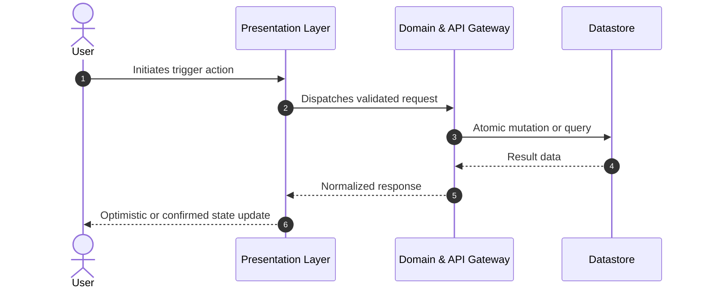

# User Journeys & Interaction Design

Guidelines for mapping user flows, specifying state transitions, handling error pathways, and formulating interface contracts.

---

## 1. User Journey Mapping

Every feature represents a journey through multiple cognitive and interactive states:

### Critical Flow States to Detail
1. **Entry & Discovery**: How does the user enter this flow? (Direct URL, menu navigation, banner click, CLI flag).
2. **Setup & Inputs**: What data or configuration is required before action can be taken?
3. **Execution**: What happens when the primary CTA is engaged? Is there visual progress or background queuing?
4. **Completion**: What is the definitive proof of success? (Toast, screen transition, downloadable artifact, email confirmation).
5. **Recovery**: What if validation fails, the session expires, or the backend returns 5xx?

---

## 2. The 5 UI States Model

For every interactive view or widget specified in the PRD, account for:

| State | Purpose | Required Specification |
|---|---|---|
| **Ideal / Active State** | Normal operating mode with standard data | Component hierarchy, actions, key data fields displayed |
| **Empty State** | First run or zero-record condition | Explanatory illustration/copy, clear call to action to create initial item |
| **Loading / Skeleton State** | Asynchronous fetch or compute in flight | Skeleton loaders, disabled action buttons to prevent double-submit |
| **Partial / Incomplete State** | Intermediate draft or filtered dataset | Filter reset controls, badge indicators, draft auto-save |
| **Error / Fault State** | Network loss, validation error, permission denied | Actionable error message, retry trigger, preserved user inputs |

---

## 3. Interface Contracts & Data Schemas

Include concrete schema previews in the PRD so engineering and product align on data shapes early:

- **JSON Payloads**: Provide example request and response envelopes with real types.
- **Error Dictionaries**: List machine-readable error codes (e.g. `INSUFFICIENT_FUNDS`, `RATE_LIMIT_EXCEEDED`) and their localized user-facing messages.
- **Event Contracts**: Detail telemetry event names, payload schemas, and tracking triggers.
