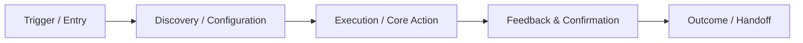
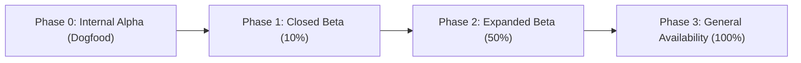

# PRD: [Feature Name]

| Metadata | Details |
|---|---|
| **Author / Team** | [Author Name / Team] |
| **Status** | Draft \| In Review \| Approved \| In Development \| Launched |
| **Target Release** | [Target Version / Milestone / Sprint] |
| **Created / Updated** | [Date] |
| **Target Audience** | [Target User Segment / Internal Stakeholders] |

---

## 1. Executive Summary & Problem Statement

### 1.1 Problem Statement
- **What is the problem?**: [Detailed description of the user or business problem]
- **Who is experiencing it?**: [Affected customer segments, personas, or internal teams]
- **Evidence / Pain Points**: [User research insights, support ticket metrics, analytics drop-offs, churn factors]

### 1.2 Opportunity & Expected Impact
- **Proposed Solution**: [High-level overview of the feature/initiative]
- **Business Impact**: [Revenue enablement, retention, efficiency gains, strategic differentiation]

---

## 2. Goals & Non-Goals

### 2.1 Goals (In Scope)
- [ ] **Goal 1**: [Specific, measurable business or user outcome]
- [ ] **Goal 2**: [Operational or capability improvement]

### 2.2 Non-Goals (Explicitly Out of Scope)
- ❌ **Non-Goal 1**: [Adjacent feature or scope explicitly deferred or rejected]
- ❌ **Non-Goal 2**: [Platform/migration consideration deliberately unaddressed in this cycle]

---

## 3. Personas & User Journeys

### 3.1 Primary Personas
- **Persona 1 ([Role/Name])**: [Context, core job-to-be-done, key frustrations]
- **Persona 2 ([Role/Name])**: [Context, expectations, interaction frequency]

### 3.2 User Journey Mapping



1. **Discovery / Initiation**: [How the user discovers and triggers the feature]
2. **Configuration / Input**: [What information or decisions the user provides]
3. **Core Action**: [Primary interaction and processing]
4. **Resolution / Feedback**: [Success state, feedback loops, receipt/export]
5. **Edge Paths & Error States**: [Failure handling, empty states, offline/timeout behaviors]

---

## 4. Requirements Specification

### 4.1 Functional Requirements (MoSCoW)

#### Must Have (P0 - Essential for Launch)
- **FR-01**: The system MUST [unambiguous requirement specification].
- **FR-02**: The system MUST [unambiguous requirement specification].

#### Should Have (P1 - High Priority, Workaround Possible)
- **FR-03**: The system SHOULD [high value secondary requirement].
- **FR-04**: The system SHOULD [high value secondary requirement].

#### Could Have (P2 - Nice to Have, Low Risk to Defer)
- **FR-05**: The system COULD [delighter or polish requirement].

#### Won't Have (P3 - Explicitly Deferred to Future Releases)
- **FR-06**: The system WON'T [deferred requirement].

### 4.2 Non-Functional Requirements (NFRs)

| Dimension | Specification | Verification Method |
|---|---|---|
| **Performance** | P95 latency < 200ms at 1,000 req/sec | Load test / APM benchmarking |
| **Scalability** | Support up to 100k concurrent active sessions | Horizontal scaling benchmark |
| **Security & Privacy** | Role-Based Access Control (RBAC), TLS 1.3 in transit, AES-256 at rest, GDPR/PII compliance | Security audit & SAST scan |
| **Reliability / SLA** | 99.95% availability, graceful degradation on downstream failure | Chaos testing / synthetic probes |
| **Accessibility** | WCAG 2.1 Level AA compliance, full keyboard navigation, screen reader ARIA labels | Automated axe-core + manual audit |
| **Observability** | Structured JSON telemetry, OpenTelemetry traces, Grafana alert triggers | Synthetic metric verification |

---

## 5. User Interface & Interaction Design

### 5.1 UI Surfaces & Information Architecture
- **Entry Points**: [Navigation menus, dashboard widgets, CLI commands, API routes]
- **Key Screens / Views**: [Description or wireframe reference for core screens]
- **State States**: [Loading, Empty, Partial, Active, Error states]

### 5.2 Interface Contracts (API / Schema Preview)
```json
{
  "request": {
    "action": "example_action",
    "parameters": {
      "mode": "standard"
    }
  },
  "response": {
    "status": "success",
    "data": {
      "id": "uuid-v4",
      "timestamp": "2026-10-02T10:00:00Z"
    }
  }
}
```

---

## 6. Success Metrics & Telemetry

### 6.1 Success KPIs

| Metric | Baseline | Target | Measurement Timeframe |
|---|---|---|---|
| **Adoption Rate** | 0% | 45% of active users | 30 days post-GA |
| **Completion Rate** | N/A | > 85% funnel conversion | Ongoing |
| **Task Time** | 4.5 minutes | < 1.2 minutes | Usability evaluation |
| **Error / Failure Rate** | N/A | < 0.5% of attempts | Sentry / Telemetry |

### 6.2 Instrumentation Plan
- **Event `feature_initiated`**: Triggered when entry point is engaged (tags: `source`, `user_type`).
- **Event `feature_completed`**: Triggered on successful resolution (tags: `duration_ms`, `mode`).
- **Event `feature_failed`**: Triggered on errors (tags: `error_code`, `step`).

---

## 7. Phased Rollout & Launch Strategy

### 7.1 Phasing



1. **Phase 0 (Dogfooding)**: Internal staff validation, staging integration testing.
2. **Phase 1 (Closed Beta)**: Feature flag enabled for 10% opt-in cohort, telemetry stabilization.
3. **Phase 2 (Expanded Beta)**: 50% cohort rollout, performance and scaling validation.
4. **Phase 3 (General Availability)**: 100% rollout, announcement, and documentation publish.

### 7.2 Rollback & Kill-Switch Plan
- **Trigger Threshold**: Error rate > 1.0% or P95 latency > 500ms sustained over 5 minutes.
- **Rollback Mechanism**: Feature flag toggle disable (`FEATURE_FLAG_NAME=false`) with zero deploy downtime.

---

## 8. Dependencies, Risks & Open Questions

### 8.1 Technical & Operational Dependencies
- [ ] Dependency 1: [Downstream service API or team deliverable]
- [ ] Dependency 2: [Infrastructure provisioning or legal/compliance approval]

### 8.2 Risk Matrix
- **Risk 1**: [Description of risk] → **Mitigation**: [Concrete mitigation strategy]
- **Risk 2**: [Description of risk] → **Mitigation**: [Concrete mitigation strategy]

### 8.3 Open Questions
- [ ] Question 1: [Unresolved product decision or technical unknown]
- [ ] Question 2: [Pricing / localization / compatibility inquiry]
