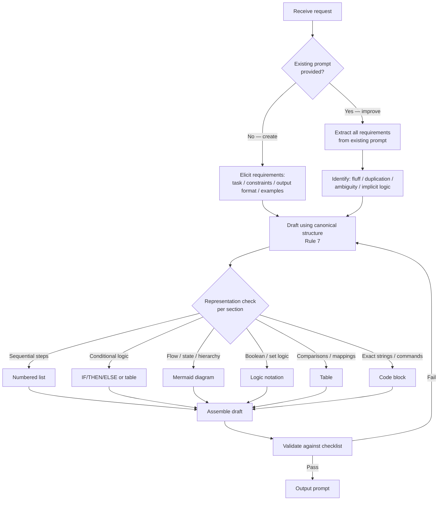

# Prompt Engineering Skill

Create and rewrite prompts to be **clear**, **concise**, and **unambiguous**. Applies equally to authoring a prompt from scratch and to optimising an existing one.

---

## Core Principles

| Priority | Principle | Test |
|----------|-----------|------|
| 1 | **Lossless** | Every original requirement survives |
| 2 | **Unambiguous** | One valid interpretation only |
| 3 | **Direct** | Instructions, not suggestions |
| 4 | **Non-redundant** | Each rule stated once |
| 5 | **Context-efficient** | Minimum tokens for maximum clarity |

---

## Process



### Creating from Scratch

When no existing prompt is provided, elicit requirements before writing. Minimum required:

| Required | Question to ask |
|---|---|
| Task | What must the model do? (one-line imperative) |
| Input | What data will the model receive at runtime? |
| Output format | Structure, schema, length? |
| Constraints | What MUST / MUST NOT the model do? |
| Audience | Who reads the output — human or another system? |

If the user provides enough context to infer these, proceed directly without asking. Flag any gaps as `⚠ Assumption` in the output.

---

## Transformation Rules

### 1. Remove Fluff

Fluff = any word/phrase that carries no instruction value.

**Remove:**
- Preamble: *"In this prompt I will explain…"*, *"As an AI assistant…"*
- Hedges: *"please"*, *"feel free to"*, *"you might want to"*, *"if possible"*
- Filler: *"Note that"*, *"It is worth mentioning"*, *"Keep in mind that"*
- Restated context: anything already implied by the task itself

**Keep:** all domain context, constraints, examples, and output format specs.

---

### 2. Eliminate Ambiguity

Every instruction must have exactly one valid interpretation.

| Ambiguous | Fixed |
|-----------|-------|
| *"Be concise"* | *"Respond in ≤3 sentences"* |
| *"Use a friendly tone"* | *"Use second person, contractions allowed, no jargon"* |
| *"Summarise briefly"* | *"Summarise in ≤50 words"* |
| *"Handle errors gracefully"* | *"On error: log the message, return `null`, do not throw"* |
| *"Recent"* (time) | *"Within the last 30 days"* |

---

### 3. Remove Duplication

**Rule:** each requirement appears exactly once, at its most authoritative location.

- If the same constraint is stated in the intro AND the detail section → keep detail, remove intro instance.
- If examples implicitly restate a rule already made explicit → keep the rule, keep the example, remove any prose repetition between them.

---

### 4. Use Direct Instructions

- Active voice, imperative mood.
- Subject is always the model (implicit or explicit).
- Obligation levels follow RFC 2119:
  - `MUST` / `MUST NOT` — absolute
  - `SHOULD` / `SHOULD NOT` — default, override allowed with reason
  - `MAY` — optional

**Avoid:** *"The model should try to…"*, *"It would be ideal if…"*, *"Ideally…"*

---

### 5. Represent Logic Formally

Replace prose descriptions of logic with notation when the notation is complete and unambiguous.

All notation uses plain-English keywords in caps — no mathematical symbols.

**Conditionals:**
```
IF <condition> THEN <action>
IF <condition> THEN <action> ELSE <other action>
IF <A> AND <B> THEN <action>
IF <A> OR <B> THEN <action>
IF NOT <condition> THEN <action>
```

**Mappings / transformations:**
```
<input> → <output>     # always label if the mapping direction is non-obvious
```

**Quantifiers:**
```
FOR EACH <x> IN <set>: <rule>       # rule applies to every member
AT LEAST ONE <x> IN <set>: <rule>   # existence condition
```

**Do NOT use notation when** the condition involves natural language judgment calls — keep those as prose.

**Deeply nested logic (>2 levels):** IF/THEN chains become unreadable past two levels of nesting. Use pseudocode instead:
```
function classify(input):
    if input.type == "urgent":
        if input.source == "customer": return "P1"
        else: return "P2"
    else:
        return "P3"
```

---

### 6. Use Mermaid Diagrams

Use a Mermaid snippet when **all three** hold:
1. The concept is inherently spatial, sequential, or relational.
2. A diagram conveys it more clearly than equivalent prose.
3. The diagram is shorter (token-count) than the prose it replaces.

**Candidate scenarios:**
- Multi-step decision flows → `flowchart`
- State machines / lifecycle → `stateDiagram-v2`
- Entity relationships → `erDiagram`
- Timelines / sequences → `sequenceDiagram`
- Hierarchies / trees → `flowchart TD` with subgraphs

**Do NOT use diagrams for** simple linear sequences (a numbered list is cheaper) or anything already captured by a table.

---

### 7. Canonicalise Structure

Standard prompt section order (omit sections that don't apply):

```
1. Role / Persona          (only if materially changes behaviour)
2. Task                    (one-line imperative statement of the goal)
3. Context                 (background the model cannot infer)
4. Constraints             (MUST / MUST NOT rules)
5. Process                 (steps, logic, diagrams)
6. Output Format           (structure, length, schema)
7. Examples                (input → output pairs)
8. Edge Cases / Exceptions (deviations from the main rule)
```

**XML tags for boundary clarity:** When user-supplied data is embedded inside a prompt (e.g. a document to analyse, a code snippet to review), wrap it in XML tags to prevent the model confusing instruction text with input data.

```xml
Summarise the following support ticket in ≤30 words.

<ticket>
{{USER_TICKET}}
</ticket>
```

Do NOT use XML tags as a universal structural wrapper for every section — markdown headers are sufficient when no user data is embedded.

---

### 8. Output Format Specification

Always make the output format **explicit** when it matters:

- Specify: structure (JSON / markdown / plain text), schema (field names + types), length (word/token/line count or range), ordering (if significant).
- Provide a skeleton or JSON schema for structured outputs rather than prose description.

**Example — before:**
> *"Return the results in a structured format with the name, score, and any relevant notes."*

**Example — after:**
```json
{
  "name": "string",
  "score": "number (0–100)",
  "notes": "string | null"
}
```

---

### 9. Examples Over Descriptions

`N` concrete input→output examples often replace paragraphs of abstract description.

- Prefer `[input] → [output]` pairs for format, tone, or transformation rules.
- One well-chosen example = roughly 5–10 sentences of description.
- Label edge-case examples clearly: `// edge case: empty input`.

---

### 10. Persona / Role

Include a role ONLY when it materially shifts the model's knowledge domain or behaviour.

- ✅ `You are a senior Rust compiler engineer.` (activates domain depth)
- ❌ `You are a helpful and knowledgeable assistant.` (no behavioural delta — remove)

---

### 11. Negative Constraints

State what the model MUST NOT do explicitly — do not rely on omission. Every `MUST NOT` MUST be paired with the replacement behaviour. This removes ambiguity about what to do instead and produces more reliable compliance.

**Pattern:** `MUST NOT <prohibited behaviour>; <replacement behaviour> instead.`

| ❌ Bare prohibition | ✅ With replacement |
|---|---|
| `MUST NOT use jargon.` | `MUST NOT use jargon; substitute plain one-syllable words instead.` |
| `MUST NOT fabricate citations.` | `MUST NOT fabricate citations; if no source is known, output "source unknown".` |
| `MUST NOT exceed 3 paragraphs.` | `MUST NOT exceed 3 paragraphs; condense by removing examples if needed.` |

---

### 12. Chunking Long Prompts

If the optimised prompt exceeds ~400 tokens, apply hierarchy:

```
System prompt   → immutable rules, persona, output schema
User message    → task + context (varies per call)
Assistant turn  → examples (few-shot, if needed)
```

Move stable rules to system prompt; keep dynamic context in user message.

---

### 13. Variable Injection (Template Prompts)

When a prompt is a **reusable template** — stable instructions with runtime data swapped in — mark every injection point explicitly. This prevents the model from treating variable placeholders as literal content and makes the template self-documenting.

**Use `{{VARIABLE_NAME}}` for inline values:**
```
Translate the following text into {{TARGET_LANGUAGE}}:

<source_text>
{{SOURCE_TEXT}}
</source_text>
```

**Rules:**
- `VARIABLE_NAME` MUST be UPPER_SNAKE_CASE.
- Each variable MUST appear in a comment or legend if its expected type/format is non-obvious.
- Use XML tags (per Rule 7) to wrap multi-line variable content; use inline `{{}}` for short scalar values.
- MUST NOT leave any unfilled `{{}}` placeholders in a finalised prompt.

---

## Output Format for This Skill

**When creating a prompt from scratch:**

```
### Prompt
<the prompt, ready to use>

---
### Assumptions
| Assumption | Confirm or correct |
|---|---|
| … | … |
```

**When improving an existing prompt:**

```
### Optimised Prompt
<the rewritten prompt, ready to use>

---
### Changes Made
| Change type        | Detail |
|--------------------|--------|
| Removed fluff      | … |
| Resolved ambiguity | … |
| Removed duplicate  | … |
| Formalised logic   | … |
| Added diagram      | … |
| Restructured       | … |
```

In both cases, flag anything unclear or inferred:
> ⚠ **Assumption:** `<what was assumed>` — confirm or correct.

---

## Quick-Reference Checklist

Before finalising a rewrite, verify:

- [ ] All original requirements preserved
- [ ] No fluff words remain
- [ ] Every constraint uses MUST / SHOULD / MAY
- [ ] No ambiguous quantifiers (*many*, *some*, *recent*, *large*)
- [ ] No duplicate rules
- [ ] Logic expressed as IF/THEN or notation where applicable; pseudocode used if nesting >2 levels
- [ ] Mermaid diagram used for any non-trivial flow (and is shorter than equivalent prose)
- [ ] Output format is explicit with schema/skeleton
- [ ] At least one example for non-obvious behaviour
- [ ] Every MUST NOT paired with a replacement behaviour
- [ ] Persona removed if it adds no behavioural value
- [ ] XML tags used to wrap embedded user data (not as universal section wrappers)
- [ ] Template prompts: all injection points marked as `{{VARIABLE_NAME}}`

---

## Using This Skill as a Dependency

Any skill whose task involves **writing text that will be consumed by an LLM** MUST declare this skill as a dependency and load it before authoring that content. This includes but is not limited to:

- Skill authoring (`SKILL.md` body, description, agent instructions within the skill)
- Agent / subagent setup (system prompts, task directives, handoff instructions)
- Multi-agent orchestration (coordinator → worker instructions)
- Chatbot / assistant configuration (system prompt generation)
- Automated pipeline instructions (LLM node prompts in any workflow tool)
- Tool and function descriptions passed to an LLM's tool-use interface

### Dependency Declaration Block

Add the following block to the **top of the relevant section** in any skill that generates LLM-facing content:

```markdown
> **Dependency:** This section produces LLM-facing content.
> Load `/mnt/skills/user/prompt-engineering/SKILL.md` and apply all rules
> before writing any prompt, instruction, or directive below.
```

### Enforcement Rule for Skill Authors

When writing or reviewing a skill that generates prompts:

1. MUST `view` the prompt-engineering `SKILL.md` before drafting any LLM-facing text.
2. MUST apply the Quick-Reference Checklist to every generated prompt before finalising.
3. MUST NOT inline prompt-quality rules in the dependent skill — defer to this skill entirely; duplication is a violation of Rule 3.
